# 欧乐 TV · Olevod Android TV

为 Android TV / Google TV 制作的个人使用客户端，使用 Kotlin、Jetpack Compose 和 Media3 原生播放器。界面以深色和绿色焦点为主，围绕电视遥控器设计，接入 [欧乐影院](https://www.olevod.com/) 的影片目录、搜索和账号功能。

这是个人项目，与欧乐影院官方没有隶属关系。影片、海报、分类与播放源来自网站；官方标识的素材来源见 [品牌资产说明](docs/BRAND_ASSETS.md)。

**v0.2 发布准备中。** 已构建候选包并验证覆盖升级；最新Top 2模糊背景修订目前位于开发包，正式签名包待更新后推送和发布。[新版发布说明](docs/releases/v0.2.md) · [安装与覆盖升级教程](docs/INSTALL.md) · [已有候选包验证](docs/verification/RELEASE_V0_2.md)

当前已公开的旧版仍是 **[v0.1 APK](https://github.com/abdvl/olevod-tv-app/releases/download/v0.1/olevod-tv-v0.1.apk)** · [v0.1 发布页](https://github.com/abdvl/olevod-tv-app/releases/tag/v0.1)。

| 项目 | v0.2 候选版 |
| --- | --- |
| 应用版本 | 0.2.0 · versionCode 2 |
| 安装包 | `olevod-tv-v0.2.apk`，14,341,714 字节（约14.3 MB） |
| 设备要求 | Android TV / Google TV，Android 8.0（API 26）及以上 |
| 操作方式 | 遥控器方向键、确认键、返回键；支持系统输入法 |
| 包名 | `com.olevod.tv` |
| 发布形式 | 独立签名 APK，侧载安装；不通过 Play 商店发布 |

## v0.2 界面与功能

`codex/ui-v2` 分支已按认可的设计规范实现新版原生 TV 界面：单行导航、完整竖版海报、最近五部聚焦展开、分类双榜、紧凑筛选浮层、三栏搜索、八按钮播放器与全屏覆盖层、两列历史和数字验证码登录。直播暂不纳入。

查看 **[v0.2签名安装包实际截图与升级验证](docs/verification/RELEASE_V0_2.md)**（13张，含1张升级前对照）、[设计对照截图集](docs/verification/v2/screenshots/README.md)、[设计对照检查](design-qa.md) 和 [集成验证与待验收项](docs/verification/v2/V2-10.md)。设计对照图库使用公开影片素材和虚拟观看记录；播放器布局图不代表真实媒体解码证据。下方v0.1图库保留为历史版本。

| 功能 | v0.2 行为 |
| --- | --- |
| 单行导航 | 搜索位于首页左侧；默认首页；分类进入mini首页，目录／历史／收藏／账号工具聚焦展开 |
| 最近播放与首页 | 最近五部默认显示集数和时间，聚焦展开信息，末格进入全部历史；推荐用横幅叠加大标题，之后按电影／电视剧／综艺／VIP／短剧显示最近更新 |
| 分类双榜 | 每榜前2部突出，下方10部五列两行；普通分类当年、VIP全部年份；底部浏览全部进入对应目录 |
| 完整海报 | 按比例Fit保留原图，评分位于海报右上角；片名和元信息在图外，整张焦点卡滚入安全区域 |
| 目录 | 排序／类型／地区／年份／更多筛选浮层，支持取消草稿、确认后首行复位、末行自动追加和返回深位置 |
| 搜索 | 左键盘、中联想、右两列结果；确认建议后进入首个结果，返回先回输入框；支持系统中文输入 |
| 播放 | 全屏、播放暂停、±30秒、±5分钟、速度、收藏；简介限高，十集分组；全屏控件覆盖视频，上隐藏、下唤醒 |
| 观看记录与账号 | 本机和网站历史、影视收藏；本机加密记住用户名密码、数字验证码键盘、明确过期登录提示 |
| 退出与范围 | 首页返回弹确认，默认继续观看；直播暂缓；片源／会员／网络和设备能力影响可用性 |

[Chromecast 真机结果与实际截图](docs/verification/v2/CHROMECAST_V2.md)：跨批次累计56个不同自动化用例通过，最终修复包19项定向回归通过。覆盖实际跳转／倍速、普通及VIP首帧、音视频解码输出、账号读取与遥控导航；已修复过期会话提示、播放错误按钮焦点和排序后列表复位。另在会话修复基线完成30分钟播放采样、系统Home暂停及后台进程重建；现场听感／同步、4K/HDR等继续单列，详见[独立报告](docs/verification/v2/CHROMECAST_INDEPENDENT.md)。


### 最新界面修订

- VIP小首页使用全部年份的片库榜单，标题明确显示“全部年份”；普通分类仍使用当年人气／评分榜。
- 每个榜单最多12部：顶部2部突出，下方10部按五列两行排列，不重复前两部。
- 评分放在海报右上角的半透明深色角标中，片名使用下方全宽；竖图继续完整等比显示。
- Top 2卡片使用本片海报铺满的模糊背景和深色渐变，前景海报保持完整，标题和元信息清晰显示；实际截图见[背景效果验证](docs/verification/v2/MINI_BACKDROP.md)。

[独立复测记录](docs/verification/v2/V02_UI_FOLLOWUP.md) · [本轮三张Chromecast实际截图](docs/verification/v2/followup-screenshots/README.md)

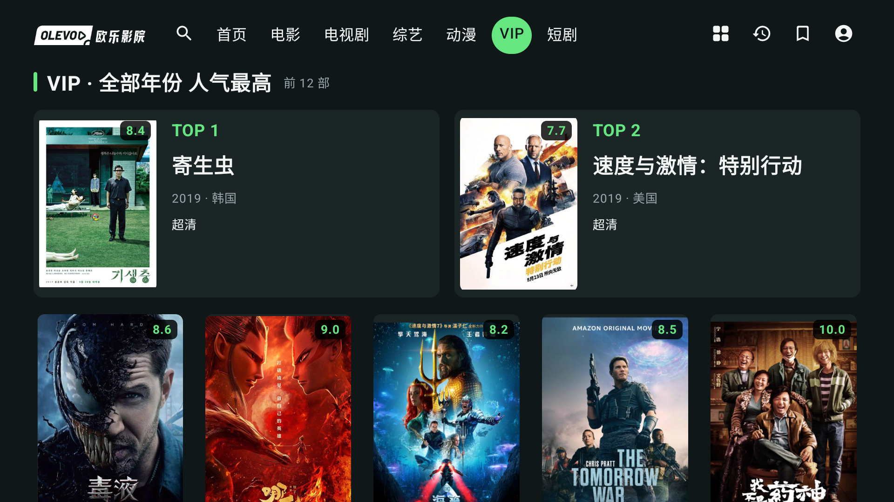

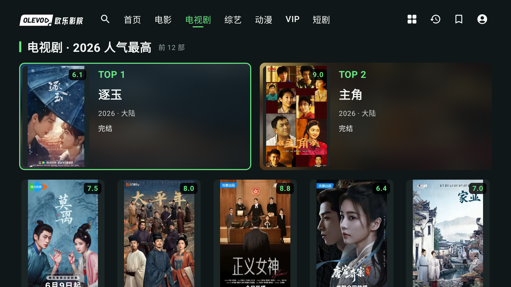

## v0.1 功能与界面

以下十张图片均为应用运行时的真实界面截图，均来自 v0.1 正式签名 APK 在干净 TV 模拟器中的实际运行，并非设计稿。网站内容会持续更新，实际片单可能与截图不同。

### 1. 首页：最近播放、推荐与分类更新

首页第一行展示最近播放的影片，保留集数和观看位置，点选即可续播。接下来是推荐影片，以及电影、电视剧、综艺、VIP、短剧的最近更新内容；每个分类最多 10 部，分两行展示。

顶部图标可快速进入首页、电影目录、搜索、历史、收藏与账号。第二行提供首页、直播及各影片分类入口，动漫也可从这里进入。

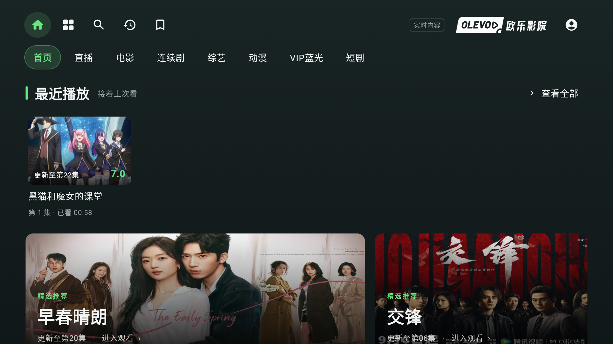

### 2. 分类首页：今年的人气榜

从第二行选择电影、连续剧、综艺、动漫、VIP 或短剧，进入该分类的小首页。首先展示当前年份的人气最高影片，最多 10 部：前两部为大卡片，其余使用较小卡片排列。

榜单使用网站的年份与人气排序结果；点击影片直接播放，底部“浏览全部”进入完整筛选目录。


### 3. 分类首页：今年的评分榜

继续向下可查看同一分类、当前年份的评分最高影片，最多 10 部。排名和评分来自网站，不在应用内另行计算。

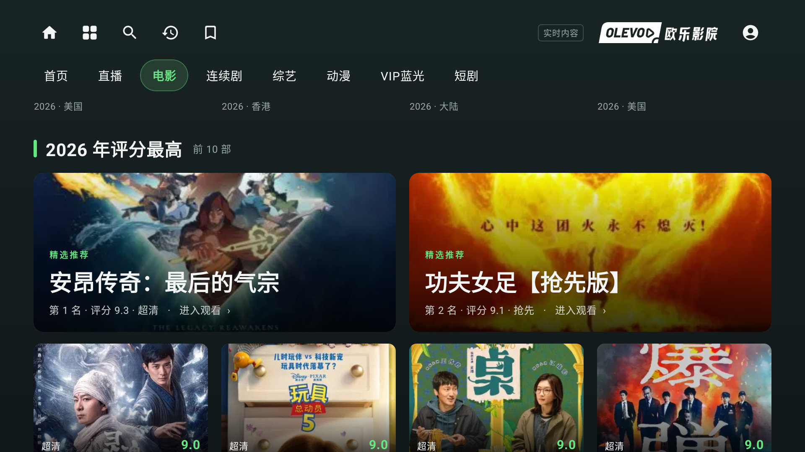

### 4. 完整目录：七行筛选与连续加载

目录保留网站提供的筛选维度：排序、分类、类型、地区、年份、会员范围和首字母。排序包括最新上传、最近更新、人气最高与评分最高。

影片采用六列竖版海报，显示标题及可用的评分、年份、地区等信息。首批加载 20 部，滚动接近末尾时继续加载，无需手动翻页；支持重置筛选，以及从影片返回列表后恢复浏览位置。

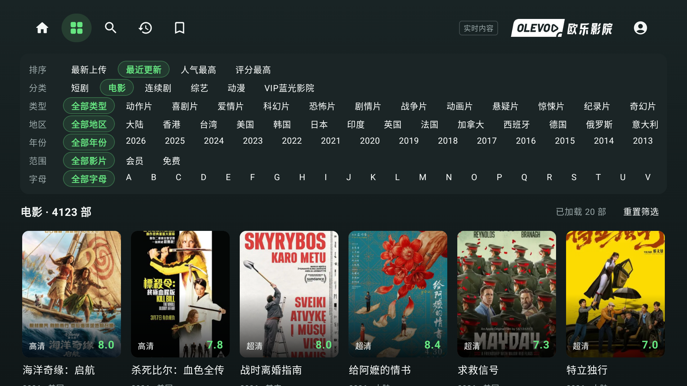

### 5. 搜索：遥控器键盘与“猜你想搜”

搜索页分为三栏：左侧是字母数字键盘，中间是热门搜索、最近搜索或联想词，右侧是影片结果。支持清空、退格和系统中文输入；语音及手机遥控输入是否可用，取决于电视系统和所选输入法。

例如输入 `MN` 后，可选择网站返回的“魔女”等联想词，无需用遥控器逐个输入汉字。

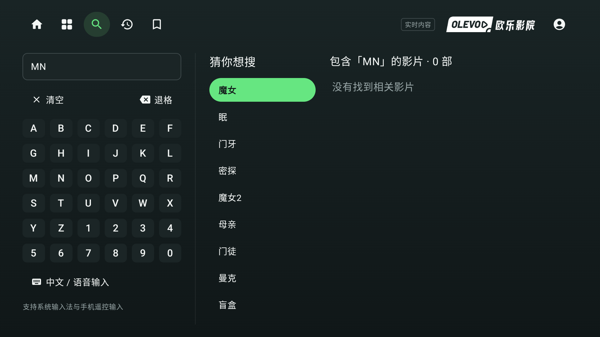

### 6. 搜索结果：选中建议后自动聚焦第一部影片

确认联想词后，结果加载完成会自动聚焦右侧第一张海报。结果以两列竖版海报展示，并支持继续向下加载。

搜索页按一次返回键，会先回到输入框；输入框已经聚焦时，再按返回键退出搜索。正在输入文字的系统弹窗会先处理收键盘或关闭弹窗。

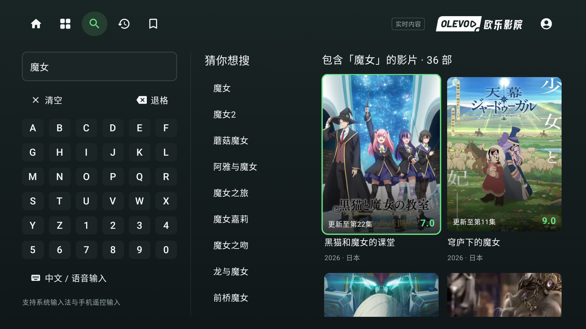

### 7. 播放页：视频、影片信息与分组选集

左侧为原生播放画面，右侧为影片名称、评分、年份、地区、简介及演职员信息。简介限制高度，为播放控制和选集留出空间。

控制按钮依次为：**全屏、播放/暂停、后退 30 秒、前进 30 秒、后退 5 分钟、前进 5 分钟、播放速度、收藏**。初始焦点在全屏按钮，速度支持 0.5× 至 2×。

选集位于控制栏下方，每 10 集一组。选择分组只切换可见集数，确认具体集数才开始播放；播放结束后可自动进入下一集。

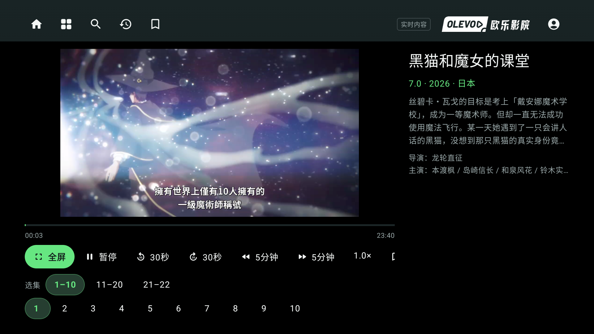

### 8. 全屏播放：半透明控制层

全屏控制栏覆盖在视频之上，显示或隐藏控制栏不会缩小视频。全屏下仍可切换集数组，也会显示当前播放轨道提供的分辨率和码率；只提供峰值码率时明确标注“峰值”，缺失信息如实显示。

播放时闲置约五秒会隐藏控制栏，浏览选集时保持可见。主控制区按上键可立即隐藏，下键唤醒；返回键先退出全屏，再次返回离开播放页。


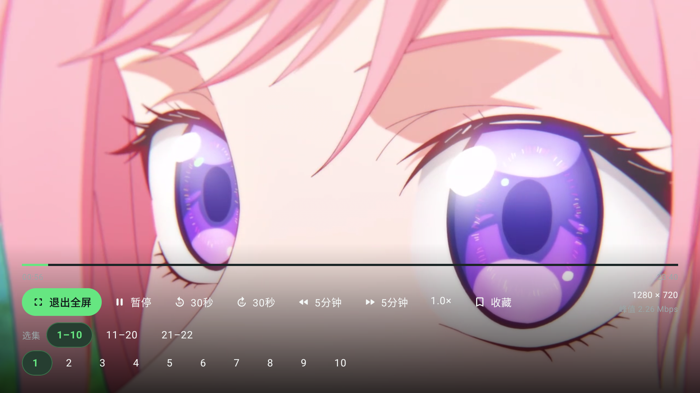

### 9. 观看历史、账号与收藏

观看历史包含封面、标题、可用的年份/地区/评分、集数和播放进度，支持点选续播。本机历史与网站账号历史分别展示；本机记录按账号和访客隔离，网站历史通过分页读取。

登录后，新观看进度会同步到网站；正常播放时节流上传，暂停、切集、进入后台和离开播放器时尝试同步最新进度。影视收藏支持添加、取消和列表浏览。

电视可以直接输入账号、密码和图片验证码登录。账号密码使用 Android Keystore 加密后在本机记住，下次可只输入新的验证码；退出登录会保留记住的凭据，也可在账号页更换或清除。APK 不包含测试账号或密码。

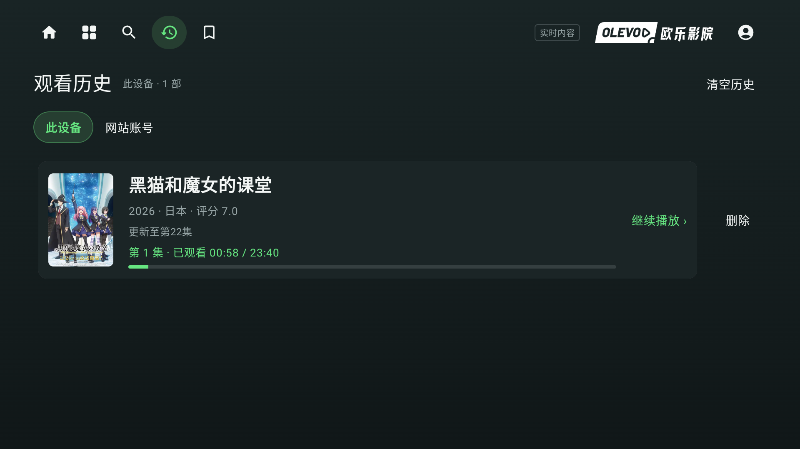

### 10. 退出确认

在首页按返回键会显示退出确认，默认聚焦“继续观看”。选择“退出应用”才关闭应用；按返回键取消弹窗。

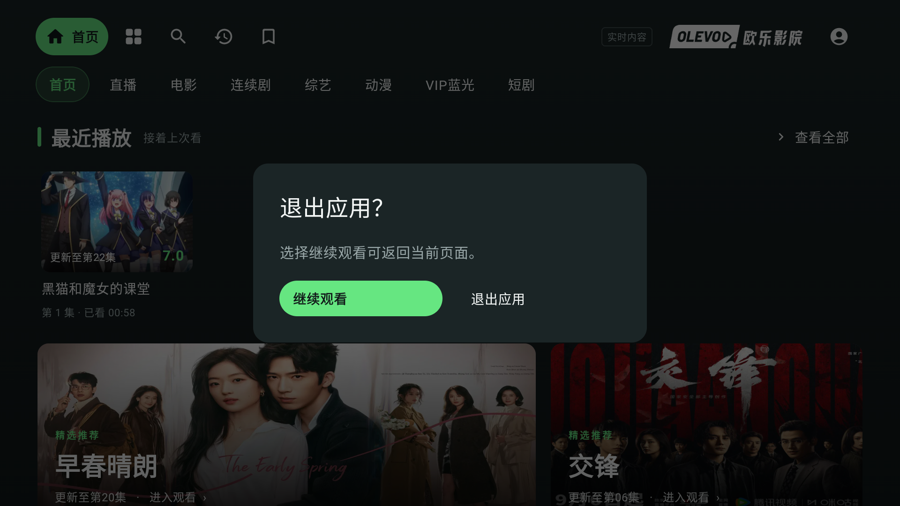

## 遥控器操作速查

| 所在位置 | 操作 | 结果 |
| --- | --- | --- |
| 通用 | 方向键 / 确认键 | 移动绿色焦点 / 打开或执行选中项 |
| 首页最近播放 | 上 | 回到单行导航“首页” |
| 单行导航“首页” | 下 | 进入最近播放；没有记录时进入推荐 |
| 分类或目录 | 左右 / 上下 | 切换同一行选项 / 切换筛选行或影片行 |
| 搜索联想词 | 确认 | 搜索该词，加载后聚焦第一条结果 |
| 搜索页面 | 返回 | 先聚焦输入框，再按一次退出搜索 |
| 非全屏播放控制 | 上 | 聚焦视频画面 |
| 非全屏视频画面 | 确认 / 下 | 进入全屏 / 回到控制按钮 |
| 播放主控制区 | 下 | 进入选集分组 |
| 选集分组 | 下 / 上 | 进入当前组集数 / 回到控制按钮 |
| 具体集数 | 上 / 确认 | 回到分组 / 播放选中集数 |
| 全屏主控制区 | 上 | 隐藏控制栏 |
| 全屏隐藏控制栏时 | 下 / 左右 | 唤醒控制栏 / 后退或前进 30 秒 |
| 全屏播放 | 返回 | 退出全屏，保留当前播放 |
| 非全屏播放 | 返回 | 返回来源页面 |
| 首页 | 返回 | 打开退出确认 |

控制按钮或分组超出当前可见宽度时，可以继续向右移动。焦点高亮表示当前遥控器操作目标，描边或较暗的绿色也可能表示已选分类或正在播放的集数。

## 安装与升级

1. 从 [v0.1 Release](https://github.com/abdvl/olevod-tv-app/releases/tag/v0.1) 下载 `olevod-tv-v0.1.apk`，可用同页的 `SHA256SUMS.txt` 校验文件。
2. 将 APK 传到电视，用文件管理器打开；按系统提示允许该文件管理器安装未知应用。也可使用电脑通过 ADB 安装。
3. 安装后在电视应用列表中打开“欧乐 TV”。需要会员内容或网站历史/收藏时，在账号页登录。

**已经安装 Android Studio / ADB 开发调试版的用户请先阅读迁移说明。** v0.1 使用独立发布证书，与此前 debug 版签名不同，同包名无法直接覆盖安装。卸载开发版会删除本机历史、搜索记录、登录状态和记住的账号密码；网站已有的云历史和收藏不受影响。应用目前没有本机数据导出功能，应先确认需要保留的记录已同步。

后续同一发布签名的更高版本可以覆盖升级。文件管理器安装、无线 ADB 配对、签名冲突及迁移步骤见 **[完整安装教程](docs/INSTALL.md)**。

## 当前验证范围与限制

- **正式 APK 与实机验证分别记录。** v0.1 发布包在干净模拟器上验证安装；同功能 debug 版已在 Google Chromecast with Google TV（sabrina，Android 14）上验证普通点播、VIP 与遥控器操作，用户确认实际音画正常。尚未声称正式发布包完成 Chromecast 实机安装验收。
- **直播与回看仍属实验功能。** 入口及播放能力保留，部分频道会发生来源错误或不稳定，进一步稳定性排查暂缓。频道取消收藏也存在服务端返回成功但列表未确认更新的情况，不能与已验证的影视收藏等同。
- **VIP 需要网站有效会员。** “VIP 蓝光”是网站分类名称，不代表每个片源都是 4K/HDR。实际清晰度、音轨与播放能力取决于片源、会员权限、网络和设备解码支持；4K/HDR 尚未验收。UI v2 指定开发包的30分钟普通播放采样见上方报告，不等同所有片源或 v0.1 发布 APK 的长时验收。
- **云同步不是离线备份队列。** 网络失败时保留本机进度；尚无持久化离线补传队列，系统终止进程时不保证最后一次网络同步完成。网站历史数量受网站保留策略影响，暂不支持云端删除或批量迁移；本机删除只影响本机记录。
- **登录依赖当前验证码。** 识别错误或验证码过期时需要刷新重试。记住的凭据只保存在当前设备，清除应用数据或卸载会删除它们。
- **网站接口可能变化。** 本项目通过网站现有接口获取内容，影片下架、接口调整、网络故障及播放源异常会影响可用性。
- **面向电视。** 最低 Android 8.0，要求 Android TV / Google TV 环境；未提供手机触控布局或 Play 商店分发。

## 开发与测试

技术栈：Kotlin 2.1.20、Jetpack Compose for TV、Media3、AGP 8.9.2、Gradle 8.11.1、JDK 17、compile/target SDK 35。

使用 Android Studio 打开仓库根目录，配置 JDK 17 和 Android SDK 35 后同步。已配置本仓库本地工具链时，也可运行：

```sh
source scripts/android-env.sh
./gradlew assembleDebug testDebugUnitTest lintDebug
```

当前 30 项 JVM 单元测试覆盖 API 参数及解析、累计加载、迟到响应、播放跳转／续播、Unicode 输入和视频信息格式。新版 Android 测试另外覆盖遥控焦点、搜索竞态、分组／全屏、历史删除／来源恢复、收藏和账号隔离；精确运行范围及结果见 [V2-10](docs/verification/v2/V2-10.md)。真实登录、会员内容、收藏及云同步集成测试需要额外账号环境和显式参数，不能将跳过的测试视为通过。

| 文档 | 内容 |
| --- | --- |
| [安装教程](docs/INSTALL.md) | APK 下载、侧载、ADB 与开发版迁移 |
| [构建与调试](docs/BUILD_AND_TEST.md) | Android Studio、命令行与测试运行方式 |
| [当前进度](docs/PROGRESS.md) | 每一步完成内容、提交检查点和验证情况 |
| [实施步骤](docs/IMPLEMENTATION_STEPS.md) | 分步开发与恢复入口 |
| [UI v2 完整设计规范](docs/design-v2/DESIGN_SPEC.md) | 已认可的新版布局、组件参数、焦点与状态、API 边界 |
| [UI v2 实施检查点](docs/verification/v2/IMPLEMENTATION_STATUS.md) | 分阶段提交、当前验证结果和实机待验收范围 |
| [UI v2 设计稿与验收](docs/design-v2/README.md) | 十张参考图、设计 tokens、验收矩阵和后续开发检查点 |
| [早期产品与代码设计](docs/DESIGN.md) | v1 历史方案；新版 UI 以 v2 规范为准 |
| [API 调查](docs/API_RESEARCH.md) | 网站接口及已确认的数据契约 |
| [云历史能力](docs/CLOUD_HISTORY_STATUS.md) | 同步行为、单位和支持边界 |
| [独立实机回归](docs/verification/FINAL_INTEGRATED_TV.md) | 播放控制、历史与遥控器检查 |
| [播放器实机检查](docs/verification/PLAYER_FINAL_DEVICE_CHECK.md) | 视频焦点、选集、全屏按键与截图限制 |

每个实施检查点通过 Git 提交和进度文档保留，便于暂停后继续。开发用凭据、签名私钥和本机工具目录不应提交到仓库或加入发布附件。

## Token history

记录每次 release 和设计里程碑所用的模型、token 用量，以及按记录时 OpenAI API 公开价格折算的美元价值。各行记录相对上次截止点的新增用量。**这是开发成本估算，不是 Codex 订阅账单或实际付款金额。**

| Release / 里程碑 | 模型 | 输入 token（含缓存） | 其中缓存输入 | 输出 token（含推理） | 总 token | 标准 API 估值（USD） |
| --- | --- | ---: | ---: | ---: | ---: | ---: |
| [v0.1](https://github.com/abdvl/olevod-tv-app/releases/tag/v0.1) | GPT-6 Astra（主任务 + 2 个子 agent） | 157,985,669 | 155,394,048 | 413,809 | 158,399,478 | **$202.00** |
| [UI v2 设计定稿](docs/design-v2/DESIGN_SPEC.md)（仅设计阶段） | GPT-6 Astra（主任务 + 设计审阅 agent） | 15,226,201 | 14,570,880 | 92,184 | 15,318,385 | **$25.73**，图片生成额外费用未统计 |
| [v0.2 发布候选版](docs/releases/v0.2.md)（设计定稿后的实现／测试／发布准备） | 待核对用量日志 | 未统计 | 未统计 | 未统计 | 未统计 | 未统计 |

以上已统计阶段合计 **173,717,863 token，约 $227.73**；不含v0.2实现／测试／发布准备、下述未统计费用与范围外任务。未统计不代表零用量，不把设计阶段重复计入实现阶段。

### v0.1 统计口径与费用明细

- 统计日期：2026-09-07（America/Los_Angeles）。来源为本地任务日志的累计用量快照，主任务和两个子 agent 分别统计后相加。
- 该快照覆盖 v0.1 开发、测试、调试、截图、文档、发布，以及发布后的 MIT License 和首次用量查询；**并非精确截至 release 标签的纯代码生成用量**。后续查询、费用估算及本节编写未计入，保留此快照以便比较。
- 主任务：输入 97,066,692，输出 315,671；两个子 agent：输入 60,918,977，输出 98,138。
- 输入包含每次请求重复携带的上下文，不等于用户输入的文字量。非缓存输入为 2,591,621；推理输出 100,319 已包含在输出总数中，不重复收费。日志记录的缓存写入 token 为 0。

| 计费项目 | Token 数 | 单价（USD / 百万 token） | 折算费用（USD） |
| --- | ---: | ---: | ---: |
| 非缓存输入 | 2,591,621 | $10.00 | $25.92 |
| 缓存输入 | 155,394,048 | $1.00 | $155.39 |
| 输出（含推理） | 413,809 | $50.00 | $20.69 |
| **合计** | | | **$202.00** |

价格依据：[GPT-6 Astra 官方模型价格](https://developers.openai.com/api/docs/models/gpt-6-astra)及 [OpenAI API 定价](https://developers.openai.com/api/docs/pricing)，核对日期为 2026-09-07。按 Standard、单次输入不超过 272K 的档位和上述缓存命中量估算；未计额外工具费用、税费或其他服务费用。若全部使用 Fast / Priority 的两倍单价，相同用量约为 **$404.00**；这不是已确认的实际服务档位账单。

计算方式：`非缓存输入 / 1,000,000 × 输入单价 + 缓存输入 / 1,000,000 × 缓存单价 + 输出 / 1,000,000 × 输出单价`。使用未四舍五入的金额求和，最后保留两位小数。

### UI v2 设计定稿统计口径与费用明细

- 时间范围：**2026-09-07 22:56:12.276 至 2026-09-08 07:35:11.093**（America/Los_Angeles，左开右闭）。起点是上表 v0.1 使用的原始统计快照，终点是设计规范提交 [`62b11e1`](https://github.com/abdvl/olevod-tv-app/commit/62b11e16bee367a6048e771ea0c8e01ae87f3f48) 推送完成后的用量记录。
- 包含本任务在起点之后的用量/价格讨论、界面设计迭代与定稿、完整 design spec、独立审阅、提交和推送。**不包含 UI v2 实现、本次统计与推送，也不包含独立任务中的首次 Token history 编辑等其他任务。**
- 核对本任务及三个子 agent 的日志，按每个请求的用量记录去重后求和，共 100 个请求，均为 GPT-6 Astra。主任务 89 个请求：输入 14,475,250、输出 88,324；设计审阅 agent 11 个请求：输入 750,951、输出 3,860。原有两个子 agent 在区间内没有新增用量。
- 本次使用逐请求账本，以包含上下文压缩：比累计界面快照相减多出一次压缩请求（输入 240,854，其中缓存 235,520；输出 4,093），约 $0.49，**已计入**本行。v0.1 保留原有快照与估值，不在本行补算更早的差额。
- 缓存输入占输入的约 95.70%；推理输出 24,592 已包含在输出中。缓存写入为 0；单次输入最大 240,854，未触发 272K 以上的长上下文价格。

| 计费项目 | Token 数 | 单价（USD / 百万 token） | 折算费用（USD） |
| --- | ---: | ---: | ---: |
| 非缓存输入 | 655,321 | $10.00 | $6.55 |
| 缓存输入 | 14,570,880 | $1.00 | $14.57 |
| 输出（含推理） | 92,184 | $50.00 | $4.61 |
| **文字模型合计** | **15,318,385** | | **$25.73** |

价格按 2026-09-08 核对的 [GPT-6 Astra 官方 Standard API 定价](https://developers.openai.com/api/docs/models/gpt-6-astra)折算，计算公式同上，未舍入合计为 $25.73329。该估值不代表本次 Codex 的实际服务档位或账单。

设计过程中另有 **20 次 ImageGen 调用、20 张返回图像**，其中 10 张作为最终参考图归档。工具日志未提供图片模型身份及计费用量，因此**图片生成额外费用未统计，不按零费用处理**；主任务撰写提示、看图和讨论所记录的模型 token 已计入。其他额外工具、服务费用及税费同样未计入，不能把 $25.73 当作含图片生成的完整 API 费用。

[统计检查点 JSON](docs/accounting/ui-v2-design-2026-09-08.json)保存各任务在起止点的累计计数、增量、压缩差额、单价与核对方法，仅包含用量元数据。后续从该截止时间之后的逐请求账本继续统计，避免跨计数口径相减。

后续 release 或里程碑在表格中追加一行，记录相对上一统计截止点的新增用量，避免重复累计；同时保存统计范围、截止时间及当时单价。若使用多个模型或计费档位，应分别计算后汇总；缺失数据标为“未统计”，不要填 0。历史估值保留当时价格，不随未来调价覆盖。

## 许可证

项目源码采用 [MIT License](LICENSE)。第三方依赖、欧乐影院标识及网站提供的影片、海报等素材仍受各自权利和许可约束。
