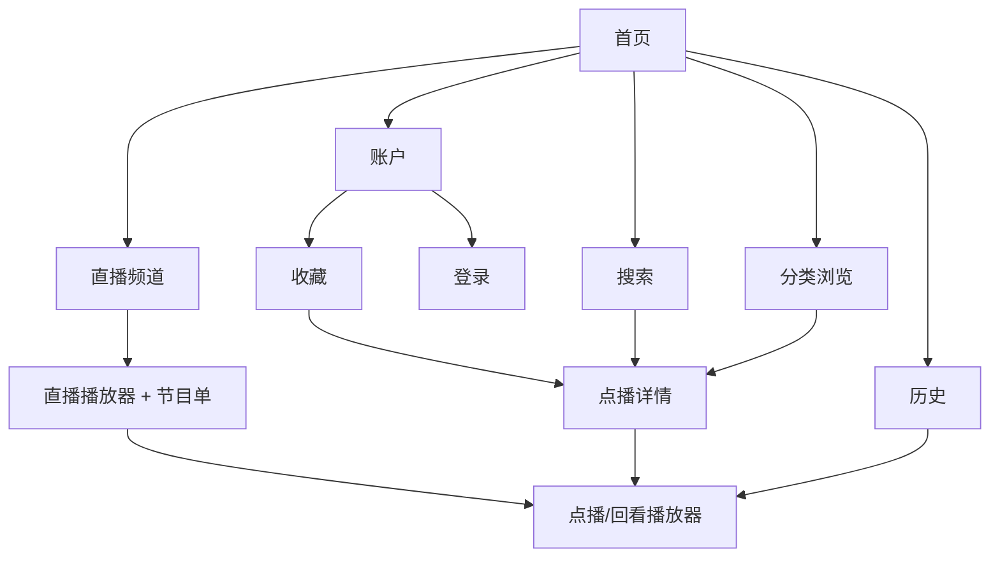

# Olevod Android TV：产品与代码设计

版本：v1，2026-09-07。本文为实现规格与代码草案，不是已实现、已编译的 App。
接口事实见 [API_RESEARCH.md](API_RESEARCH.md)，执行顺序见 [EXECUTION_PLAN.md](EXECUTION_PLAN.md)。

## 1. 已确认需求与默认决策

| 项目 | 决策 |
| --- | --- |
| 用途 | 个人侧载 Android TV APK |
| 目标设备 | **Google Chromecast with Google TV**，用户最后更正覆盖此前 Streamer 信息；4K/HD 版本待确认 |
| 首版内容 | 普通点播、短剧、连续剧、综艺、动漫、VIP 蓝光、直播 |
| 首页 | 推荐 + 每个点播分类最近更新 10 部，每类两行、每行五张 |
| 登录 | 电视直接输入账号、密码、图片验证码 |
| 导航 | 遥控器 D-pad、确定、返回、媒体键，完整无触屏操作 |
| 架构 | Kotlin + Compose for TV + Media3，App 直接访问网站接口 |
| 云端服务 | 首版无需自建后端；不依赖电脑 Chrome 常驻或复用其 cookie 文件 |
| 历史 | App 完整本地保存；网站账户记录按接口实际能力接入 |
| 搜索输入 | 系统中文输入法 + 图示风格字母数字键盘；拼音匹配单独验证 |

三张参考图只借鉴空间分配、深色风格和导航方式。图片中的广告、VIP 推销、弹幕、下载、评论及品牌元素不是用户新增需求。
首版不默认包含评论发布、弹幕发送、离线下载、支付、会员购买、注册/找回密码或 Google TV 主屏内容推荐集成。
网站赛事入口保留可发现性，但赛事独立播放/回放需 P0 核实；若与频道协议不同，将补充适配工作，不以电视频道成功宣称赛事全支持。

## 2. 信息架构



详情与播放共享信息组件，播放器中的右侧信息栏可以进入选集或相关推荐。返回必须恢复来路的卡片、筛选条件和滚动位置。

## 3. 视觉系统与布局基线

设计基线为 960×540 dp 的 16:9 界面，实际采用约束布局与系统密度适配；视频输出分辨率独立于 UI。默认横屏。
背景 `#101B22`，表面 `#1B2932`，主文字 `#F5F7FA`，次文字 `#ADB9C2`，强调色 `#42D778`。对比度需实机/自动检查，不能仅凭色值判断。
左右安全边距 40dp、上下 24dp；卡片间距 16dp；基础圆角 10dp。标题建议 24–30sp，卡片标题 16sp，标签不低于 14sp。
焦点：2dp 高对比外框 + 约 1.04 倍放大 + 文字强调，动画约 120ms；父容器预留放大空间，防止裁边。选中状态用填充与标记，和焦点外框区分。
禁止背景自动预播、同时运行多个播放器或整页大模糊效果。海报按展示尺寸解码，虚拟列表只预取临近内容。

### 3.1 首页

```text
┌ 搜索  历史  收藏                         账户 ┐
│ 首页 直播 短剧 电影 连续剧 综艺 动漫 VIP蓝光   │
│ [          推荐横幅 A         ][ 横幅 B ]   │
│ 电影 · 最近更新                         更多 │
│ [海报1] [海报2] [海报3] [海报4] [海报5]     │
│ [海报6] [海报7] [海报8] [海报9] [海报10]    │
│ 连续剧 · 最近更新 ……（向下滚动）             │
└────────────────────────────────────────────┘
```

每分类作为完整的 2×5 分组，不要求横幅与两行海报同时挤在一屏。向下滚动后，分类标题及两行海报应可完整阅读。
顶部导航的焦点移动不立即切页；按确定再进入分类，避免路过选项触发请求。推荐不自动抢焦点。
数据取服务端最近更新前 10；不足 10 则展示实际数量。分类 ID、名称、图片根地址来自元数据；每个分组独立加载和重试，失败不遮住整个首页。
直播分组展示频道/当前节目，不称为“最新影片”；可选显示最近观看频道。推荐图缺失时使用海报和文字回退，不强行拉伸竖图。

### 3.2 浏览页

顶部保留分类栏。正文上方放紧凑的筛选摘要及“筛选”入口，点击展开筛选面板：分类、地区、年份、类型、首字母、会员/免费。选择依赖类别的可用值，切换分类时清除不合法旧值。
排序独立一行：最近更新 / 最近添加 / 最热 / 评分，与网站服务端排序映射。按确定应用筛选，关闭面板后聚焦结果首卡。
结果用 5 列海报网格，显示标题、版本/更新集数、评分、VIP 标识；未知评分显示“暂无评分”，不能伪装为 0 分。
列表分页加载，接近尾部才预取；以内容 ID 去重，但不合并不同 ID 的普通版/VIP 版。加载新页不重排已有焦点。底部失败提供“重试本页”，保留已加载项目。
返回筛选面板时恢复之前选项；返回首页恢复原位置。长年份列表放面板内滚动，不让用户穿越几十个选项才到结果。
直播独立使用频道类别（央视/地方等）、最新/热度/推荐；不伪造影片年份、评分筛选。

### 3.3 点播详情与播放器

详情页显示海报、标题、版本、年份/地区/类型、评分、主演、导演、简介、播放/继续观看、收藏及剧集。
点击播放进入下列布局；默认不自动播放相关推荐。

```text
┌───────────────────────────┬────────────────┐
│                           │ 标题 / 版本    │
│        视频区域 16:9       │ 评分 年份 地区 │
│                           │ 简介（展开）   │
├───────────────────────────┤ 剧集 / 线路    │
│ 进度条                    │ [1][2][3][4]   │
│ -30 播放/暂停 +30 倍速     │ ……             │
│ 全屏 收藏                 │ 相关推荐       │
└───────────────────────────┴────────────────┘
```

左侧约 68%、右侧约 32%。全屏隐藏右栏，保留同一个 player 实例，切换不重建视频、不归零。
速度初始档位：0.5、0.75、1、1.25、1.5、1.75、2 倍；实际受媒体可用命令约束。优先保留音调，记录用户选择。
快进后退目标为当前时间 ±30,000ms，限定在有效 seekable 范围；长按只按受控重复频率积累，不在每次按键立刻发起网络重载。
集数过多时按 50 集分段，集数为服务端 index，不假设零起点或永远连续。播放结束默认自动下一集，设置内可关闭；最后一集不跳到推荐影片。
字幕、音轨、分辨率菜单只展示播放器实际报告的轨道；“超清/VIP蓝光”文案不能当作 4K、HDR 或多音轨证据。
断网显示“正在重连”，允许重试/退出；403 类错误先重新解析授权一次，仍失败则明确区分需登录、会员不足、资源失效与网络错误。

### 3.4 直播与回看

频道浏览使用 16:9 缩略图，显示频道名和当前节目；频道列表与点播内容使用不同 ID 类型。
右侧节目单包含日期、节目开始时间、标题、直播中/回看/未开始状态。请求日期使用验证后的站点时区，展示时明确时区，避免 Mac/电视本地日期与节目单差一天。
直播默认贴近 live edge；实时模式只开放 pause、全屏、收藏和回到直播。±30s 仅当有足够 DVR seekable 窗口才显示，倍速默认关闭；回看进入 VOD 控制模式。
回看先通过 programmeId 与 stream_id 请求授权；过期、不可回看、空节目单各有独立状态。直播列表的 liveHasVod/liveAlive 不作为唯一可用性判断。
直播收藏、历史与影视分别存储；恢复频道历史默认播放当前直播，只有明确的节目回看记录才续播旧节目。

### 3.5 搜索

左侧约 30% 放输入框、清空、退格、字母数字键盘及“中文输入”；右侧显示热搜/搜索历史或结果网格。
系统中文输入法是中文输入的基本路径；Google TV 遥控器语音/手机遥控输入作为系统输入法能力使用，不承诺自行实现系统级语音搜索。
键盘采用参考图的六列字母数字布局。原站全拼和缩写搜索尚未确认：在验证前不显示“支持拼音首字母”承诺，不通过下载全站片库建立拼音索引。
联想使用约 350ms 防抖，确认后发正式搜索；取消过期请求，旧响应不能覆盖新关键词。搜索词按 URL segment 编码，不能直接拼路径。
右侧热搜可选后直接搜索；结果显示普通/VIP版本标签、海报、标题与年份。空结果和请求失败分开；短暂 loading 不显示“没找到”。
App 搜索历史仅本地保存，最多 30 个去重词，提供清空。不会自动导入 Chrome 搜索记录。

### 3.6 历史与收藏

历史提供“影视 / 频道”和来源标识，按最后观看时间降序，按今天/更早分组，卡片显示集数、进度及继续播放。
本地数据库保存 App 产生的全部记录，无网页 18 条截断；按分页展示。剧集进度以 `(accountScope, mediaKind, contentId, episodeId)` 存储，列表按影片聚合到最近一集。
云端读取通过后追加同步范围说明；不能读取时显示“此设备历史”，已有云端部分记录可明确单列。未登录使用 guest 分区，不在登录后静默把 guest 全部上传。
同步冲突按可信 updatedAt 选择较新事件，不能简单取最大 position，因为用户可能重看。未知服务端时间语义时分别保留而不覆盖；outbox 按账户隔离，切账号不得串写。
播放器每 15 秒、暂停、切集、退出时保存本地进度；远端合并节流。失败保留待同步状态，重试必须避免重复副作用。
收藏展示影视和频道分栏。操作开始显示处理中，成功再定稿，失败回滚；没有验证幂等语义前不盲目重复 POST。
历史删除/清空为用户主动功能，App 内有明确确认；本地删除与云端删除范围分别说明，未验证云端删除时不提供“全部设备清空”。

### 3.7 登录与设置

账号、密码、验证码、刷新验证码、登录按顺序可聚焦。验证码放大可读，系统输入法能返回表单；错误保留账号，清除失效验证码，显示可理解的错误。
进入登录后完成用户本人登录；不从电脑导出密钥作为 App 配置。没有扫码设备码 API，首版不做扫码。
会话失效跳到登录并保存原意图，成功后返回原影片/收藏动作；只自动恢复一次，不形成登录循环。
设置包含账号状态/退出、自动下一集、默认速度、缓存清理和版本信息。退出清除会话与当前账号的内存数据，账户隔离的历史不交给下一账号。

## 4. 遥控器交互契约

| 场景 | 上下左右 | 确定 | 返回 |
| --- | --- | --- | --- |
| 首页/网格 | 按空间移动；上下保留最近列 | 打开目标 | 恢复上一级；首页再按返回交回系统 |
| 顶部分类栏 | 左右选择，下进内容 | 进入所选分类 | 返回上一页面 |
| 筛选面板 | 面板内移动，不漏到背景 | 选值或应用 | 放弃未应用修改，回到筛选按钮 |
| 输入法显示 | 交给系统 IME | IME 行为 | 先收起 IME，再返回页面 |
| 全屏视频，控制隐藏 | 左右 ±30s（可 seek 时）；上/下显示控制 | 显示控制并聚焦播放按钮 | 退出全屏 |
| 控制显示 | 移动控件焦点 | 执行当前控件 | 先关闭弹层，再隐藏控制 |
| 进度条焦点 | 左右每次 ±30s；上下离开进度条 | 确认 seek 预览 | 取消预览 |
| 直播无 DVR | 显示控制，不执行 seek | 控制操作 | 按播放器层级返回 |
| 倍速/选集弹层 | 仅弹层内移动 | 选择并关闭 | 关闭并恢复触发按钮 |

媒体播放/暂停键始终通过 MediaSession 分发；焦点在视频以外的按钮时不重复触发。音量键交给系统。
控制条空闲约 5 秒隐藏；打开菜单、暂停、错误或无障碍操作时不自动隐藏。每次按键只由一个层级消费。
所有 focus key 使用稳定内容 ID，分页或刷新不得用数组位置作为身份。记录每条路由的 focus key 与 scroll anchor；内容下架时回退到最近可见项。
测试必须仅用遥控器完成登录→搜索→选集→播放→全屏→返回→历史续播闭环。

## 5. 代码架构

采用单 Activity、单向状态流：Compose Screen → ViewModel/StateFlow → Repository → API/Room。初期采用少量 Gradle 模块，功能包隔离，避免每个页面一个模块的构建负担。

```text
app/                         Activity、导航、依赖装配、TV manifest
core/model/                  领域模型、标识类型、能力和错误
core/data/                   网络 DTO、OlevodAdapter、Room、会话、同步
core/playback/               Media3、流解析、播放器状态、MediaSession
core/ui/                     TV 卡片、焦点、主题、分页/空态组件
app/.../feature/
  home/ browse/ detail/ player/ live/ search/ history/ favorites/ account/
```

推荐依赖：Kotlin Coroutines/Flow、Compose for TV、Media3 ExoPlayer/HLS/Session、OkHttp、kotlinx.serialization、Room、DataStore、Coil。实施时锁定兼容的稳定版本到 version catalog，不使用浮动版本；此文不把未经构建验证的版本组合定为最终配置。
最低版本暂定 API 26；compile/target SDK 在创建工程时根据工具链确认。发布目标为用户设备，不因此假设所有旧 Android TV 都可正常运行。

### 5.1 关键领域契约（设计草案）

```kotlin
@JvmInline value class VodId(val value: Long)
@JvmInline value class ChannelId(val value: Long)
@JvmInline value class EpisodeId(val value: Int)

enum class SortOrder { UPDATED, ADDED, HOT, SCORE }
data class BrowseQuery(
    val categoryId: Long,
    val area: String? = null,
    val year: String? = null,
    val typeId: Long? = null,
    val initial: String? = null,
    val membership: MembershipFilter = MembershipFilter.ALL,
    val sort: SortOrder = SortOrder.UPDATED,
)
enum class MembershipFilter { ALL, FREE, MEMBER }
data class Page<T>(val items: List<T>, val nextPage: Int?, val total: Int?)

sealed interface PlaybackTarget {
    data class Vod(val id: VodId, val episode: EpisodeId) : PlaybackTarget
    data class Live(val id: ChannelId, val streamId: String) : PlaybackTarget
    data class Replay(val id: ChannelId, val streamId: String,
                      val programmeId: Long) : PlaybackTarget
}

// 不使用 data class，避免自动 toString 泄露带签名的媒体 URL。
class ResolvedStream(
    val uri: android.net.Uri,
    val mimeType: String?,
    val expiresAt: java.time.Instant?,
    val headers: Map<String, String>,
) { override fun toString() = "ResolvedStream(<redacted>)" }

interface PlaybackResolver {
    suspend fun resolve(target: PlaybackTarget): ResolvedStream
}
interface CatalogRepository {
    suspend fun browse(query: BrowseQuery, page: Int): Page<VodSummary>
    suspend fun detail(id: VodId): VodDetail
    suspend fun search(query: String, categoryId: Long?, page: Int): Page<VodSummary>
}
interface HistoryRepository {
    fun observe(scope: AccountScope): kotlinx.coroutines.flow.Flow<List<WatchEntry>>
    suspend fun record(entry: WatchEntry)
    suspend fun sync(scope: AccountScope): HistorySyncResult
}
```

`VodSummary/VodDetail/AccountScope/WatchEntry/HistorySyncResult` 在实施时按本节与 API schema 定义；这里不是可直接编译的完整源码。
身份必须区分点播、频道和回看节目，避免相同数字 ID 碰撞。DTO 可容忍未知字段；映射校验关键 ID、URL、分页，空标题提供占位，不把坏数据抛成整页崩溃。
评分来源分别保留站点评分和豆瓣评分，不混用；时间 DTO 保持原始单位，转换集中在 adapter，领域层全部使用毫秒/Instant。

### 5.2 API 隔离及错误模型

`OlevodAdapter` 封装站点数字枚举、路径位置、请求时间签名、会话拆分、动态域名与业务错误。ViewModel 不拼接 API 路径。
能力对象区分 supported/unsupported/unverified，包含 cloudHistory、pinyinSearch、replay 等；只有验证通过才开启对应完整功能。
错误类型：NetworkUnavailable、Timeout、RateLimited、LoginRequired、MembershipRequired、ContentUnavailable、UnsupportedStream、ProtocolChanged、Unknown。未知业务 code 保留脱敏诊断，不全部重定向登录。
GET 可做有界指数退避；取消请求立即传播。POST 是否重试取决于验证后的幂等语义；收藏未知结果先读取现态再决定。
仅 API origin 使用鉴权拦截器。媒体重定向遵循独立允许策略，带凭据头不跨 origin 转发。正常 TLS 校验开启。

### 5.3 数据持久化

Room 表：`watch_progress`、`watch_recent`、`favorite_cache`、`sync_outbox`、`catalog_cache`。数据库 schema 可迁移。
`watch_progress` 主键含 accountScope、kind、contentId、episode/programme；保存 positionMs、durationMs、updatedAt、来源及同步状态。
DataStore 保存非敏感偏好。会话 token 使用 Android Keystore 保护的密钥加密存储，关闭相关文件云备份；不保存密码。用户记录只存在应用私有目录，无默认遥测。
缓存建议：目录 10 分钟、元数据 24 小时，仍可 stale-while-revalidate；直播节目单按当前节目边界刷新。私有详情/会员状态不能共享到其他账号；播放授权不作为长期离线内容缓存。
图片磁盘缓存初始上限约 150MB，可清理；内存占用根据 Chromecast 实测调整。

### 5.4 播放生命周期

状态机：Idle → Resolving → Preparing → Playing/Paused ↔ Buffering → Ended/Error。
界面换全屏只换布局，不换播放器。切集先落盘进度、取消旧解析，再替换 MediaItem。仅一个活动视频 Surface，优先 SurfaceView 并实测 Compose 容器焦点。
Activity 不可见时暂停并保存进度，首版不做后台音频播放；释放时注销 listener/MediaSession，回来重新解析必要授权并恢复位置。
音频焦点丢失暂停，播放时保持屏幕唤醒，停止/暂停时遵循 Ambient Mode。系统媒体键由 MediaSession 处理。

## 6. 兼容性与验收目标

Google TV/Android TV 启动入口、TV banner、横屏、无需触摸屏声明以及互联网权限必须正确配置。使用 TV 专用可聚焦组件，不能直接套手机触控布局。
Google 官方建议 TV 播放接入 MediaSession；Media3 支持 HLS，但实际编码解码仍受设备影响。[TV 播放指南](https://developer.android.com/training/tv/playback)、[Media3 格式支持](https://developer.android.com/media/media3/exoplayer/supported-formats)。
主验收设备为用户的 Chromecast with Google TV，4K/HD 和 OS 版本在 P0 读取确认。4K/HDR 属于条件验收：设备、显示器、HDMI 链路与片源都满足才要求输出，不以“蓝光”标签推定能力。

目标值（是验收预算，不是已测成绩）：焦点反馈 <100ms；缓存首页可交互 <2秒；网络稳定下首屏主要内容 <5秒；典型 HLS 首帧 <8秒，超时反馈清晰；连续播放 30 分钟无持续内存增长或音画失步。
中文长标题、空图、无评分、数百集、空历史、无会员、登录失效、弱网、长时间暂停恢复、分页中返回、系统 Home 再返回都纳入验收。

## 7. 剩余决策与技术闸门

用户决策已落实：包含直播/VIP，最新=最近更新，直接登录，设备更正为 Chromecast。
4K/HD 版本未确认，暂以 1080p/低内存设计预算推进。
以下是工程验证项，不能让用户猜 API：全部云端历史是否可读、字段单位、筛选参数位、拼音缩写、赛事链路、片源授权和原生解码。
若 P0 证明某要求站点不支持，先记录具体响应与替代方案，只有改变用户范围的取舍才再请用户决定；不能在实现中静默删掉功能。


## 最新界面修订（用户确认，覆盖早期对应设计）

- 顶部六个导航按钮未聚焦时仅显示图标，聚焦时展开图标和标题，均有可访问标签；目录直接选择电影分类。
- 分类采用参考照片中的上方分行筛选和下方竖版海报结构，沿用深绿主题。只呈现欧乐已验证的排序、分类、类型、地区、年份、会员范围和首字母条件。
- 搜索采用左侧字母数字键盘、中间联想词、右侧两列竖版影片的三栏结构，保留中文及系统输入法入口。
- 分类和搜索取消翻页按钮，触达末行时追加下一批；失败保留已有结果。进入影片再返回保留缓存、滚动和焦点。列表底部64dp留白，聚焦时完整显示海报、标题和年份。
- 用户名和密码按用户明确要求保存到独立Keystore/AES-GCM加密存储。退出登录保留；清除记忆与保存使用同一队列，并等待清除落盘。验证码不记住，登录页直接提供数字遥控键盘。
- 点播控制顺序：全屏、播放暂停、后退30秒、前进30秒、后退5分钟、前进5分钟、速度、收藏；默认焦点全屏。
- 简介最多4行且高度不超过90dp；标题和演职员各最多2行，首屏保留选集入口。
- 直播源稳定性排查按用户要求暂缓；保留已实现功能和真实失败记录，不影响本轮新增界面交付。

- 筛选上下键严格进入相邻行（保持选项序号，短行取末项），长行左右可横向滚动；搜索键盘显式指定四向焦点，并支持建议词与结果区往返。
- 本机和网站历史使用完整影片卡片：封面、可用年份/地区/评分、更新备注、集数和观看进度；网站缺失资料按可见项补查详情，最多3个并发。

- 首页第一项为最近播放：当前账号本机最新10条横排，显示观看进度并可续播；其后依次为推荐和分类。
- 全屏上键立即隐藏控制栏（暂停时也可）；下键/确认键唤醒，返回键退出全屏。

- 全屏控制栏采用底部半透明渐变叠层，不参与视频区域测量；显隐时视频位置和尺寸固定。
- 全屏控制栏右侧显示当前视频轨道分辨率与可用码率。平均码率优先，仅有峰值则标明；缺失值如实显示，不能拿下载带宽代替。
- 品牌使用官网当前原始Logo及favicon，本地随APK打包；来源和哈希见BRAND_ASSETS.md。
- Homepage order: 最近播放 → 精选推荐 → 电影 → 电视剧 → 综艺 → VIP → 短剧. Home-only ordering uses API category IDs; directory retains complete categories and original API names.
- Recent-playback Up targets Home in the category navigation row (首页、直播、短剧、电影…), not the top icon bar. Category Home Up reaches the top Home icon; top Home Down returns to category Home. Category Home Down remounts the recent row before restoring its last card, including after returning from a deeply scrolled page. Empty history uses View all as the entry target.
- Episode selection appears below the player controls in normal and fullscreen modes: choose a ten-episode range, then select an episode. Browsing a range alone does not switch playback.
- Search suggestion confirmation submits that title and, once matching results arrive, scrolls the right list to its beginning and focuses its first movie. Plain letter input does not trigger this focus jump. Back on the search page first focuses the query box; Back again from the query box exits the page. Input changes/Back/Chinese-input action cancel pending focus transfer; no-result/error returns focus to the query box.
- Category navigation now opens a category mini home for VOD categories. Each mini home has current-calendar-year popularity and score rankings, up to10 movies each: top2 as large hero cards, followed by the remaining8 in four-column rows. Bottom Browse all opens the category directory without the ranking's year restriction. Directory Back returns to the originating mini home.
- Middle navigation order is 首页、直播、电影、连续剧、综艺、动漫、VIP蓝光、短剧; short dramas stay last in home sections as well. Live routing remains unchanged/deferred.
- Back from the root home opens exit confirmation. Continue watching is initially focused; OK cancels, Right selects Exit application, and Back dismisses. The dialog switches to keyboard input mode before initial focus to support touch-to-remote transitions. Confirming exit finishes MainActivity.
