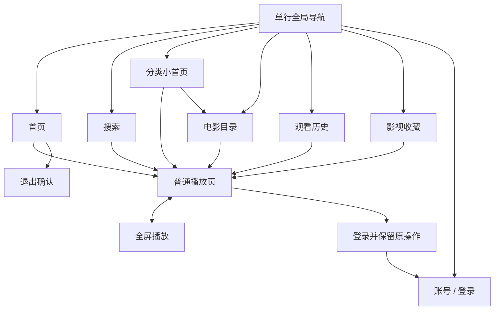

# 欧乐 TV · UI v2 开发设计规范

版本：`2.0-design` · 日期：2026-09-08 · 状态：设计稿已获用户认可，本文为后续实现基线。

**这不是已实现功能说明，也不是新的 APK 版本。** 本次只交付规范、设计参数、设计稿和验收清单。`v0.1` 已发布界面的实际行为仍以项目 README 和对应版本代码为准。

配套文件：[设计稿索引](README.md) · [视觉参数 tokens.json](tokens.json) · [验收与开发检查点](ACCEPTANCE.md) · [图片来源与校验](assets/manifest.json)。

## 阅读与裁决规则

1. 用户后续明确修改 > 本文的行为与数值约束 > 已认可设计稿的视觉意图 > 早期文档。
2. 设计稿确定色彩、层次、空间关系与交互方向；图片中的生成文字、影片数据、像素误差不能变成 API 或布局事实。
3. 本文中的尺寸为**开发基准值**，不是对生成图片逐像素测量的宣称。实现以等比图片、完整焦点、可读文字和约束布局优先。
4. 未单独出稿的分类小首页、收藏、首次登录及异常状态，使用本文定义的组件与交互补齐；它们是规范补充，不能标为已完成截图验收。
5. API 能力依据本仓库当前适配器与验证记录整理，本次未重新登录网站或重新验证线上接口。接口变化必须由适配层处理，不靠 UI 猜参数。

| 查找内容 | 章节 |
| --- | --- |
| 范围、旧规则覆盖、导航结构 | 1–3 |
| 颜色、单位、字体、图片与组件 | 4–5 |
| 焦点、返回、滚动、生命周期 | 6 |
| 首页与分类小首页 | 7–8 |
| 目录与筛选 | 9 |
| 搜索 | 10 |
| 普通／全屏播放与选集 | 11 |
| 历史、收藏、登录 | 12–14 |
| 弹窗、错误、无障碍、性能 | 15–18 |
| API 映射、代码落点、交付范围 | 19–22 |

## 1. 产品范围与不可退化要求

目标设备为 **Google Chromecast with Google TV**；本仓库已有 sabrina、Android 14 的实机记录。UI 基线为横屏 16:9，支持 Google TV 遥控器完整操作。4K 视频解码、HDR 或音频能力不由 UI 设计推导。

| ID | 硬性要求 |
| --- | --- |
| R01 | 全局导航合并成一行；搜索位于“首页”左侧；冷启动默认聚焦首页。 |
| R02 | 只在首页“精选推荐”使用真正横幅素材；其他影片使用完整竖版海报。视频画面不属于海报。 |
| R03 | 最近播放位于首页第一节；默认展示最近五部＋最后一张“全部历史”；每部默认显示集数／已看时间。 |
| R04 | 聚焦最近播放时展开信息；不压窄其他海报，不改变下一节的垂直位置。 |
| R05 | 首页顺序为最近播放、精选推荐、电影、电视剧、综艺、VIP、短剧；短剧在最后。 |
| R06 | 分类导航进入该分类小首页：当年人气前十、当年评分前十，各榜前二突出，最后“浏览全部”。 |
| R07 | 目录由标题分类切换＋常用筛选一行＋浮层组成，保留网站实际七个维度。 |
| R08 | 内容列表连续加载，没有上一页／下一页按钮；最后一行海报、标题和焦点框完整可见。 |
| R09 | 搜索保持键盘、联想词、结果三栏；确认联想词成功后聚焦首个结果；返回先到输入框。 |
| R10 | 播放按钮严格为全屏、播放／暂停、−30秒、+30秒、−5分钟、+5分钟、速度、收藏。默认全屏。 |
| R11 | 普通模式控制区按上聚焦视频，确定进入全屏；简介限高。 |
| R12 | 选集在控制区下方，十项一组；选分组不播放，选具体集数才播放；全屏同样可用。 |
| R13 | 全屏控制是半透明覆盖层，不改变视频几何尺寸；主控制区按上隐藏。 |
| R14 | 全屏右侧显示播放器当前轨道的分辨率及可用码率，只有峰值时明确标“峰值”。 |
| R15 | 历史包含海报、影片信息、集数与进度；本机和网站账号历史分开。 |
| R16 | 账号密码在本机安全记住；再次登录优先只输入新验证码；保留更换和清除入口。 |
| R17 | 使用仓库中官网原始 Logo，不使用生成图里的重绘字形作为资源。 |
| R18 | 根首页返回弹出退出确认，默认“继续观看”；返回取消。 |

直播／回看稳定性按用户要求暂缓，本次新版主导航不安排直播入口，不扩展频道功能；不删除已有服务层代码或频道数据。支付、注册、找回密码、下载、评论、弹幕、二维码登录、独立语音服务、自建后端、推荐自动预播均不在本次范围。

## 2. 与旧规格的差异及实现现状

下表必须在开发开始前阅读，不能同时实现冲突规则。

| 旧文档或 v0.1 行为 | v2 目标 |
| --- | --- |
| 顶部图标栏＋第二行分类 | 单一全局导航；近期列表向上回该行“首页” |
| 七行全部展开的目录筛选 | 分类标题下拉＋五个常用入口＋按需浮层 |
| 普通卡片使用不同宽高比并裁剪 | 统一竖版容器、原图等比完整显示 |
| 最近播放最多十部横向卡 | 最近五部＋历史入口；聚焦横向扩展 |
| 分类小首页用竖图填横幅 | 前二用“竖图＋旁侧文案”的宽卡，不裁成横幅 |
| 早期播放器右侧选集／五十集一组 | 控制下方，十项一组，普通与全屏共享 |
| 早期不保存密码 | 保留已实现的 Keystore 加密凭据记忆 |
| 网站历史与收藏手动翻页 | v2 也改为累计式连续加载，不能只替换页码文案 |
| 早期规划 Room、离线 outbox、全面设置页 | 不因 UI 改版强制新增这些系统；保留当前存储与明确限制 |
| 两层导航 README 截图 | 属于 v0.1 运行截图，不能改标为 v2 运行成果 |

现状基线：目录和搜索已存在追加加载；云历史与影视收藏仍有页码替换逻辑。密码记忆、分组选集、全屏覆盖及退出确认已有基础实现。本文要求补齐或重构的行为都必须重新验收，不能因为已有函数就视为完成。

## 3. 信息架构与路由



不新增“先详情、再点播放”的中间路由。选影片直接进入普通播放页，加载详情并按续播规则准备播放。右侧简介属于播放页。

建议使用具名状态而非字符串拼接：`Home`、`CategoryHome(categoryId)`、`Catalog(query)`、`Search`、`History(source)`、`Favorites`、`Account(returnIntent?)`、`Player(movieId, origin, resume?)`。全屏是同一 Player 的展示状态，不另建播放器实例。

每条路由保存：来源路由、来源内容稳定 ID、筛选／搜索参数、滚动锚点、最近焦点、弹层触发者。用户从全局导航主动进入新页面时，返回默认回首页；从“浏览全部”进入目录则返回分类小首页；从影片返回必须回实际来源。

## 4. 视觉基础

### 4.1 单位、视口与安全区

| 项目 | 基准 |
| --- | --- |
| 逻辑画布 | 960 × 540 dp，16:9 |
| 设计审阅截图 | 通常 1920 × 1080 px；生成图原文件为 1672 × 941 px |
| 水平安全区 | 左右 36 dp；内容可用宽约 888 dp |
| 顶部／底部安全区 | 最少 24 dp；全局 Header 自身包含顶部留白 |
| Header | 高 64 dp，内容固定一行；正文从 Header 后开始 |
| 网格列表底部 contentPadding | 64 dp，覆盖焦点描边、标题、元信息及滚动余量 |
| 焦点外扩空间 | 至少 4 dp，任何父级不得裁掉描边 |
| 标准行列间距 | 12／16／18／24 dp 按页面表使用 |
| 大字体适配 | 优先增高文本区和滚动；必要时减少可见列数，不能缩小字号或截断焦点 |

以上是密度无关布局。1080p 测试设备常见比例接近 1 dp = 2 px，但实际必须读取系统密度，不能在 Kotlin 中写死 px/2。4K 屏也不把 dp 数值翻倍；视频输出尺寸与 Compose 尺寸独立。

图片允许滚动过程暂时离开视口，但**滚动停止时当前聚焦项的完整图片、标题、辅助文字和焦点框必须全部可见**。静态设计稿不以半张海报作为“还有内容”的唯一提示；使用向下提示或自然滚动。

### 4.2 颜色、字体与形状

| Token | 值 | 用途 |
| --- | --- | --- |
| `color.background` | `#101718` | 页面底色 |
| `color.surface` | `#1B2526` | 键盘、历史条目、输入区 |
| `color.textPrimary` | `#F3F6F5` | 标题、操作名称 |
| `color.textSecondary` | `#99A7A8` | 年份、地区、说明 |
| `color.focus` | `#66E681` | 唯一当前遥控器焦点 |
| `color.onFocus` | `#101718` | 绿色填充上的文字／图标 |
| `color.border` | `#344143` | 未聚焦输入／按钮边界 |
| `color.warning` | `#E8BC68` | 需要处理的提示，不用于普通 VIP 装饰 |
| `color.error` | `#FF9C96` | 错误说明，必须同时有文字 |

字体沿用 Android 系统 sans-serif 中文回退；不引入未许可字体。字重常规 400、中等 500、标题 600／700。不把整页文字都加粗。

| 文字角色 | 字号／行高 |
| --- | --- |
| 页面标题 | 28 / 36 sp |
| 区块标题 | 22 / 28 sp |
| 推荐横幅标题 | 28 / 34 sp，最多两行 |
| 播放信息标题 | 24 / 30 sp，最多两行 |
| 正文／导航 | 16 / 22 sp |
| 海报标题／控制标签 | 14 / 19 sp |
| 元信息／提示 | 13 / 18 sp；主要决策信息不得低于此值 |

海报圆角 8 dp；普通按钮、键盘键、输入框 8 dp；大记录条目 10 dp；浮层 14 dp；选中导航可使用胶囊。描边普通 1 dp、焦点 2 dp。默认不缩放海报，不靠放大制造焦点；最近播放扩展是专门的布局状态。

### 4.3 焦点、选中与播放中必须区分

| 状态 | 视觉 |
| --- | --- |
| 遥控器当前焦点：按钮／键盘／词条 | 绿色实心、深色文字 |
| 遥控器当前焦点：海报／历史续播区域 | 完整的 2 dp 绿色外框；不裁图、不改变相邻布局 |
| 当前页面／当前筛选／当前分组 | 细绿色下划线或安静的勾选，不使用焦点实心块 |
| 正在播放的集数 | 小均衡器图标＋绿色集数，无焦点边框 |
| 未聚焦的主要操作 | 白色文字、安静深色底；不能长期涂满焦点色 |
| 不可用操作 | 弱化底色和文字，附明确原因；不能伪装成加载 |

同一窗口只有一个可操作焦点；浮层打开后焦点只能在浮层内。绿色评分是数据强调，不能附与海报相同的焦点描边。

### 4.4 图片与品牌资产

- 主标识使用 `app/src/main/res/drawable-nodpi/official_olevod_logo.png`，原始 364×64，参考显示宽 120 dp、高度按原比例计算。不得从生成图裁出 Logo，也不得换成 OLE TV 字样。来源见 [品牌资产说明](../BRAND_ASSETS.md)。
- 影片海报默认容器宽高比 **2:3**，`ContentScale.Fit` 或等效 contain。原图不同比例时，在同一深色容器中留边，不能 `Crop`、拉伸或把竖图改成横图。
- 只有首页真正的推荐横幅允许使用 banner 素材。优先保持横幅完整构图；容器不匹配时用同色背景承接，不把人物裁掉以追求铺满。
- 只有最近播放允许在竖海报底部叠加“第几集／已看时间”；阴影渐变仅覆盖底部约四分之一，不遮挡主体。其他卡片的分数、年份与更新信息放在图外。
- 海报失败：保持原尺寸，显示安静图片占位图标；标题与操作仍可用。重试图片不刷新整个列表，不让焦点消失。
- Banner 缺失：用完整竖海报＋旁侧标题组成宽卡；禁止拿低清竖海报裁满推荐位。
- 图中片名、演员、评分、进度、统计数量是示意，运行时全部由 API／本地记录生成。不因插画内容生成假的影片信息。

## 5. 共享组件规格

| 组件 | 构成与约束 |
| --- | --- |
| `UnifiedHeader` | 官网 Logo＋搜索＋首页／电影／电视剧／综艺／动漫／VIP／短剧＋目录／历史／收藏／账号。 |
| `PosterTile` | 完整海报＋最多两行标题＋一行元信息；列表项整体是一个焦点目标；布局高度按最长允许文字统一预留。 |
| `RecentTile` | 海报底部进度说明；标题图外；支持下文的展开态；使用独立于普通片单的焦点身份。 |
| `RecommendationBanner` | 真实横幅、底部左侧大标题和更新说明、轻渐变；两张等宽，不轮播、不自动预播。 |
| `FilterTrigger` | 标签、当前值、下箭头；焦点只影响视觉，不应用参数；例如“年份：全部”。 |
| `OptionPopover` | 标题、选项网格／列表、当前已应用值、一个焦点；限制高度并内部滚动；不参与背景测量。 |
| `HistoryEntry` | 完整小竖图、片名、可用元信息、集数／时间、进度条；续播和本机删除是两个独立操作目标。 |
| `PlayerAction` | 图标上、短标签下；八项一行完整显示；固定外框尺寸，暂停／播放文案切换不跳动。 |
| `EpisodeSelector` | 分组一行、集数一行；十项一组；焦点、选中组、当前播放分别表示。 |
| `CaptchaKeypad` | 三列数字键盘；1–9，最后一行退格／0／清空；单独登录按钮。 |
| `InlineState` | 加载、无内容、错误的页面内状态；不随意使用阻断弹窗。 |
| `ConfirmDialog` | 标题、后果说明、取消／确认；取消默认聚焦；确认只对目标范围生效。 |

`PosterTile` 的标题优先两行；超长名称用省略号，并在焦点停留约 800ms 后使用一次缓慢跑马灯或同位置完整文字层，不无限滚动、不改变卡片高度。屏幕阅读器始终读完整名称。元信息缺失就省略，不用一串“未知”占满每张卡。

所有文本按钮的可聚焦区域至少 36×36 dp；常用按钮高 40–48 dp。装饰图标、区块标题、评分、进度条不单独占焦点。大文本模式时可提高行高并减少一屏可见数量。

## 6. 全局焦点、返回与滚动契约

### 6.1 单行导航

按顺序：**Logo（非焦点）→ 搜索 → 首页 → 电影 → 电视剧 → 综艺 → 动漫 → VIP → 短剧 → 目录 → 历史 → 收藏 → 账号**。

- 默认冷启动聚焦“首页”，不触发额外点击；内容加载成功不抢走该焦点。
- 分类名称保持可见。搜索、目录、历史、收藏、账号默认只显示图标；焦点停留时展开对应标题，移开收回。当前类别的下划线与真正焦点分开。
- 参考尺寸：Logo 120 dp；工具图标可聚焦格至少 36×36 dp，展开宽约 72–88 dp；文字导航按内容 40–60 dp；间距 8–12 dp。图标图形可小于格子，但整个操作目标不能小于最小尺寸。工具项扩展从预留宽度／弹性间距获取空间，不能挤掉“短剧”或图标。
- Logo 与右侧工具组之间的内容，在 960 dp 基线必须全部可见。大字体下允许导航容器横向滚动并将焦点完整滚入；不得自动换成第二行。
- 左右只移动焦点，不直接切页或请求。确定才切路由。同页导航确定滚到页面顶部并进入规定的默认状态。
- Header 的选中状态表达当前路由；播放器不把“全屏”映射成某个导航选中状态。搜索、历史、账号分别用各自工具图标的下划线。
- Header 按下进入该页面“最后有效正文焦点”；若无历史锚点则使用页面默认目标。普通播放页例外：Header 下固定回视频区域。
- 冷启动默认首页；从其他页面“返回首页”优先恢复离开时的位置，只有点击 Header 的首页明确重置到顶部。

### 6.2 通用焦点身份与恢复

采用 `(routeKey, sectionKey, entityId, action)`，而非列表下标。相同影片在最近播放、推荐、榜单中出现，要有不同 sectionKey。账号范围必须进入历史／收藏的状态键。

恢复顺序：原稳定 ID → 同一列表同一列最近有效邻居 → 该节首项 → 页面主操作 → Header 当前路由项。先定位或滚动目标，再等待其已布局再请求焦点；目标尚未挂载时不能反复向空 FocusRequester 请求。

记录每个列表的行列、滚动 anchor ID／offset；返回后保留筛选、已加载页、关键词和选集分组。元数据补全、图片加载、增页不能重新执行首项聚焦。用户已经离开异步请求对应区域时，旧响应不得抢焦点。

### 6.3 按键与边界

- 默认上下保留列，短行取合法最近列；左右到边界不自动循环到另一行。输入键盘使用固定邻接表。
- 每次物理按键只消费一次，不同时让外层与按钮执行。确定与媒体键不能双触发；长按方向使用系统重复事件但进行节流。
- 方向键不能落入不可点击标题、Spacer、加载占位或不存在的元素。
- 系统音量／Home 键交系统；App 内返回键按下列栈处理。失去 Activity 前台时保存状态，不强制把用户带回 App。

### 6.4 返回优先级

| 当前状态 | 返回结果 |
| --- | --- |
| 系统 IME／输入对话框正在编辑 | 先关闭 IME，再关闭编辑层；保留已输入内容和触发控件焦点 |
| 筛选／速度／简介／确认等浮层 | 关闭当前浮层，取消未提交修改，恢复触发者 |
| 全屏播放器 | 退出全屏、继续同一播放器；恢复普通模式全屏按钮 |
| 普通播放器 | 保存进度，回实际来源卡片及滚动位置 |
| 搜索正文焦点不在输入框 | 聚焦输入框，不清空关键词或结果、不弹出 IME |
| 搜索输入框已经聚焦 | 离开搜索，返回来源页面 |
| 登录由具体操作发起 | 取消登录意图并回来源，不执行待登录动作 |
| 目录来自分类“浏览全部” | 回该分类的“浏览全部” |
| 分类小首页／独立目录／历史／收藏／账号 | 回首页或明确记录的来源，不直接退出 App |
| 根首页 | 退出确认，默认“继续观看” |
| 退出确认 | 取消弹窗，恢复打开前焦点 |

### 6.5 连续加载

适用于目录、搜索结果、网站历史、影视收藏；本机历史可由本地全集合懒加载显示，不强制人为分 API 页。

1. 首批及后续每页通常 20 项；底层仍按 API page/pageSize 请求，界面不展示翻页器。
2. **焦点进入当前已加载最后一行**或该行即将完整进入视口时，请求下一页；一次只允许一个请求，不等待用户向下按到空白。
3. 增页只在尾部追加，以内容 ID 去重；不同 ID 的普通版／VIP 版不合并。只有成功响应才推进 nextPage。
4. 正在加载时保持现有焦点与页面；向下无有效下一行则停在当前项，显示底部加载说明。返回永远可用。
5. 成功且用户仍明确等待向下进入新行时，可消费一次待处理向下意图；否则不自动转焦点。不得把“刚加载完成”当作抢焦点理由。
6. 失败保留现有列表和页号，底部出现“加载失败 · 重试”；不转成“当前条件下没有影片”。重试后不得重复已有项目。
7. 服务端返回末页／空页时结束；total 未知时不显示 0 部或假总数。若声明还有更多却整页只有已存在 ID，停止自动请求并提供重试，不无限循环。
8. 筛选、搜索词、来源或账号变化立即换 generation key，取消旧请求、重置对应 feed；旧结果不能混入新列表。
9. 焦点可见性按整张卡片的联合边界计算：图片＋标题＋元信息＋外框。最底部至少 64 dp contentPadding，不能只对图片调用滚入视口。

## 7. 首页

参考：[默认态](assets/01-home-default.png)、[最近播放聚焦态](assets/02-home-recent-focused.png)。

### 7.1 层次与尺寸

| 区域 | 开发基准 |
| --- | --- |
| Header | 64 dp，页面顶部固定 |
| 最近播放标题 | 顶部约 70 dp，22 sp |
| 最近播放默认六格 | 总宽 888 dp，格间 18 dp，每格约 133 dp；海报 133×199.5 dp |
| 最近播放图外标题 | 一行 14 sp；完整名称在展开态给出；预留固定 22 dp |
| 精选推荐 | 两张等宽宽卡，间 16 dp；每张约 436×138 dp |
| 后续分类节 | 每节 10 部、5 列×2 个逻辑行，间距 16 dp；可以纵向滚动，不把两行压缩进一个屏幕 |

默认尺度的首屏尽量同时看到最近播放与两张精选推荐。字体放大或屏幕可用高度不足时，以完整海报和可读文字为先，允许推荐向下滚动；不强制缩短竖海报。

### 7.2 最近播放

- 读取**当前账号范围的本机影视历史**，按最近观看降序取五部；不自动拿网站历史覆盖本机排序。
- 每张默认即显示“第12集 · 18:24”；电影没有有效集数时显示“已看32:15”。超过一小时使用 `H:MM:SS`。不要把秒数当分钟。
- 不足五部：展示实际数量，紧接“全部历史”卡，不用假影片占满。没有记录时显示精简提示和历史入口；Header 下可进入首张推荐，不把整个空区做成无意义焦点。
- “全部历史”卡使用历史图标、标题与一句说明，不使用虚构海报；它始终是逻辑最后一项，打开本机历史。
- 聚焦某部时，在**同一高度**内展开为“完整竖图＋旁侧信息”，参考总宽约 380–410 dp。显示完整片名、可用年份／地区／评分、当前集数、已看／总时长、进度条及“继续播放”。
- 展开项仍只有一个主焦点目标，确定续播。它的“继续播放”是动作提示，不再新增需要多按一次的子按钮。
- 其余影片维持原宽高；允许横向滚动到剩余影片与历史卡，不能把五部海报都压成细条。滚动停靠时保证展开项及当前视口中的主要卡完整可见。
- 离开整个最近播放区域，收回默认六格视图；不保留会使默认只显示三部的横向偏移。回到该区域时恢复最后影片焦点。
- 展开／收起 180ms，不增减行高、不推动推荐上下跳。减少动效时直接切换。

### 7.3 推荐与分类更新

推荐使用服务端 banner，最多两张。大标题叠在横幅内部左下方，最多两行，辅助文字一行；白字＋暗渐变，保持主体可读。冷启动、停留和聚焦都不自动开播。

推荐后固定：**电影 → 电视剧 → 综艺 → VIP → 短剧**。动漫仍在 Header，可进分类小首页；本阶段不擅自在此固定序列中插入动漫或直播。每节使用该分类 `sort=update` 的前十个有效结果，不用分类聚合页任意数据代替“最近更新”。各节独立加载／重试。

### 7.4 首页焦点

- 首页 Header“首页”按下：有历史则最近播放首部／恢复项；无历史则首张推荐；两者无内容则第一个可操作状态或分类节。
- 最近播放任意项按上：**单行 Header 的首页**。这是旧“两层导航”问题的新落点。
- 最近播放按下：推荐同侧卡片；无推荐则下一节最近列。推荐按上回最近播放恢复项。
- 分类节行间上下保列；首行上回上一节末行，末行下到下一节首行。标题中的“浏览全部”若出现，作为独立可达入口，不挡住主列表上下路线。
- 从影片返回保持来源 sectionKey；同一影片出现在其他节不能恢复到错误副本。

## 8. 分类小首页

适用电影、电视剧、综艺、动漫、VIP、短剧。此页尚无独立 v2 生成稿，使用下列规范组合已有组件，必须补开发截图审核。

1. 点击 Header 分类进入小首页，而非目录。标题使用“电影”等面向用户的统一别名；ID 保持服务端值。
2. 内容顺序：`当前年份 人气最高` → `当前年份 评分最高` → `浏览全部`。
3. 两榜各使用 `year=当前年份`、`sort=hot/score` 获取前十个有效结果，不从第一页自行重排。年份由设备本地日期生成，测试注入固定时钟；跨年重新进入时更新缓存键。
4. 各榜前两名在该榜最上方单独突出，用两个等宽“完整竖海报＋旁侧排名／片名／元信息”卡。不是横向裁图，也不把前二重复放进后续八张。
5. 第三至十名用竖版 `PosterTile`，默认四列×两行；本页可自然长滚动，不要求整榜首屏完整显示。人气榜和评分榜允许同一影片各出现一次。
6. 不足十部展示实际数量，保留正确排名。不用往年片补齐“当年”榜单；为空时写“今年暂无相关影片”，仍提供浏览全部。
7. “浏览全部”进入该分类完整目录：年份默认全部、排序最近更新、其他条件全部。标题与返回意图说明是浏览所有年份，不隐性沿用当年限制。
8. Header 下进入人气榜首项；无可用数据则该榜重试或评分榜首项；内容首项上回当前分类 Header 项。返回自目录时回“浏览全部”，返回自影片时回对应榜单／排名。

## 9. 目录与筛选

参考：[目录](assets/03-catalog.png)、[年份浮层](assets/04-catalog-year-overlay.png)。

### 9.1 页面结构

Header 后为标题行：“电影目录 ⌄”、已知总数、右侧重置。标题本身是分类切换入口。

下一行固定五个入口：**排序：最近更新｜类型：全部｜地区：全部｜年份：全部｜更多筛选**。

- 排序／类型／地区／年份只展示当前生效值，长值可缩写，但焦点时必须能读完整值。
- 更多筛选包含会员范围、首字母；按钮在有附加条件时显示数量，如“更多筛选 · 2”。关闭后在按钮附近用一行小字显示“会员 · M”，不能把条件藏得不可见。
- 目录网格六列，间距 12 dp；每张基准宽 138 dp、竖图高 207 dp；图外最多两行片名、一行元信息。评分右对齐并为标题留足宽度，不相互覆盖。
- 参考 y 范围：标题约 84–112 dp，筛选 130–170 dp，海报首行约 198 dp 开始。实际用约束布局，不能把这些坐标直接写成绝对定位。
- Header 和筛选顶区固定；结果区域独立纵向滚动。焦点位于结果深处时上移按行返回；不因任意一个上键突然跳回筛选。

### 9.2 维度及提交

| 维度 | 选项／行为 |
| --- | --- |
| 分类 | 标题下拉；来源 categories；电影目录工具入口默认电影；VIP 名称可缩为 VIP |
| 排序 | 最新上传、最近更新、人气最高、评分最高；顺序固定 |
| 类型 | 当前分类 children＋全部；提交子类型 ID，不提交文案 |
| 地区 | 当前分类 areas＋全部；保留服务端实际文字和值 |
| 年份 | 当前分类 years＋全部；默认降序展示合法年份，不造服务端不支持的年代分组 |
| 范围 | 全部影片／会员／免费，位于更多筛选 |
| 首字母 | 全部／A–Z，位于更多筛选；不是搜索输入框 |

这里的“七个维度”仍然保留，但不会以七行常驻。没有语言、连载状态、画质过滤；即使早期用户参考照片出现这些字段，也不代表本网站 API 已支持。

常用浮层按确定选值即提交并关闭，恢复到原触发按钮。**不自动把焦点跳到结果**；应用不同于当前的新条件后，结果列表重置到首行、加载该查询首页，用户再按下进入首部。重新确认未变化的值不刷新、不改滚动位置。重置保留当前分类，将其余条件恢复为全部＋最近更新；条件确有变化时清空本分类的旧加载数据并重新取首页。

切换分类清除类型、地区、年份、会员范围、首字母和排序到该目录默认值，避免旧分类参数污染；这是有意重新浏览，不把不兼容条件偷偷带过去。返回其他路由时原目录查询仍按 routeKey 保存。

### 9.3 浮层

- 浮在结果之上，背景加约 48% 黑色遮罩。打开、预览和取消时背景布局／滚动／海报尺寸不变；不将浮层插入网格顶端把结果推下去。应用新条件后的结果重置遵循 9.2，与浮层显隐引起的布局变化分开。
- 年份：约 360–390 dp 宽、最大 330 dp 高，四列；全部年份在上方，年份按新到旧；长列表内部滚动。
- 排序采用单列四项；地区／类型按文字长度使用三或四列；分类单列。超过屏幕安全区时翻转锚定方向或居中，不允许越界。
- 初始焦点在已应用值；不存在则“全部”。已应用值是勾选；当前焦点是绿色填充。方向移动不发请求。
- 年份网格每列显式指定上下邻居；短行 clamp 到最近有效项；边界停住，不穿透背景或跳过中间年份。
- 更多筛选是有草稿的复合浮层：范围三选一、首字母网格、重置本面板、取消、应用。修改不即时请求；应用一次提交两项；返回／取消丢弃草稿。
- 浮层打开期间 Header、结果网格不可聚焦；关闭只恢复触发者。取消保留原背景位置；应用新条件回结果首行，但焦点仍在触发者。

### 9.4 加载与焦点

首次从目录工具进入：焦点在“排序：最近更新”；从分类浏览全部进入同样如此。Header 下恢复最近筛选或正文项。筛选条任意按钮按下都能直接进入结果首行最近列，不能跨越隐藏的七行选项。

目录标题分类、重置、筛选一行之间用明确邻接；首行结果按上回最后使用的筛选按钮。加载／空态期间筛选仍可用；无结果时结果区域主操作为“重置筛选”，首屏网络失败为“重试”。空结果必须来自成功且确实为空的响应。

## 10. 搜索

参考：[联想词](assets/05-search-suggestion.png)、[结果](assets/06-search-results.png)。

### 10.1 三栏布局与输入

逻辑宽度约：左 254 dp、中 170 dp、右剩余约 400 dp，栏间约 18 dp 与细分隔线；结果两列，完整竖海报。常规尺度结果首行的图片、标题、年份／地区、评分、更新信息必须完整放下；后续行向下滚动，不缩短海报。

左栏顺序：输入框 → 清空／退格 → 6×6 字母数字键盘 → 中文／语音输入。254 dp 键盘区使用约 7 dp 列间距，每键宽约 36.5 dp、高至少 36 dp，满足最小焦点区域；不能照生成图把数字键缩得更小。

```text
A B C D E F
G H I J K L
M N O P Q R
S T U V W X
Y Z 1 2 3 4
5 6 7 8 9 0
```

输入框聚焦不打开 IME；确定或“中文／语音输入”才调起系统输入法。输入法的语音与手机遥控由系统提供，不承诺 App 自有语音识别。原始输入保留，实际请求 trim；删除按 Unicode 字符处理，避免中文／emoji 破损。

### 10.2 查询状态

将 `draftQuery`、`submittedQuery`、`suggestions`、`results` 分开，避免 MN 联想与“魔女”正式结果混为一组。

| 状态 | 中栏 | 右栏 | 焦点 |
| --- | --- | --- | --- |
| 初次空输入 | 最近搜索＋热门词，去重 | 安静引导“输入片名，或选择左侧词条” | 输入框 |
| 编辑非空词 | 350ms 防抖请求联想 | 约 400ms 防抖可查文字的字面结果；不自动聚焦 | 保留输入／键盘位置 |
| MN 等缩写有建议、字面结果为空 | “猜你想搜”如魔女 | 引导选择联想词；不宣称缩写等价于中文搜索 | 可右移首个建议 |
| 确认建议／提交完整文字 | 被确认词轻勾选 | 使用该词正式搜索，标题与该 query 一致 | 等待结果，保留发起处 |
| 正式搜索成功有结果 | 保留建议 | 两列结果，标题显示真实查询与已知总数 | 仅这次确认意图自动到第一张 |
| 正式搜索成功无结果 | 可继续改词 | “没有找到相关影片” | 回输入框，不打开 IME |
| 正式搜索失败 | 保留已有建议 | 搜索失败＋重试，不显示假 0 部 | 保留有效焦点，重试可达 |

空输入右栏的精简引导是 v2 对 v0.1“最近更新”填充的调整：避免搜索页一进入就被与输入无关的片单占满。默认词条点击直接搜索；搜索记录只记录已确认词或打开结果时使用的有效词，不保存每次字母输入。

每个请求带 query generation；新字符、返回输入框、切页都可取消过期的自动聚焦意图。网络慢时用户已经继续输入或主动导航，旧“魔女”结果不得再拉走焦点。分页追加不能再次聚焦第一张。

拼音／首字母体验来自网站联想端点；不把网站返回过 MN→魔女扩展成“所有拼音都支持”的承诺。不得下载全库建立隐藏索引。

### 10.3 精确遥控器映射

- 键盘左右移动同一行；左边界停止。右边界按右：中栏首项／恢复项；中栏为空则进入已有结果，否则停住。
- 键盘上下同列；第一行上到清空或退格（左三列／右三列）；末行下到中文／语音输入，反向上回末行最近列。
- 输入框下到清空；输入框上到 Header 搜索。清空／退格上回输入框，下回对应键盘列。
- 中栏上下在词条内移动；左回刚离开的键盘键；右进结果首列的恢复项。没有结果时右键不落空。
- 结果第一列左回中栏恢复项；中栏空时回键盘最近键；第二列左回第一列。结果上／下保持列，首行上可进入 Header 搜索，深处先逐行上移。
- 用户场景：M、N → 键盘右边界 → 首个“魔女” → 确定 → 搜索完成 → 第一张海报获得绿色框 → 返回 → 输入框获得焦点。此闭环必须单独验收。
- 搜索 Back Handler 不得在 IME／弹层仍打开时越级执行；输入框再次返回才离开搜索。

## 11. 播放器

参考：[普通模式](assets/07-player.png)、[全屏模式](assets/08-player-fullscreen.png)。

### 11.1 普通布局

Header 后，左右安全边距 36 dp，列间 24 dp。左侧约 600 dp，右侧约 264 dp。左侧自上而下：视频容器、只读进度条／时间、八个控制、分组、具体集数。右侧为片名和介绍。

左侧视频容器占剩余可用高度，基准约 276 dp；画面在容器内按自身比例 Fit。容器比 16:9 更宽时正常留黑边；不得拉伸视频以追求填满。**黑边是播放器比例适配，不是要给每个海报增加黑框。**

| 控件 | 基准 |
| --- | --- |
| 主按钮行 | 高约 46–48 dp，8 项一次完整可见；间距约 7–8 dp |
| 进度信息 | 条高 2–3 dp，时间 13 sp；整区约 24 dp |
| 分组行 | 可聚焦区高至少 36 dp，组间 12 dp；下划线和文字本身可更小 |
| 集数行 | 高 36 dp；10 项等宽，左侧 600 dp 内完整显示 |
| 右侧简介 | 最多四行、约 88–96 dp；末尾提供展开简介 |

基准计算：540−Header64−正文顶部4−底部24 = 448 dp；进度24＋按钮48＋分组36＋集数36，加相邻间距8＋8＋8＋4，剩余视频高276 dp。此式用于核对总高度，布局仍按实际测量剩余空间分配。若高度不足，优先减少视频容器高度并保留比例；控制、分组、集数不能被推到屏幕下方。扩大正文文字时右侧可独立滚动，但左侧始终固定可操作。

右栏：片名（最多两行）、评分／年份／地区／分类、正在播放第几集、更新状态、分隔线、简介、展开、导演与主演。无数据的行不显示。导演一行，主演最多两行；完整简介和演职员在同一个详情浮层内滚动。展开浮层不会改变左侧尺寸或停止播放。

### 11.2 八个控制

| 顺序 | 名称 | 规则 |
| --- | --- | --- |
| 1 | 全屏／退出全屏 | 初始焦点；切换同一 player 展示状态 |
| 2 | 播放／暂停 | 文案与实际播放状态一致；缓冲不伪装成暂停 |
| 3 | −30秒 | 当前位置减 30,000ms，并 clamp 到 seekable 范围 |
| 4 | +30秒 | 加 30,000ms；不超过有效片尾 |
| 5 | −5分钟 | 减 300,000ms，同样 clamp |
| 6 | +5分钟 | 加 300,000ms，同样 clamp |
| 7 | 速度 | 按钮显示当前倍速，如 1.0×，下方“速度” |
| 8 | 收藏／已收藏 | 由服务端真实状态决定；提交期间防双击，失败恢复原状态 |

进度条在本次 TV 设计中是**只读显示**，不插入额外的遥控器焦点行；定位通过四个跳转按钮、全屏隐藏态左右键或系统媒体键完成。不要沿用旧草案的“上键先进入可拖动进度条”，否则会破坏用户要求的上键聚焦视频。

没有可 seek 的时间轴时，四个跳转按钮保留位置但禁用，并提供“此片源暂不支持跳转”；焦点移动跳过禁用项。数字显示 `MM:SS`，超过一小时 `H:MM:SS`；未知时长用 `--:--`，不显示无穷大／负数。

速度选项：0.5、0.75、1、1.25、1.5、1.75、2 倍；小浮层中当前值有勾，焦点独立；确定应用、返回取消，关闭后回速度按钮。切集与普通／全屏切换保留本播放会话速度；离开播放页后下一次默认 1.0×，跨会话速度记忆不在本次新增范围。

### 11.3 视频与控制的焦点

- 普通模式进入后默认第一个“全屏”按钮，即使视频／详情仍在加载也要有稳定可用目标。
- 主按钮任意项按上 → 视频区域；视频区域用薄绿色框表示焦点，确定进入全屏，下回“全屏”按钮。
- 视频区域上 → Header 最近项；Header 下 → 视频区域，不能把焦点送到不存在的旧导航或焦点根节点。
- 视频区域右 → 简介展开（存在时）；简介展开左 → 视频区域，上 → Header 当前项，下 → 全屏按钮，右边界停止；信息文本自身不抢焦点。
- 主按钮下 → 当前选中的集数组；选集不存在时下边界停止。组上 → 最近主按钮（默认全屏），具体集数上 → 所属组选项。
- 全屏切换只换展示状态，不暂停、不重新解析 URL、不创建播放器或重置进度。Activity 失去前台时暂停并保存；任何方式离开 Player 路由（包括返回来源或使用 Header 切页）都保存并释放对应资源，不能在其他页面继续后台播放。

### 11.4 十集分组

按服务端剧集数组的有效播放顺序，每十个条目一组；展示真实 index／title，不依赖 `index = 数组位置 + 1`。常规 22 集显示 `1–10 / 11–20 / 21–22`；非连续 index 仍只显示真实存在的十项，不补造缺集。特殊条目优先显示服务端短标题，较长时在固定宽度内省略并读完整无障碍名称。

- 首次进入选择正在播放集数所在组；手动换组只改变可见行，焦点停在所选组，不解析／播放。
- 按下进入该组当前播放集数；不在该组则进入该组最近焦点，否则首项。左右按真实顺序移动，末项不循环。
- 确定某集才保存旧进度、取消旧请求、解析并播放新集。点击正在播放集不重新开始；保持播放位置。
- 手动切到其他集从 0 开始；从历史显式续播使用该记录的位置；不因详情返回一个旧 recordEpisode 就把每次手动选集带回旧位置。
- 切集成功后焦点保留所点集数，当前播放标记更新；失败仍保留该按钮及“重试本集”，不得假装已切成功。
- 分组很多时仅组行横向滚动，当前组完整滚入；具体集数最多十项，在默认基线不需横向卷动。
- 播放结束自动进入实际下一项；最后一集显示“已播放完”，不自动打开其他影片。自动切集不抢走正在浏览其他组的焦点；焦点不在选集区时可把选中组更新到新集所在组。

### 11.5 全屏覆盖层

视频 Surface／Texture 始终占完整可用屏幕，控制和选集作为兄弟覆盖层。不得用 `Column(video.weight(...), controls)` 使控制显隐参与视频高度计算。

全屏不显示 Header 和右侧简介。底部依次为片名／集数与按键提示、进度与时间、八个按钮＋右侧视频信息、分组、具体集数。安全边距左右 36 dp、底部至少 24 dp；覆盖区高度参考 220–240 dp。背景从透明平滑过渡到 `#0A1112` 约 88% 不透明，无硬边黑色矩形；下面的视频仍可见。

| 状态与按键 | 行为 |
| --- | --- |
| 主控制行按上 | 立即隐藏整个控制层，焦点交视频层 |
| 分组按上 | 回主控制，不隐藏 |
| 集数按上 | 回分组，不隐藏 |
| 控制隐藏时按下／确定 | 显示控制并聚焦退出全屏 |
| 控制隐藏时按上 | 保持隐藏，不出现无焦点状态 |
| 控制隐藏时左右 | −30／+30秒；可短显位置反馈，不改变视频尺寸 |
| 全屏返回 | 先关现有浮层；否则直接退出全屏 |
| 媒体播放／暂停键 | 切实际状态，最多处理一次 |

播放且主控制区空闲 5 秒自动隐藏；按键重置计时。暂停、缓冲错误、速度浮层、选集区焦点、无障碍探索期间不自动隐藏。自动隐藏后焦点交视频层，不能留下不可见按钮焦点。

视频信息采用播放器**当前视频轨道 Format**：宽高合法才显示 `1280 × 720`；averageBitrate 有效时显示格式码率，只有 peakBitrate 时显示“峰值 2.26 Mbps”，都缺失则“码率未提供”。不把带宽估计、网速、显示器 4K 输出、网站 VIP 标签当视频分辨率／码率。

只在格式变化时更新读数，数字区固定宽度约 140 dp，右对齐；不因长度变化挤掉收藏按钮。平均码率不是逐秒实测码流速率；UI 不声称该值为实时吞吐。

### 11.6 续播、保存与异常

续播优先级：用户从历史明确选中的 record → 当前账号本机最新记录 → 服务端详情记录 → 第一集从 0。记录中的集数已不存在时回首个有效条目并提示，不静默请求非法索引。最后十秒内的已完成记录再次打开可从该集 0 开始，UI 文案相应为“重新播放”。

保留当前实现的本机约 10 秒落盘、暂停／切集／后台／离开时保存；网站正常播放约 30 秒节流，关键生命周期尝试同步。本机保存不能等待网络。后台不持续播放音频；回前台从合理状态恢复，不在后台强制开播。

状态为 Idle → Resolving → Preparing → Playing／Paused ↔ Buffering → Ended／Error。准备和缓冲显示小加载状态，画面存在时保留最后帧。失败区分无网络、需要登录、会员权限不足、无片源、资源失效、不支持解码；只对明确鉴权失效引导登录，不能把所有 403 或未知 code 都当会话失效。

## 12. 观看历史

参考：[历史两列布局](assets/09-history.png)。

### 12.1 布局与内容

Header 后是“观看历史”、说明、右侧“清空历史”，下一行为“此设备／网站账号”。默认此设备；来源各自保存滚动与焦点。标题和来源不是额外全局导航。

默认两列两行可见，列间 16–20 dp，记录卡约 434×164 dp；海报约 96×144 dp，完整 Fit。图右侧最多两行标题、可用元信息、更新状态、集数／已看时长、进度条和动作。四张完整可见后再滚下一行。字号放大时允许一列或更高记录卡，仍不能裁竖图。

进度比值 = `positionMs / durationMs` 并 clamp 到 0–1；duration 未知时只显示已看时间，不造百分比。影片没有集数时省略“第0集”。评分／地区缺失就省略。历史元信息不足时优先用本机缓存，再按需补 detail；补全不改变记录排序、身份或原进度。

本机记录显示可信 updatedAt 对应“刚刚／今天／昨天／日期”。云端当前适配器没有可信观看时间，不能显示“刚刚”或用当前时间冒充；维持服务端顺序，隐藏该字段。

### 12.2 来源与删除

- 本机列表仅当前 accountScope 或 guest 的数据，按最后观看时间降序；无固定十八条限制。首页最近播放取此集合的前五项。
- 网站账号页登录后按 20 条连续追加，展示服务端可读范围；不承诺永久保留或全部设备完整历史。
- 云端没有删除能力，所以网站账号页不出现单条删除／清空；本机页面文案明确“仅清除此设备当前账号的历史”。
- 本机单条删除先确认，默认取消；清空也确认。成功后最近播放同步更新，但不触发云端删除或整库上传。
- 删除当前项后聚焦同位置下一项，末项则上一项；集合空时回“开始浏览”或来源切换。清空后不能把焦点留在已消失的删除按钮上。
- 无记录显示“还没有观看记录”＋“开始浏览”；网站未登录显示“登录查看网站历史”；网络失败保留已加载记录及重试。

### 12.3 两列记录的操作焦点

每个本机记录有“续播区域”和独立删除按钮，不能在一个可点击父卡内部再放会吞键的重复点击层。续播区域获焦时外框包围记录视觉区；删除获焦时仅删除按钮填绿，取消外框，清楚显示当前动作。

一行左右路径：左卡续播 → 左卡删除 → 右卡续播 → 右卡删除。上下保留影片列和操作角色；若对应项没有删除（云端），回其续播区域。首行上回来源切换；Header 下默认第一条续播。这个映射避免依赖几何算法从进度条跳入错误卡片。

## 13. 收藏

本页没有独立 v2 图，复用目录的六列完整竖图和单行 Header。标题“我的收藏”，说明“网站账号收藏”；不提供本次暂缓的频道收藏入口，也不抹除旧频道数据。

登录后调用影视收藏分页并连续追加。未登录主操作“登录查看收藏”；空集合“还没有收藏的影片”＋“开始浏览”；首屏错误重试，尾页错误保留旧卡片。

确定影片进入播放，返回保留来源。添加／取消在播放器收藏按钮完成，结果确定后刷新本页；取消导致当前卡消失时选择最近邻居。同步状态未确定前不能用永久绿色状态假装成功；错误需恢复先前状态。普通版与 VIP 版不同 ID 分开收藏。

## 14. 登录与账号

参考：[已记住账号的登录](assets/10-login-remembered.png)。图中 `movie_fan` 和验证码仅为示意。

### 14.1 状态与布局

| 状态 | 左侧 | 右侧 | 默认焦点 |
| --- | --- | --- | --- |
| 无已存凭据 | 标题、账号输入、密码输入 | 验证码与数字键盘，未准备好时禁用提交 | 账号输入 |
| 已存凭据、未登录 | 当前账号、隐藏密码、已自动填写、更换／清除 | 图片验证码、验证码输入、数字键盘、登录 | 数字 1 |
| 正在编辑凭据 | 可编辑账号／密码，保存失败提示 | 已有验证码可保留，仍需手动提交 | 所选编辑字段 |
| 正在提交 | 保留账号，禁止重复提交 | 登录中，禁止刷新／重复输入导致请求错配 | 原提交处 |
| 已登录 | 昵称／账号状态、退出登录、清除已记住信息 | 简短账号说明；不再显示验证码键盘 | 账号主操作 |

主体两列，中间细线；左列约 390 dp，右列约 360 dp，中间留 48 dp。验证码图至少约 170×55 dp，保持原图比例；换一张至少 36 dp 高。图片可放大查看而不是要求用户凑近屏幕。

记住状态只在本机持久化成功后显示“已自动填写／已记住”。保存失败保留当前输入，提示“本次可继续登录，但账号未能记住”，不得让用户误以为下次会自动填好。

### 14.2 输入与数字键盘

```text
1     2     3
4     5     6
7     8     9
退格  0    清空
```

数字按钮约 64×40 dp 或按右列均分；图中更宽的按钮由容器弹性分配。确定输入一个数字；退格删一个字符、清空只清验证码。没有输入时退格／清空可以禁用并在邻接表中回退到最近数字。

四个输入格是当前常见四位验证码的**展示形式，不是硬编码的 API 长度保证**。当前适配允许最多八字符；超出四位时扩展／切成单一文本输入，不能截断；遇非数字验证码保留“使用系统键盘”备用入口。提交要求账号、密码、验证码非空、验证码图片有效且没有进行中请求，不以图片生成稿的“5832”或固定长度校验真实性。

填到第四位不自动登录、不自动推测验证码。用户明确点登录才提交。验证码为空时登录按钮弱化并不可执行；已填时可用但不自动获得焦点。

账号／密码字段聚焦只高亮，确定才开系统 IME；完成账号编辑到密码，完成密码编辑后尝试原子保存有效凭据并进入验证码键盘。原始密码不可自动 trim，不得写入日志／截图测试 fixture。

### 14.3 焦点路径

- 键盘左右同排不环绕，上下同列；底排下进登录（可用时），不可用则停住；登录上回最后数字键。
- 顶排上进验证码输入区；输入区上进验证码图片／换一张；图片左可到更换账号。右列左边界可回左列更换账号／正在编辑字段，保留返回右列的位置。
- 账号区 Header 下按状态进入账号输入或数字 1。顶部验证码区按上回 Header 账号。
- “换一张”发起时清空旧验证码并禁用登录；成功替换整对 `captchaId/picture`，保留刷新按钮焦点，按下回输入／数字键盘。
- 登录失败保留账号密码；验证码失效或错误时刷新挑战、清空验证码，提示就近展示，焦点回数字 1；不反复弹系统输入法。

### 14.4 凭据、会话和返回意图

沿用 `CredentialsStore`／`SessionStore` 的 Keystore 加密与私有存储，不把测试文件、账号或密码编进 APK。退出登录清会话并切 guest 范围，保留记住的凭据供下次使用；“清除已保存信息”单独删除记住的账号密码。

已登录时清除已记住信息不等同退出当前会话；若要退出必须点退出登录。未登录时清除后转首次输入态。动作前以确认说明影响，默认取消；不删除历史。

从播放／收藏／网站历史触发登录，保存原目标 ID、resume、请求动作的期望状态和来源焦点。成功后恢复一次：继续原影片、读取网站历史、或完成明确的收藏目标状态。不能再做一次盲目 toggle；失败或返回取消不执行待操作。通过 Header 主动登录成功后留在账号页。

首次／更换账号后，清空旧账号的内存私有列表和焦点缓存；不能把 A 的记录闪给 B。不存在自动上传访客全部历史、跨账号复制密码、二维码／手机配对流程。

## 15. 弹窗与非主路径

| 弹窗 | 内容与默认焦点 | 确认后／返回 |
| --- | --- | --- |
| 退出 App | “要退出欧乐 TV 吗？”；继续观看／退出应用；默认继续观看 | 退出才 finish；返回取消 |
| 删除历史 | “删除《片名》的此设备记录？”；取消／删除 | 删指定 scope/id；不影响网站 |
| 清空历史 | “清空此设备当前账号的全部观看历史？”；取消／清空 | 清指定 scope；保留其他账号 |
| 清除凭据 | “清除后，下次需要重新输入账号密码”；取消／清除 | 只清凭据，按 14.4 更新状态 |
| 展开简介 | 完整简介、导演／主演，内部滚动 | 返回原展开按钮，视频不变形 |
| 倍速 | 七个实际支持值；焦点当前速度 | 确定应用；返回取消 |

确认弹窗建议 360–420 dp 宽，最高不超过可用高度减 48 dp，14 dp 圆角、24 dp 内边距，标题 22 sp、正文 16 sp、按钮高 40 dp。焦点限制在弹窗，背景不响应按键。正在完成一次不可重复提交的操作时禁双击，但返回不得导致挂起的无焦点界面。

## 16. 数据缺失、加载与错误文案

| 条件 | 呈现 | 操作／焦点 |
| --- | --- | --- |
| 首屏加载 | 与最终布局尺寸一致的安静占位；超过约 150ms 再出现，避免闪烁 | Header 可达，加载不抢焦点 |
| 独立首页节失败 | 节内“加载失败” | 仅重试该节 |
| 请求成功但无结果 | 目录“当前条件下没有影片”，搜索“没有找到相关影片” | 重置条件／输入框 |
| 无网络／超时 | “网络连接失败，请重试” | 保留已读数据，提供重试 |
| 尾页失败 | 列表尾“加载失败 · 重试” | 不清空前页 |
| 图片失败 | 原尺寸占位图标＋真实标题 | 内容可打开 |
| 影片下架／无片源 | “该影片暂无可用播放源” | 返回来源／重试；不循环解析 |
| 登录态失效 | “登录已过期，请重新登录” | 保留原操作意图 |
| VIP 权限不足 | “此影片需要有效会员权限” | 返回；不在 App 内加购买流程 |
| 解码不支持 | “当前设备无法播放此片源” | 返回／有实际其他源时才允许换源 |
| 评分为空／0 或非法 | 卡片省略分数，详情可写“暂无评分” | 不显示假 0.0 分 |
| 总数未知 | 省略总数，可显示已加载数量 | 不写“共0部” |
| 总时长未知 | 只显示已看时长，隐藏比例 | 不造进度百分比 |
| 网站历史无时间 | 不显示“刚刚／昨天” | 保持服务端顺序 |

UI 不输出 token、密码、完整带签名播放 URL、堆栈或服务器内部异常。诊断另存脱敏日志；错误不是永久遮挡遥控器的 Toast。普通提示可 2.5 秒后消失，但需要用户采取动作的错误保留在对应区域。

## 17. 动效、可读性与无障碍

- 焦点色／描边过渡 120ms，最近卡扩展 180ms，筛选浮层 160ms；不能用弹簧放大使邻居不断移动。
- 页面切换可用 120–160ms 淡入；同一播放器全屏切换不使用会暂时重建 Surface 的页面动画。
- 减少动效设置／系统动画关闭时直接切状态。自动隐藏控制遇屏幕阅读器探索时暂停计时。
- 对正文和控制标签检查对比度，目标至少 4.5:1；大文字 3:1；焦点边界对邻接背景至少 3:1。按实际 alpha 合成后的颜色测，不能只检查原始 hex。生成图不等同对比度验收。
- 每个图标按钮有中文语义名称；聚焦工具图标展开标题，不能只靠记图案。
- 海报作为同一可点击项的装饰不重复朗读；组合语义示例：“黑猫和魔女的课堂，7.0分，第1集，已看58秒，继续播放”。
- 标明 selected、focused、disabled、正在播放；进度提供当前／总时长语义。标题的视觉省略不截断无障碍名称。
- 字体比例至少验证 1.0 与 1.3；放大时减少密度或滚动，八个控制可在保持顺序的可见带内横向导航，但基准尺度必须全部可见。不能让字号设置造成隐藏后不可达的操作。

## 18. 性能与持久状态

这是后续开发的验收目标，不是已测结果：Chromecast 上焦点反馈目标在 100ms 内出现；普通焦点移动不提交筛选、搜索或播放解析，最后一行的分页触发以及邻近图片／元数据预取按 6.5 节执行；选择筛选／搜索提交后即时显示反馈，不等待远端成功才更新交互状态。

使用惰性列表和按显示尺寸解码的图片，预取当前邻近行。不要同时预加载所有历史详情／全目录海报，也不为页面每个卡片创建常驻视频播放器。保留缓存可见内容，筛选变化按 query key 隔离。

状态保存区分：路由 UI 状态（筛选、滚动、焦点、选组）与敏感会话／凭据。Activity 重建恢复有效 UI；进程终止后恢复到可安全加载的页面，不自动重放收藏、删除或登录请求。

已有 SQLite `HistoryStore` 以 `(scope,id)` 聚合影片最后一集的位置，不是每集进度档案。本次 UI 不要求迁移为 Room 或每集表；若未来改变 schema，必须另写迁移与回滚方案，不能作为视觉重构顺手重建数据库。

## 19. API 与显示数据契约

内部来源：[当前 OlevodApi](../../app/src/main/java/com/olevod/tv/data/OlevodApi.kt)、[API 调查及补证](../API_RESEARCH.md)、[云历史验证](../CLOUD_HISTORY_STATUS.md)。接口根地址、签名、图片域名、鉴权仍封装在适配器，UI 不拼 URL。

### 19.1 关键能力映射

| 页面／数据 | 当前接口或本地来源 | v2 使用方式 |
| --- | --- | --- |
| 分类条件 | GET `/v1/pub/vod/list/type` | category ID、children、area、year 动态生成 |
| 图片根配置 | GET `/v1/pub/index/data` | 由 adapter 解析，不能全页硬编码 CDN |
| 首页横幅 | GET `/v1/pub/index/banners`，当前过滤 bannerType=4 | 真横幅最多两张 |
| 普通目录／分类榜 | GET `/v1/pub/vod/list/true/{membership}/{initial}/{area}/{category}/{type}/{year}/{sort}/{page}/{pageSize}` | 固定位置与真实值，不能用显示文案代替 |
| 详情／剧集 | GET `/v1/pub/vod/detail/{id}/true` | 标题、content、actor、director、urls、favorite、resume |
| 联想 | GET `/v1/pub/index/search/keywords/{query}` | 只取 vod 词组 |
| 搜索 | GET `/v1/pub/index/search/{query}/vod/{category}/{page}/{pageSize}` | 当前 adapter 从 data 的 vod 分组读取 list/total，不当通用根 list |
| 热门词 | GET `/v1/pub/index/search/hot/keywords` | 只取 vod 类型并去重 |
| 验证码／登录 | POST `/pub/captcha`、`/pub/user/login` | 图片与 ID 配对；明确提交 |
| 影视收藏 | POST `/pub/vod/favorite`、`/favorite/cancel`、`/favorite/list` | 列表分页追加；操作非盲目重试 |
| 网站历史 | POST `/pub/vod/history/list` | page/pageSize=20，读取 list/total |
| 网站观看同步 | POST `/pub/user/watches/sync` | 新观看记录；不是全量双向历史合并 |
| 最近播放／此设备历史 | SQLite HistoryStore 当前 scope | 同一片取最新记录；首页最多五部 |

### 19.2 筛选值：不能再发生排序全部为空

| UI 值 | 请求值 |
| --- | --- |
| 最近更新 | `update` |
| 最新上传 | `desc` |
| 人气最高 | `hot` |
| 评分最高 | `score` |
| 范围全部／会员／免费 | `3 / 1 / 2` |
| 全部地区／年份／首字母 | 字符串 `0` |
| 全部类型 | 数字 `0` |
| 分类 | 服务端 ID，当前代码常用电影1、电视剧2、综艺3、VIP6、短剧14；动漫等同样读取元数据，不能凭名称猜 ID，也不能只依赖此表 |
| 首字母 | `A`–`Z` 原值 |

query key 包含所有七个维度。只改排序时只替换 sort，其他值保持；参数构造要有纯单元测试。分类元数据加载失败不能默默变成电影1并给用户空结果；显示可重试状态。数据格式错误不等于成功空列表。

### 19.3 时间、标识、缺失字段

- 领域位置和时长统一毫秒。云历史 `watchDuration` 是已看**秒数**，`watchPercent` 实为总时长**秒数**，不是百分比；读取乘1000，显示比例自行计算。
- 同步 body 的 `duration/percent/saveTime` 均用整数秒，字段名称保留 adapter 兼容；只有进度与时长有效时发送。
- 收藏／云历史中的 `vodId` 是影片 ID；不能拿记录行 ID 打开播放器。不同影片 ID 同标题不能去重合并。
- 本机 updatedAt 可信；当前云端映射 updatedAt=0，不补当前时间。评分只接受有效数值，不从图片文字 OCR；版本、VIP 或更新标签仅在数据存在时显示。
- 当前 Movie 不承载所有详情字段；如要增加 genre、version 展示，应补 DTO 与映射，不在 UI 按片名猜。标题有普通版／蓝光版差异时保留原信息。

### 19.4 同步边界

已授权同步的是新产生的观看进度；仍保持账号隔离、发送时冻结账号、防止切号串写。本机保存不依赖网络；网络错误可提示“已保存在此设备，网站同步暂未完成”。目前没有持久化离线 outbox，不能画出“全部已备份”保证；不承诺进程被杀时最后一次上传成功。

网站保留范围、云端删除、访客批量迁移、扫码登录、实时编码码流统计、语言／画质筛选不因本规范而获得支持。UI 不提供虚构入口。

## 20. 代码落点与建议拆分

以下是开发映射，不是本次已创建的组件或源码。保持 Kotlin、Compose for TV、Media3 和现有 API／存储，不将 UI 改版变成整体技术栈重写。

| 现有文件 | 主要后续工作 |
| --- | --- |
| `OlevodApp.kt` | 合并 Header 与分类导航、具名来源状态、统一基础卡片与焦点身份 |
| `ConnectedHome.kt` | 五部＋历史入口、横向扩展、首屏推荐、固定节顺序 |
| `MiniCategoryHome.kt` | 前二竖图宽卡、余下竖图、当年两榜、浏览全部返回锚点 |
| `ConnectedBrowse.kt` | 移除七常驻筛选行，触发器与浮层、六列完整海报 |
| `CatalogFeed.kt` | 可复用累计分页、generation 防旧响应、去重与尾页错误 |
| `ConnectedSearch.kt` | draft/submitted/focusIntent 分离、三栏邻接、完整结果卡 |
| `NativePlayer.kt` | 八按钮固定可见、独立控制状态、简介浮层、生命周期回归 |
| `PlayerVideoStage.kt` | 保留全屏兄弟覆盖结构，验证显隐不变尺寸 |
| `EpisodePicker.kt` | 十项分组、真实 index、组与播放标记分离 |
| `VideoTrackInfo.kt` | 保留实际轨道宽高、平均／峰值区别与缺失文案 |
| `Collections.kt`、`HistoryRecordCard.kt` | 两列历史、两个操作目标、删除后的焦点恢复 |
| `CloudHistoryPanel.kt`、`FavoritesScreen.kt` | 页替换改累计无限列表；来源、空态与账号 key |
| `AccountScreen.kt` | 首次／记住／登录中状态、三列键盘、验证码输入适配 |
| `CredentialsStore.kt`、`SessionStore.kt` | 保持安全存储语义，仅在必要时补状态反馈 |
| `ExitConfirmationDialog.kt` | 套用新样式，保留默认继续观看与返回取消 |

建议先抽 ThemeTokens、UnifiedHeader、PosterTile、FilterPopover、FocusRestoration，再逐页接入。不是要求每个组件变成独立 Gradle 模块。每一阶段都能恢复到可运行版本，并按 [开发检查点](ACCEPTANCE.md) 提交和记录。

## 21. 设计稿偏差与开发裁决

| 参考图细节 | 实现裁决 |
| --- | --- |
| 最近播放展开图里缺失搜索图标 | 仍必须保留首页左侧搜索，以默认首页和 R01 为准 |
| 生成图的海报框／视频可能有比例误差 | 原图 Fit 和真实视频比例优先，不复刻拉伸 |
| 部分图把所有绿色标签画得接近焦点 | 只允许一个真实焦点；选中／播放中使用安静标记 |
| 截图含固定2026、36部、评分、movie_fan、5832 | 都是示例，不进产品常量、测试账号或网络请求 |
| 目录年份浮层示例只画到某年 | 使用实际年份数据并内部滚动，不截断选项 |
| 搜索示例 MN 右侧为空 | 不等于禁止有效字面结果；按 10.2 明确区分联想、字面与确认查询 |
| 历史卡示意百分比和相对日期 | 按真实时长／时间计算，云端缺失时间不得仿画 |
| 登录只出了记住账号状态 | 首次、编辑、失败、已登录必须按 14 节完成 |
| 控制隐藏后的纯视频无另一个设计图 | 几何必须与显示状态逐像素相同，只移除覆盖层 |

## 22. 完成定义

本规范交付完成：十张最终认可参考图已随仓库保存，语义规则、组件参数、状态、API 映射与验收矩阵可以脱离对话独立使用。

后续实现完成则必须满足：默认页面截图＋关键焦点状态截图经过对照，所有 R01–R18 和验收 P0 项通过，普通／VIP 播放与遥控器闭环在目标 Chromecast 验证，未完成的能力单列，不能用生成设计图替代运行证据。账号测试只使用本机私有配置，设计资产不含测试凭据。

本阶段不修改 APK、不更换签名、不发布新版本。后续实现与发布由新的执行任务明确启动。
