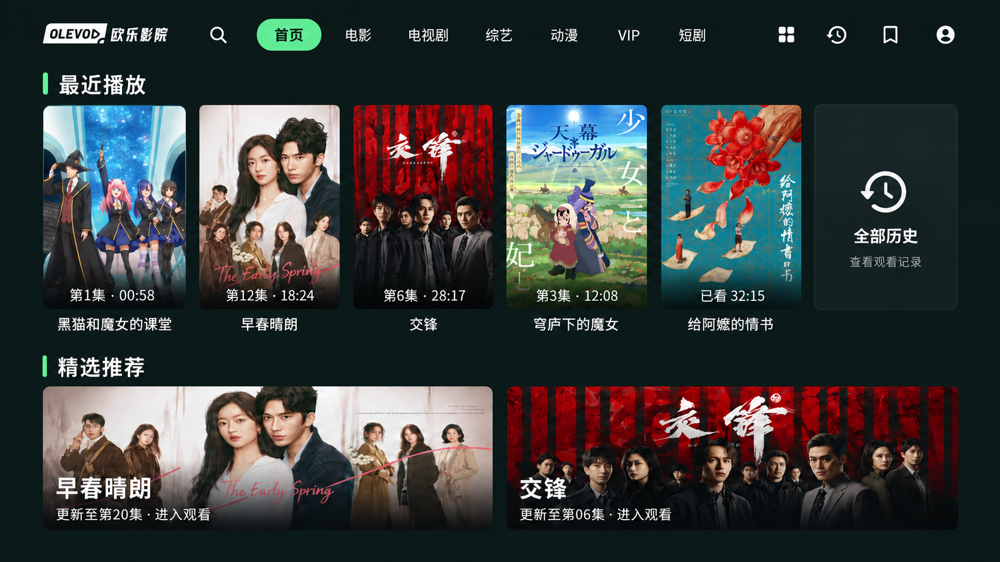
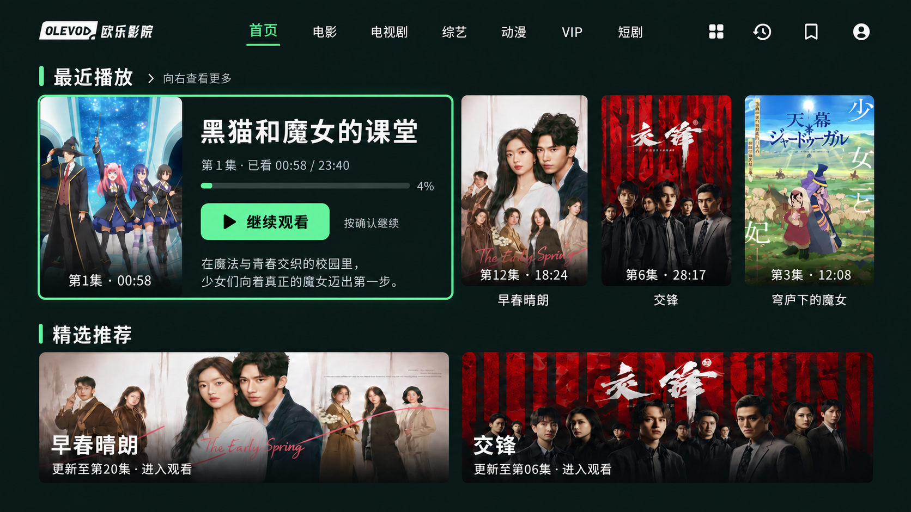
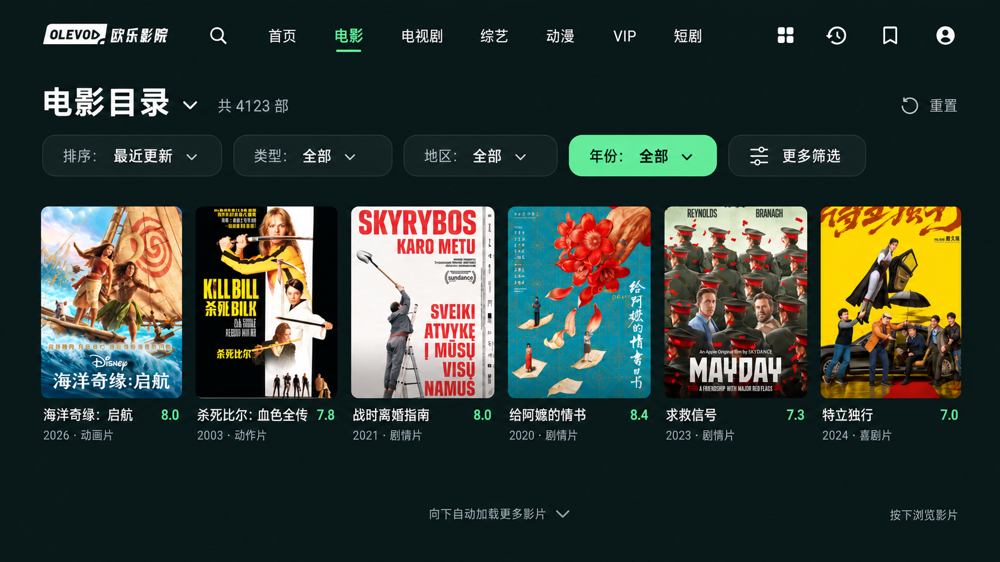
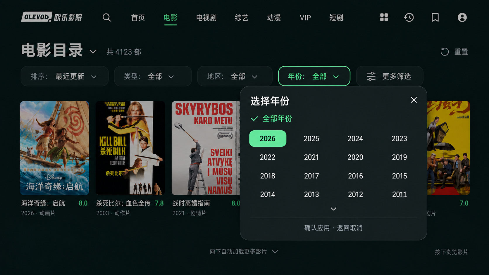
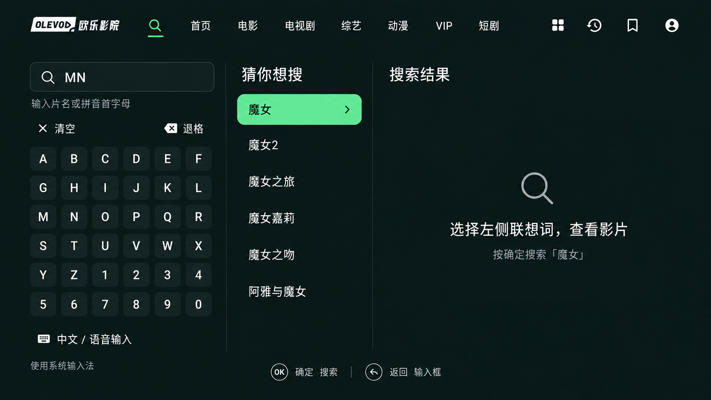
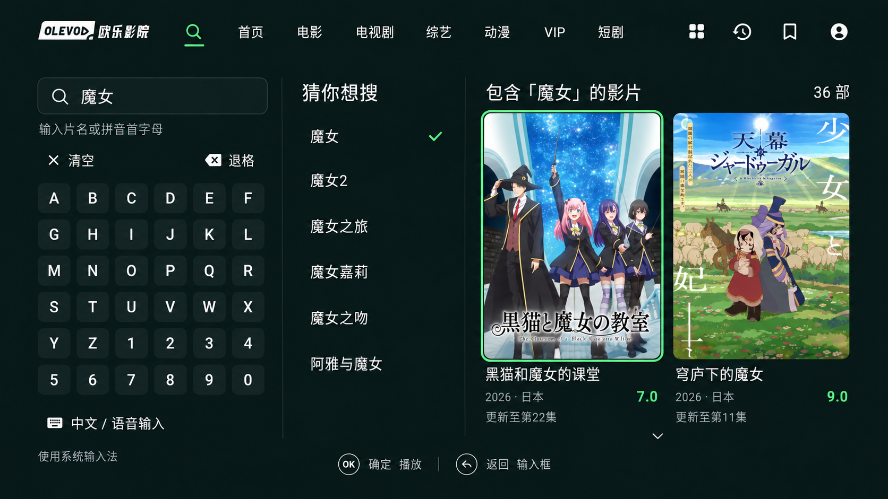
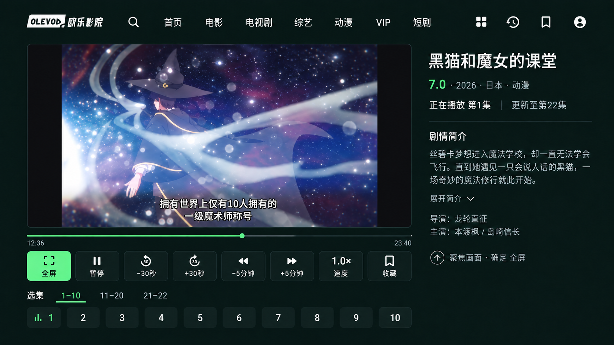
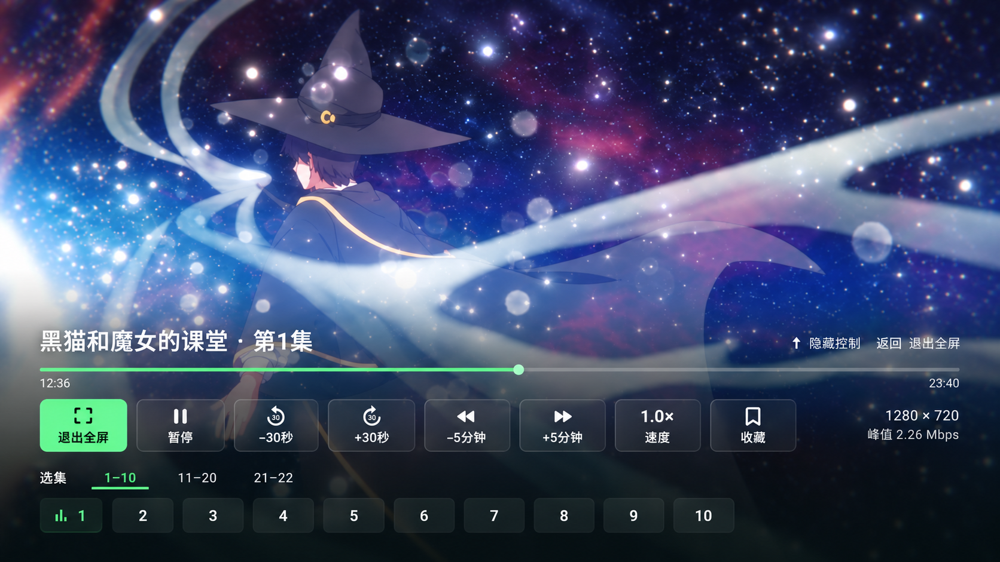
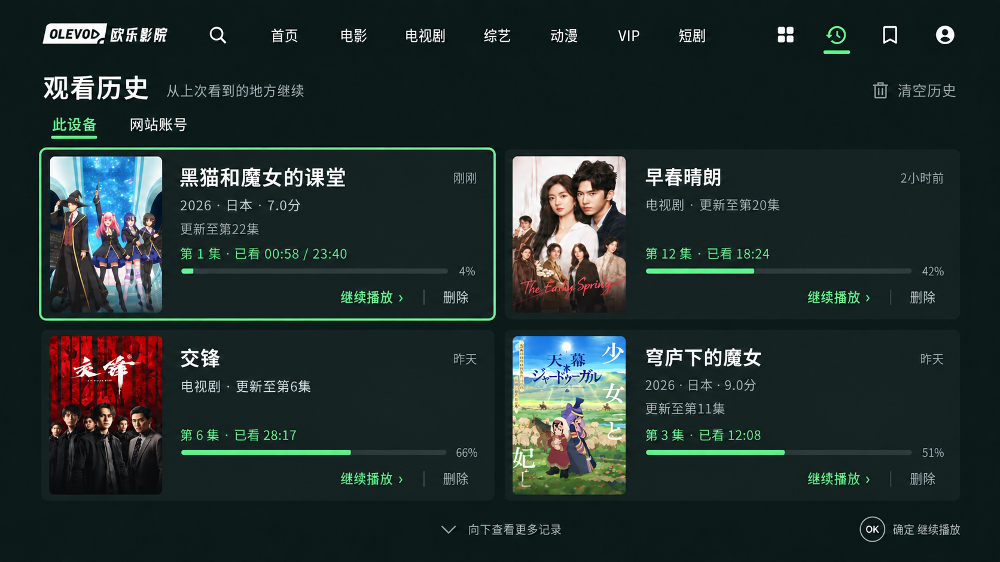
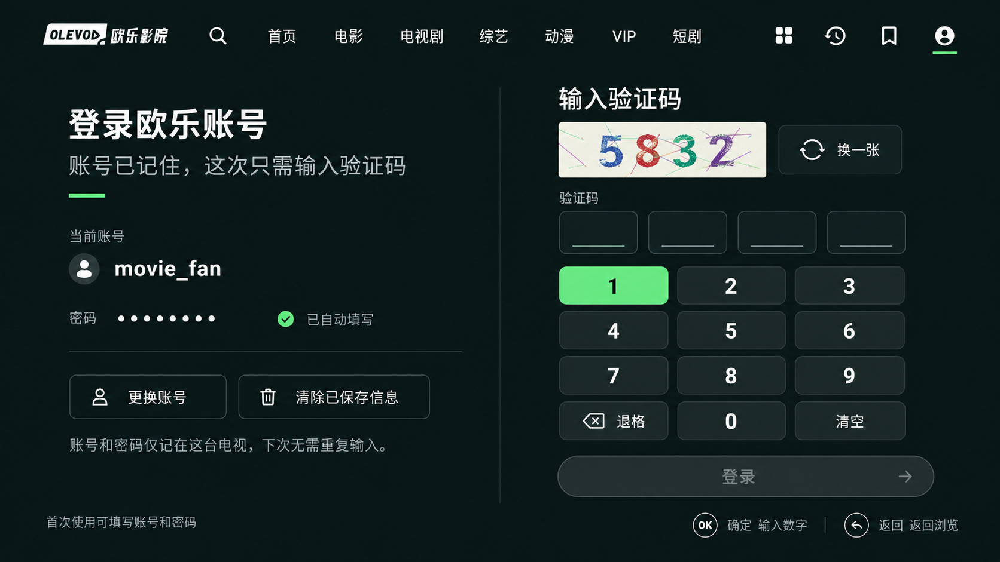

# UI v2 设计包

2026-09-08：用户认可本组设计稿，并要求形成完整开发规格。**这里是未来界面的设计参考，不是 v0.1 运行截图，也不代表代码已实现。**

更新：新版原生实现与 [运行截图](../verification/v2/screenshots/README.md) 已另行归档，验证范围见 [V2-10](../verification/v2/V2-10.md)。本目录继续仅存设计参考图。

| 文件 | 用途 |
| --- | --- |
| [DESIGN_SPEC.md](DESIGN_SPEC.md) | 开发主规范：范围、视觉、页面布局、状态、焦点、API 与代码落点 |
| [tokens.json](tokens.json) | 可供开发读取的 dp／sp／颜色／间距／时序参数，属于规范数据 |
| [ACCEPTANCE.md](ACCEPTANCE.md) | 验收矩阵、截图清单、分步开发与暂停恢复要求 |
| [assets/manifest.json](assets/manifest.json) | 十张参考图的来源文件名、尺寸、字节数与 SHA-256 |

后续开发以主规范为行为与尺寸裁决依据；图像负责表达视觉关系。原图均从本任务已经展示并认可的 ImageGen 输出逐字节复制，原始文件保留，未裁剪或修改。图像中影片、数字、账号、验证码是示意内容；官网 Logo 实现必须使用 [原始品牌资源](../BRAND_ASSETS.md)，不能从生成图取字形。

## 首页：默认态

默认聚焦首页。最近五部显示集数／已看时间，最后是全部历史；精选推荐保留真实横幅上的大标题。

## 首页：最近播放聚焦态

聚焦卡横向展开信息，其余海报保持比例，整行高度不变；剩余影片与历史入口仍在同一横向列表。**这张生成图漏了搜索图标，实现必须按上一张和主规范补在首页左侧。**

## 目录：紧凑筛选

分类由标题切换；常用条件放在一行，会员范围与首字母收进更多筛选。结果是完整竖版海报。

## 目录：年份浮层

浮层覆盖背景，背景列表不位移。真实年份来自服务端，长列表在浮层内滚动。

## 搜索：选择联想词

输入首字母后，键盘、中间建议与右侧正式结果各自有清楚角色。

## 搜索：结果首项焦点

确认联想词后，仅在该确认意图仍有效时移到第一张结果；返回先到输入框。

## 播放：普通模式

采用最后的比例修正版：画面等比适配，右侧简介限高，八个按钮与十项选集完整可见。

## 播放：全屏覆盖

视频铺满可用屏幕；控件、分组与集数覆盖在渐变背景上，显隐不能改变视频尺寸。

## 历史：两列记录

完整竖图旁显示可用影片信息与真实进度。本机／网站来源分开；图中删除仅适用于本机。

## 登录：账号已记住

右侧放大验证码和三列数字键盘。示例用户名与验证码不用于真实请求；首次、失败、已登录状态详见主规范。

## 仍需在实现阶段补运行截图的界面

分类小首页、收藏、首次／失败登录、更多筛选、空列表、尾页错误、简介展开、倍速菜单、退出／删除确认、字体放大以及全屏控制隐藏。它们已有文字规格，但本设计包没有冒充这些状态的运行证据。

参考图和其中的第三方媒体／品牌不因仓库使用 MIT 许可证而自动获得独立授权；项目源码许可证范围见仓库 [LICENSE](../../LICENSE)。
