# 欧乐 TV v0.2 界面一览

深色背景、完整海报和清晰的绿色焦点，让选片与追剧更适合电视。

以下为新版签名安装包在 Android TV 模拟器中的实际截图。影片内容与榜单会随网站更新，观看记录来自独立测试设备。每张图片对应的安装包和采集信息见 [截图清单](manifest.json)。

## 打开就能接着看

最近播放显示集数与进度，精选推荐用横幅和大标题帮助你快速挑片。

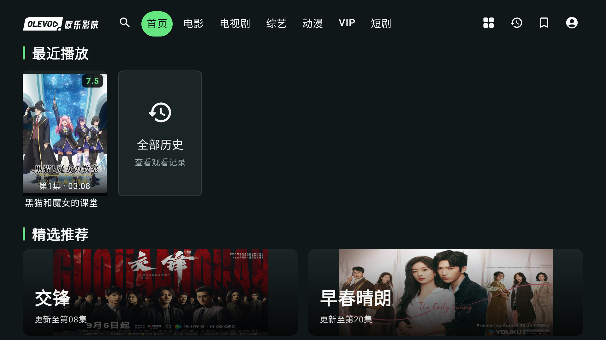

## 每个分类，都有值得看的榜单

电影小首页优先呈现今年的人气和评分榜；Top 2 的海报颜色柔和地铺进背景，下面每排五部，向下继续浏览。

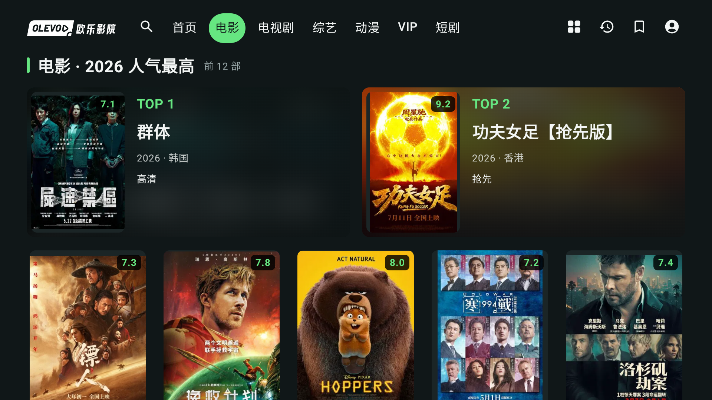

VIP 榜单涵盖全部年份，经典影片也能轻松找到。

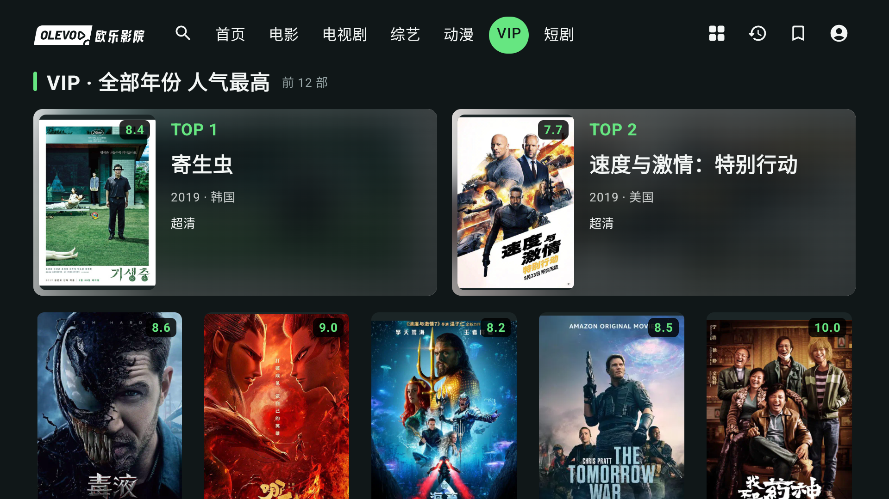

## 按自己的口味筛选

排序、类型、地区和年份就在片库上方；更多条件需要时再展开。

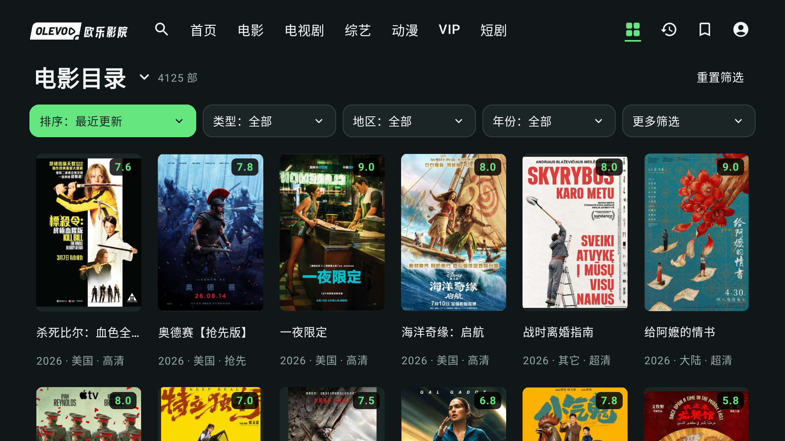

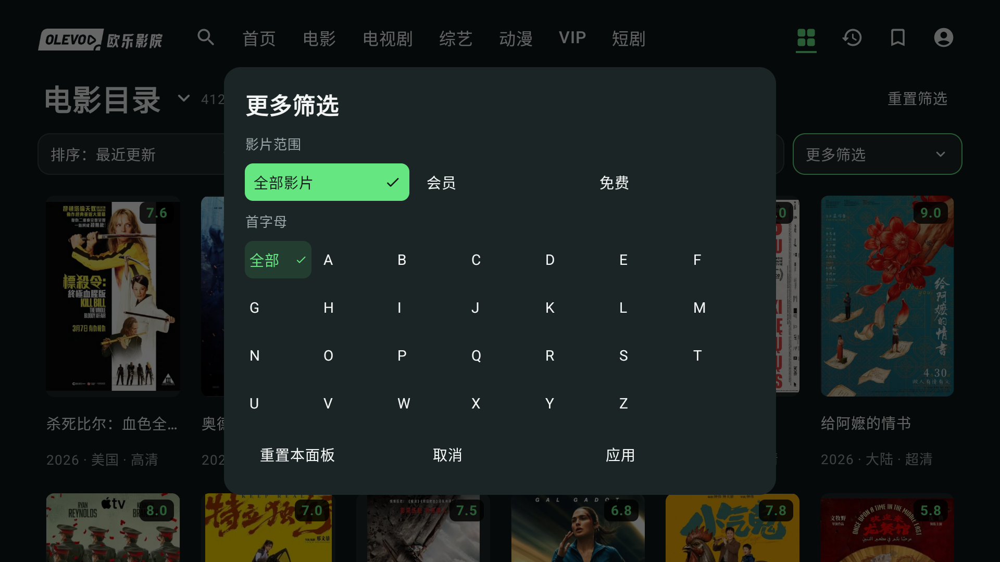

## 用首字母找片

左边输入、中间选联想片名、右边看结果。确认片名后焦点进入第一部结果，返回即可继续修改输入。

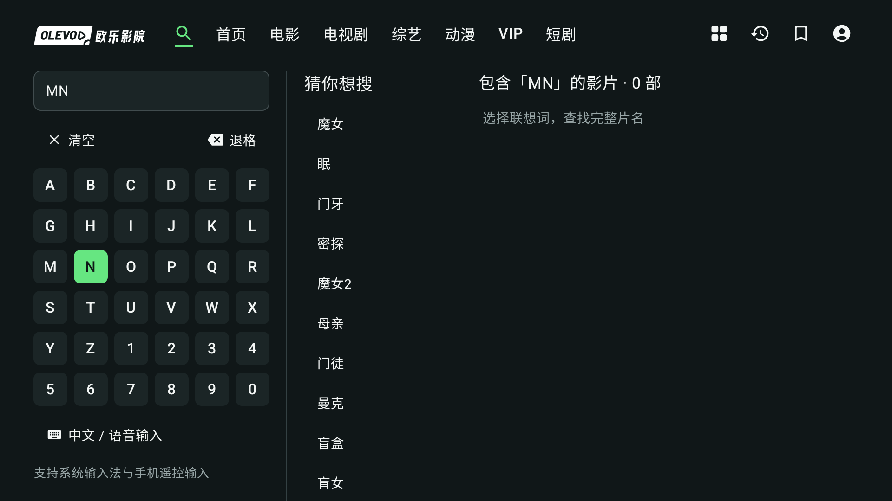

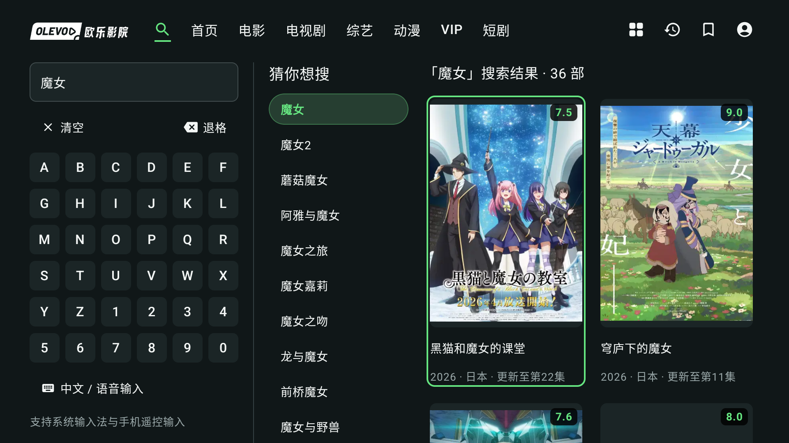

## 长剧也好选集

常用控制放在视频下方，集数按十集分组。简介可以展开，选集始终有自己的位置。

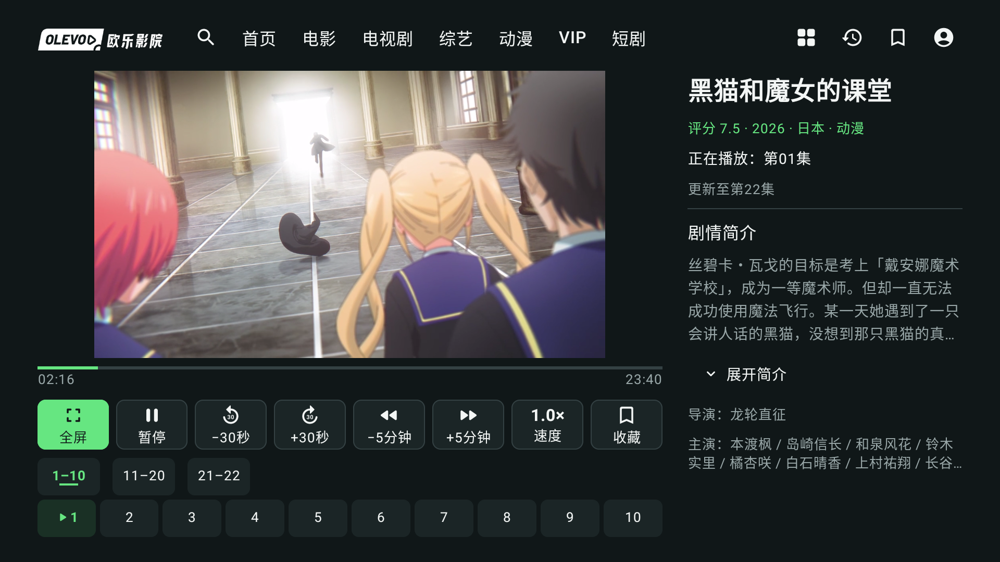

全屏控制栏覆盖在画面上；收起和唤回时，视频大小保持不变。

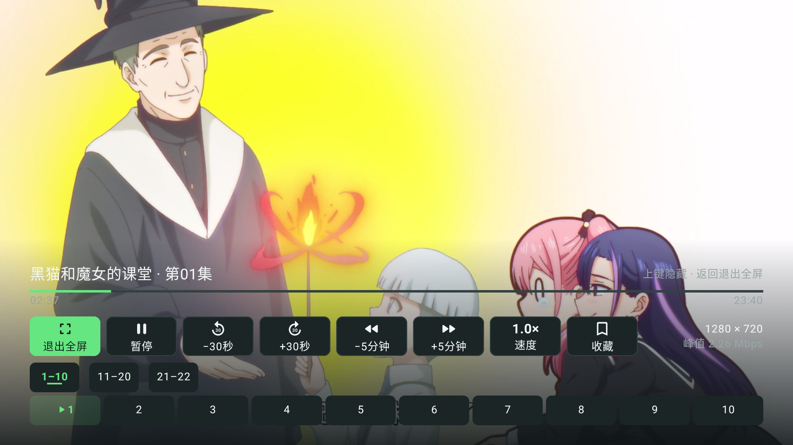

## 把上次的进度留下来

历史卡片显示海报、集数与进度，选中便能续播。

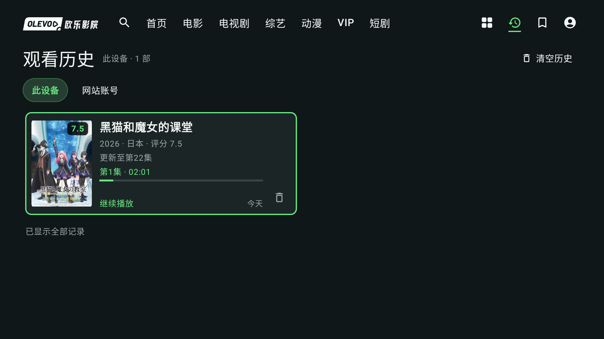

电视可直接登录，记住账号密码后，再次登录只需补上新的验证码。

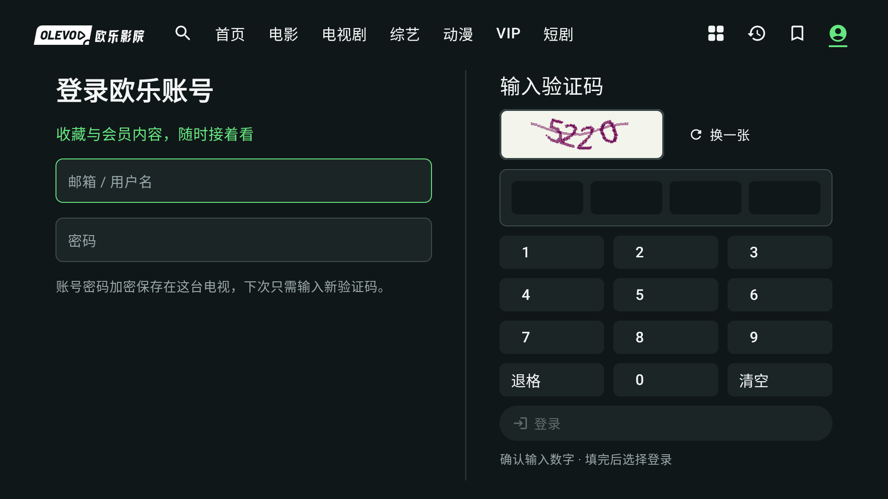

退出前默认停在“继续观看”，误按返回也不会突然离开。

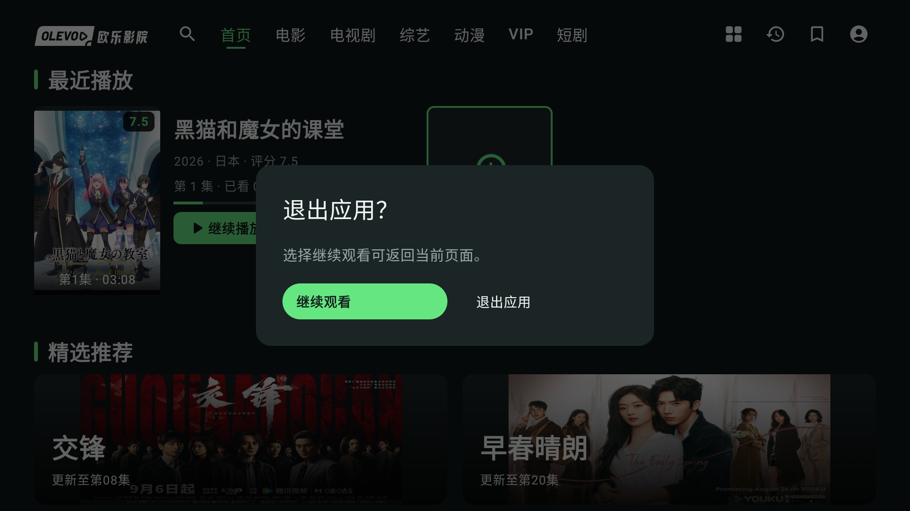

[返回产品介绍](../../../README.md) · [安装教程](../../INSTALL.md) · [发布包验证](../../verification/RELEASE_V0_2_FINAL.md)
