# v0.2 release candidate 验证

2026-09-08（America/Los_Angeles）。**原签名 release APK 已构建并完成专用 Android TV 模拟器覆盖升级和实际界面冒烟验证；尚待远端发布。** 本报告不代表 GitHub tag、Release 或资产已经上传。

后续修订：本报告记录的冻结候选包不含最新Top 2模糊背景；该修订见[背景效果验证](v2/MINI_BACKDROP.md)。发布前需要构建并验证包含后续修改的新候选包，本报告的哈希和截图仍只对应下列旧候选包。

## 安装包与构建

| 项目 | 本轮结果 |
| --- | --- |
| 安装包 | `artifacts/releases/v0.2/olevod-tv-v0.2.apk` |
| Package / version | `com.olevod.tv` / `0.2.0` / versionCode `2` |
| APK SHA-256 | `001c33cf20736cbe675347e1e5a13c56d2eb6eca72796fcf504432723a8d89ab` |
| 原 release 证书 SHA-256 | `db2d039b4b6685678c5c71e397df7146d5e3bac038d438d55f496db1cdd060f4` |
| 生产代码 | 最终对应 `fba0f77ea8a77e3542a3d183a026363b2727d3d6`；构建先于该提交，提交不改变已构建的生产内容 |
| SDK / ABI | minSdk 26、targetSdk 35；arm64-v8a、armeabi-v7a、x86、x86_64 |
| TV 元数据 | Leanback 启动入口；不要求触摸屏 |
| Release 构建 | `assembleRelease testReleaseUnitTest lintRelease` 成功 |
| JVM | **47 项通过，0 failure / 0 error / 0 skipped** |
| Lint | **0 Error / 0 Fatal；21 Warning**，未将警告描述为零问题 |
| 签名 | APK Signature Scheme v2 验证通过；一个签名者；与 v0.1 证书完全相同 |
| 调试隔离 | 非 debuggable；实际传入 `screen=player, preview=true, movieId=1` 仍进入真实首页 |

本轮只使用原有本机发布签名配置，没有重新生成密钥或输出密码。APK ZIP 条目检查未发现私有签名配置、密钥库或测试凭据命名的文件；这是包内容清单检查，不等同于任意形式秘密泄露的形式化证明。

执行命令：

```sh
source scripts/android-env.sh
bash scripts/build-release.sh v0.2
```

发布脚本已审查：要求显式版本标签、核对 `versionName`、拒绝覆盖已有发布目录，并在构建和签名校验成功后原子写入 APK 与 `SHA256SUMS.txt`。脚本不执行上传或 Git 写入。完整构建及签名日志保存在本机忽略目录 `.tools/v02-release/`。

v0.1 原资产在构建前后逐项比对未变：

| 文件 | SHA-256 |
| --- | --- |
| `artifacts/releases/v0.1/olevod-tv-v0.1.apk` | `72291aa02800eb599f9d9261e94a39586eb77880be88b15373772f1c5d845e3d` |
| `artifacts/releases/v0.1/SHA256SUMS.txt` | `f014ebb18d73e93d7509e915ecaa8ef43bd51621afa7180e146e523a254feb84` |

## 同签名保留数据升级

本轮只操作专用 AVD `Olevod_Release_v01` / `emulator-5556`，Android TV API 34、arm64-v8a、1920×1080、density 320。沿用 v0.1 发布验证时创建的数据盘，不 wipe、不卸载、不 clear；未触碰 Chromecast 或开发模拟器的数据。

安装前为 `0.1.0 / code 1`。通过 `adb install -r` 安装本次 release，返回 `Success`。随后从已安装应用路径拉回 `base.apk`，其 SHA-256 与上表候选包完全相同。

| 证据 | 升级前 | 升级后 |
| --- | --- | --- |
| appId | 10122 | 10122 |
| dataDir | `/data/user/0/com.olevod.tv` | 相同 |
| firstInstallTime（设备输出原值） | `2026-09-07 22:24:44` | 相同 |
| lastUpdateTime（设备输出原值） | `2026-09-07 22:24:44` | `2026-09-08 20:37:46` |
| 自建非敏感 external app-data 标记 | 存在 | 字节逐一相同；验证结束已移除 |
| 既有本地观看记录 | 《黑猫和魔女的课堂》第1集，00:58 | 同一影片、集数、00:58仍显示 |

旧观看记录来自原 v0.1 的专用模拟器烟测，不是真实用户账号记录。来源可交叉核对 [v0.1 验证报告](RELEASE_V0_1.md) 中的干净模拟器、无真实账号登录和测试历史说明，以及仓库原有的 [v0.1 历史截图](../screenshots/09-history.png)，其中正是该片第1集 `00:58 / 23:40`。

首次尝试 `adb root` 返回 `adbd cannot run as root in production builds`。没有绕过此限制，也没有读取私有账号或凭据；改用上表安装身份、自己创建的非敏感标记和实际可见旧记录交叉验证。结论限于本次同签名升级及这些实际数据样本，不能外推为所有加密凭据或全部用户迁移场景已经验收。

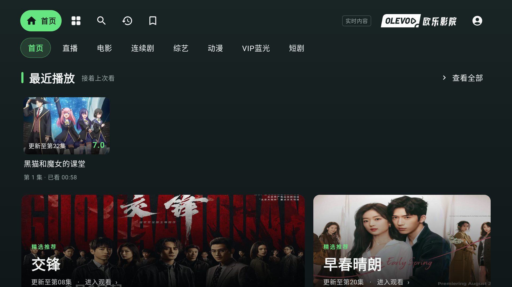

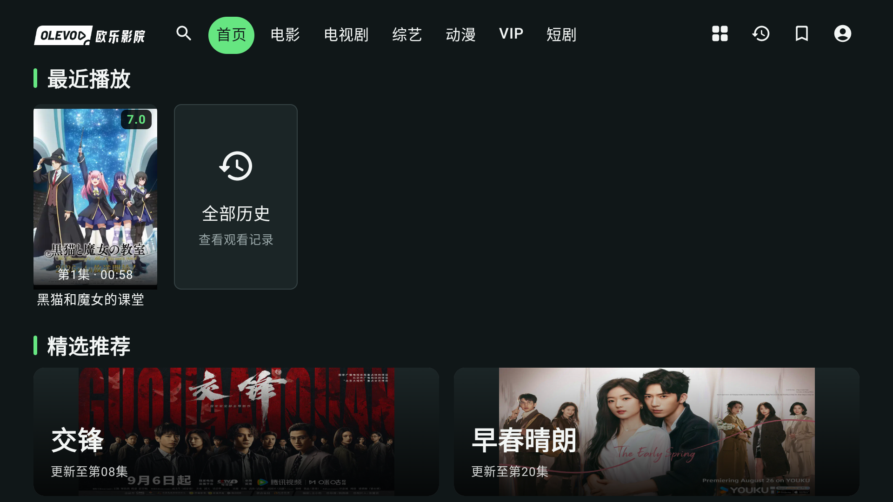

## 实际 release 遥控旅程

通过真实 D-pad、确定和返回按键操作生产界面，使用公开网站数据。截图不是设计稿或 debug preview。本轮没有登录账号、变更收藏或调用账号写入测试；播放只新增、更新隔离模拟器的本地测试记录。

| 范围 | 实际观察 |
| --- | --- |
| 首页 | 冷启动默认聚焦首页；单行导航；最近播放和大文字横幅推荐可见；完整竖海报和右上角评分 |
| VIP 人气榜 | 明确标注 `全部年份`、`前 12 部`；前两部独立展示，第3–12名为两行，每行5张；该12条没有重复 |
| VIP 评分榜 | 同样为全部年份的2+10布局；第3–7名和第8–12名均实际导航到并截图 |
| 浏览全部 | VIP底部进入真实目录，显示2318部；Back回到原 `浏览全部VIP` 入口焦点 |
| 搜索 | 从键盘输入MN，右移选择首联想“魔女”；显示36部结果并聚焦首卡；Back返回“魔女”输入框，保留结果 |
| 普通播放 | 首卡《黑猫和魔女的课堂》第01集实际视频画面出现；播放时钟约00:59/01:00，之后继续推进；总时长23:40 |
| 播放器布局 | 全屏默认聚焦；8个按钮按全屏、播放/暂停、±30秒、±5分钟、速度、收藏顺序；十集分组可见 |
| 全屏 | 确定进入；Up隐藏、Down恢复覆盖控制栏；返回正常播放器。恢复控制栏截图约01:23，显示1280×720、峰值2.26Mbps |
| 返回链 | 全屏→普通播放器→原首结果→搜索输入框→首页；各已观察步骤均有真实焦点 |
| 退出 | 首页Back出现提示，默认焦点“继续观看”；确定取消成功；再次打开、右移到“退出应用”确定后，前台为系统TV Launcher |

VIP 全部年份是明确的数据范围决定。站点类别6在当前年份查询返回零条，公开不限年份查询有结果；没有把跨年结果标为“当年”。普通分类继续使用当前年份。该接口诊断及定向测试范围另见 [v0.2 UI 定向验证](v2/V02_UI_FOLLOWUP.md)。

### VIP 的前两部与两行海报

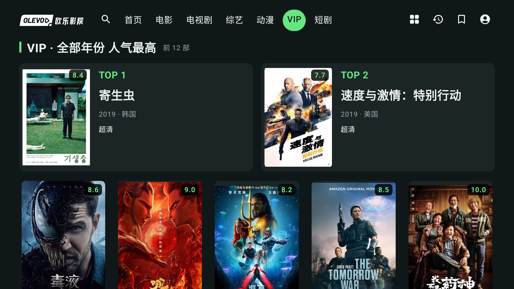

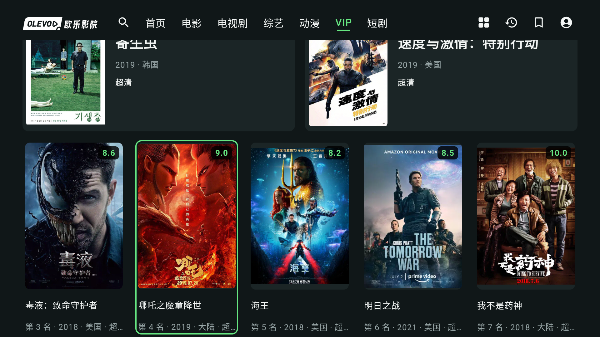

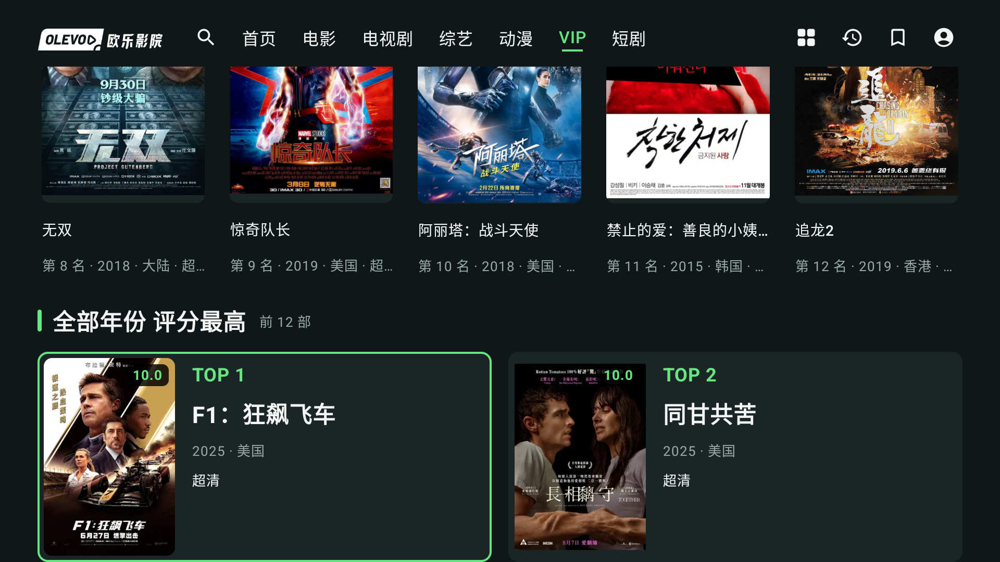

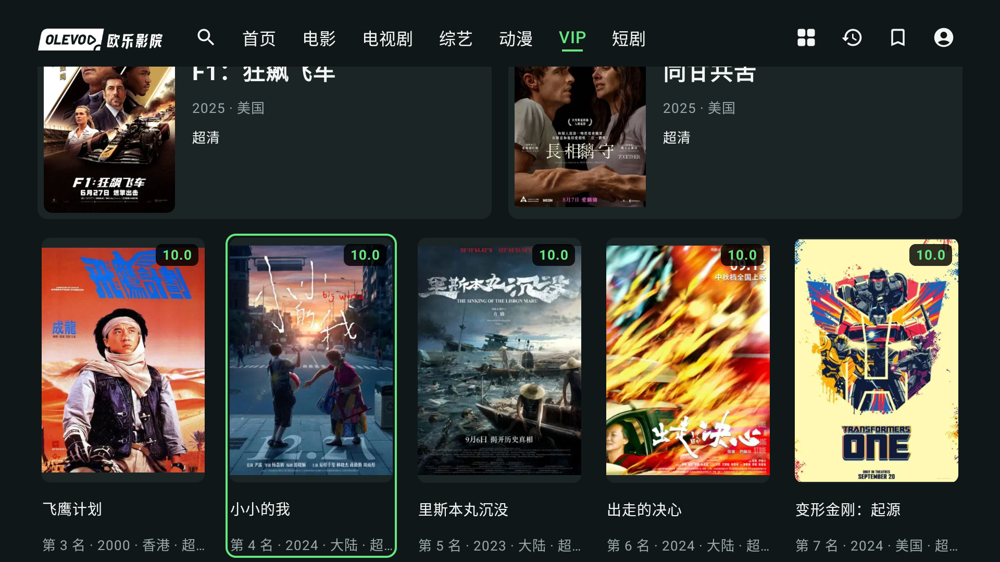

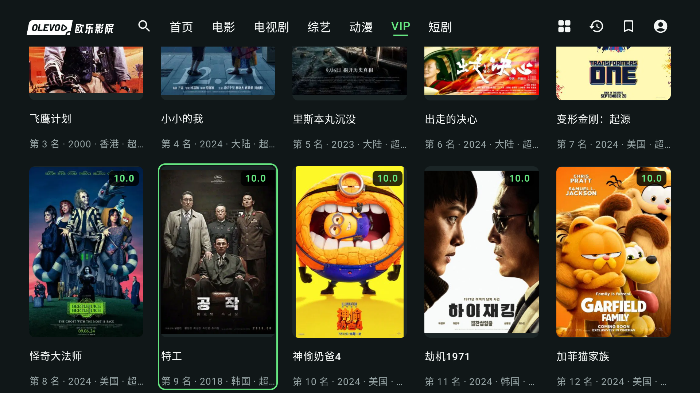

实际人气榜前两部是《寄生虫》《速度与激情：特别行动》；评分榜前两部是《F1：狂飙飞车》《同甘共苦》。影片、评分与总数会随站点更新，这些是本轮采样值。普通卡片和前两部海报的评分均位于图像右上角。完整第二行焦点边框和标题保留在屏幕内。

### 目录与搜索

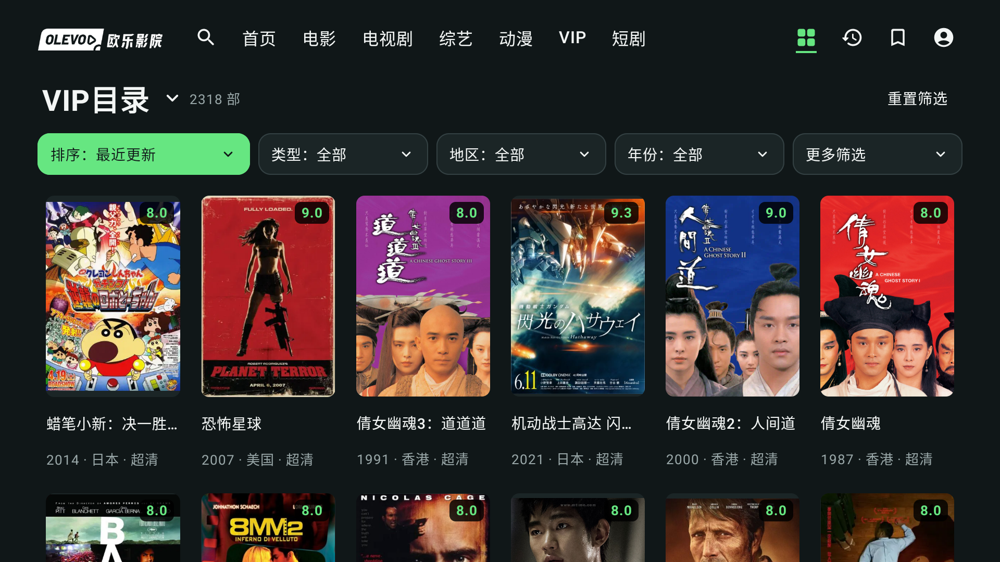


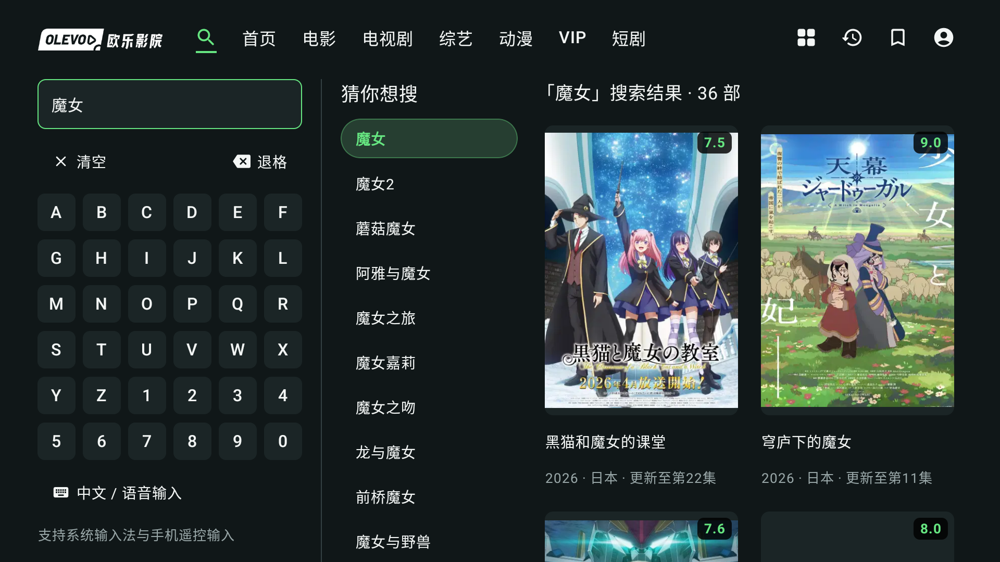

### 播放与退出

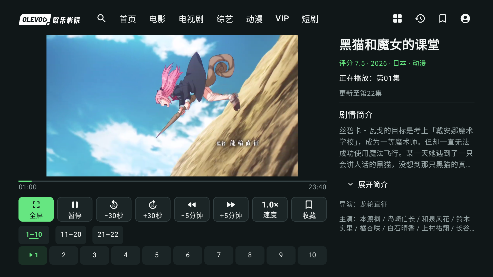

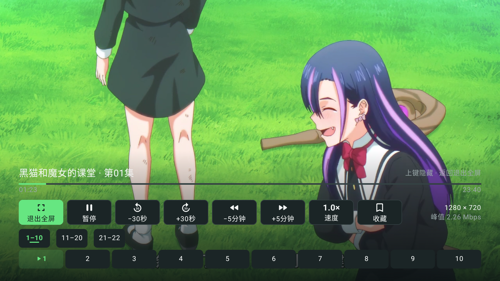

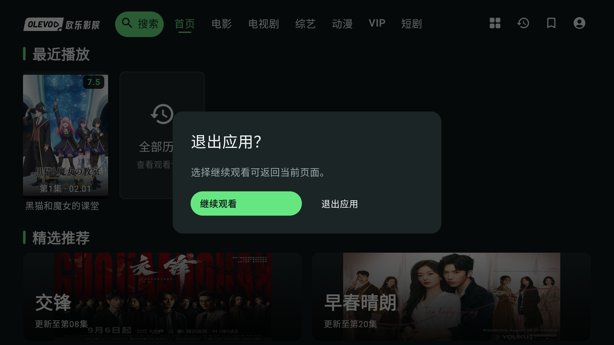

## 证据范围与交接

- 13张公开截图均为原样1920×1080 PNG，来源、SHA-256、尺寸及对应XML摘要哈希见 [截图 manifest](v0.2-screenshots/manifest.json)。图片和XML依次抓取，不是原子同帧；播放时钟相差一秒不作精确位置断言。
- 原始操作证据保存在 `.tools/v02-release/`：`build-release.log`、`jvm-summary.json`、`signature-v01.log`、`signature-v02.log`、`apk-badging.log`、`upgrade-install.log`、`install-identity-{before,after}.log`、`upgrade-probe-{before,after}.txt`、`installed-release.sha256`、`v02-debug-extra-launch.log`、各截图同名XML/JSON及 `after-explicit-exit.log`。公开仓库没有加入凭据、密钥、账号原始响应或私有数据。
- 本轮 release 模拟器确认实际视频画面与时钟推进，未听测声音、音画同步、4K、HDR、长时间稳定性或实体遥控器手感。也未在release包重新登录真实账号、测试VIP解码或重复所有自动化测试。不能将此前Chromecast的debug验收描述为该release签名APK已经在电视上覆盖升级。
- 真实 Chromecast 的分批自动化、VIP解码、30分钟采样及进程恢复请以 [真机报告](v2/CHROMECAST_V2.md) 和 [独立报告](v2/CHROMECAST_INDEPENDENT.md) 的具体APK与证据范围为准；不重复计算或扩大本轮结果。
- 验证结束已明确退出应用回到系统TV Launcher，移除自己创建的升级探针；专用AVD的数据保留。构建已交回主代理，本报告不执行提交、tag、推送或发布。

**发布状态：候选包准备就绪，等待远端发布与资产校验。**
