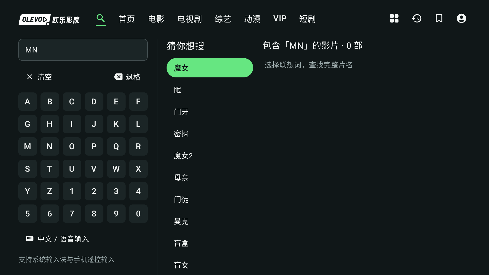
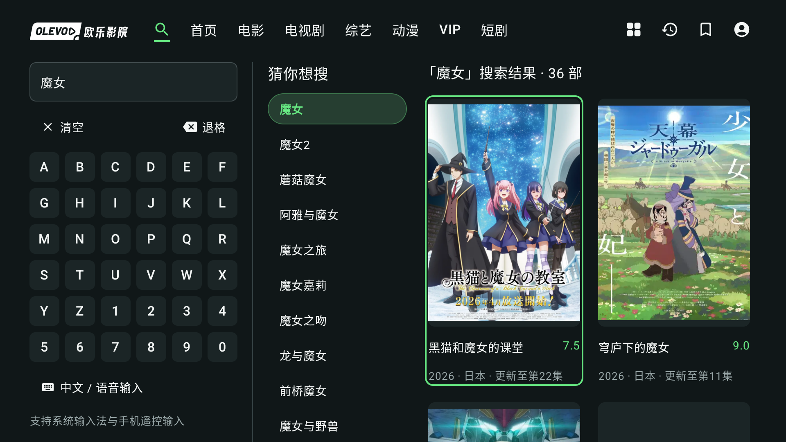
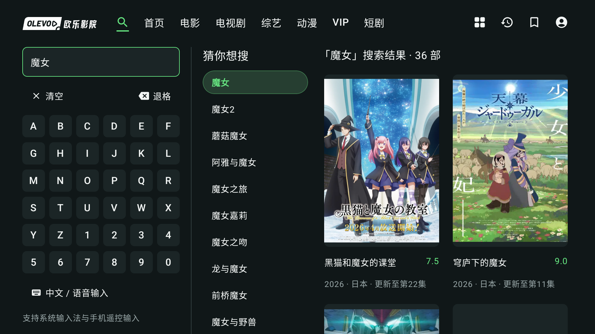
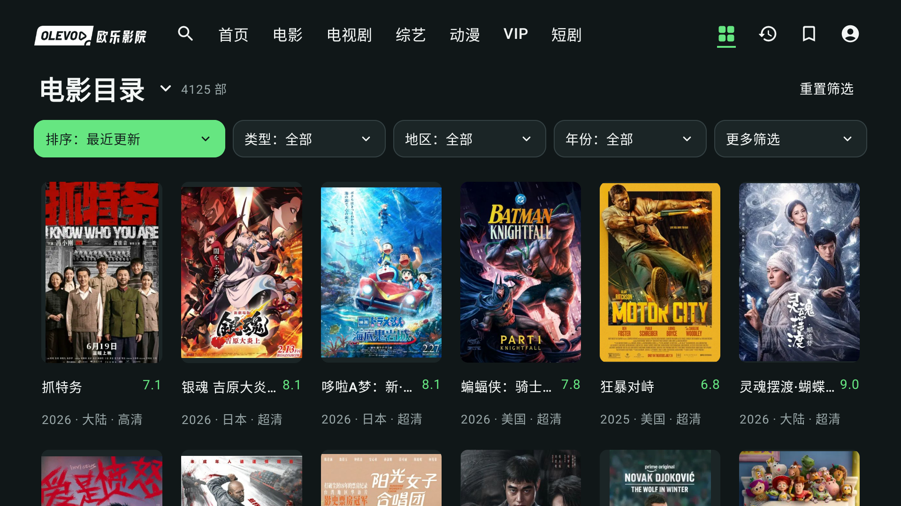

# UI v2 Chromecast 真机验证

2026-09-08 · 分支 `codex/ui-v2` · 测试基线提交 `c8e50e7`。

**累计51个不同自动化用例通过，其中修复版定向复测17项通过。** 旧会话失效导致的VIP空地址已定位；新增VIP首帧、视频与音频输出检查也通过。30分钟稳定性正在采样；以下区分原始包与修复包，保留先前失败，不把所有51项说成在修复包上重新跑过。

## 环境与安装

| 项目 | 实际读数 |
| --- | --- |
| 设备 | Google Chromecast with Google TV，`sabrina` |
| 系统 / ABI | Android 14；`armeabi-v7a,armeabi` |
| 显示 | 物理 3840×2160；override 1920×1080；density 320 |
| App APK SHA-256 | `e14387a733c072d46a78b7af722336893115dd7409ba8deaf549cbed725587ce` |
| 基础批 Test APK SHA-256 | `6e1eb0ea9ad0215d6a9d08daef4df3da0712b9b6778c794cb71eea1e6b712915` |
| 安装 | App 与测试包分别 `install -r` 成功；未卸载或清除数据 |
| 签名 | 原安装与新 APK 的 debug 证书 SHA-256 一致：`65e3a78be6cfa68cabc71ed91c4b4c76253e612193cead838cc1f2d287c13f6e` |

旧连接端口拒绝连接，原生 Bonjour 后发现当前连接服务；沿用已有 ADB 配对成功连接。无线调试的连接端口会变化，不将配对端口当成连接端口。未将配对码、账号凭据或播放签名 URL 记入本报告。

## 独立验证

另一 agent 独占设备执行 12 个 V2 测试类的 45 项界面／状态回归，再单独执行真实目录与普通播放测试。完整范围见 [独立报告](CHROMECAST_INDEPENDENT.md)，原始日志仅保存在本机 `.tools/chromecast-v2/`。

| 验证 | 结果 |
| --- | --- |
| 12 类 V2 界面／状态 | 45/45，0 失败／跳过，225.692 秒 |
| CatalogIntegrationTest | 1/1，9.597 秒；真实分类、排序、分页和搜索 |
| V2LivePlaybackTest | 1/1，19.508 秒；普通首帧、正宽高、进度、全屏显隐／返回、隔离历史 |
| V2DevicePlaybackTest | 1/1，29.889 秒；四种实际 seek、1.5 倍速、全屏连续性、Activity ON_STOP 暂停和离开保存／释放 |
| V2AccountReadTest | 0/1；VIP 样本返回空地址，收藏／云历史断言尚未执行 |

控制专项首轮因测试方法返回类型导致JUnit初始化失败，修正后通过；该首轮及VIP两次失败日志均保留，详见独立报告与下文，未从记录中删除。

控制专项增加前后生产 App 散列相同。新增测试包运行通过时 SHA-256 为 `78e6633c161b790f1e5ac50cbf74ac241a0dac028df903bb02508e8793cf7415`；最终补充 VIP 诊断断言后的测试包为 `fa8807579e3e11a5338be0376515f67708d44072f1744188608efa8658ff3cf0`，构建成功并安装。未把最终测试包说成重新运行过45项。

`V2DevicePlaybackTest` 显式启用方式：

```sh
adb -s "$ANDROID_SERIAL" shell am instrument -w -r \
  -e class com.olevod.tv.V2DevicePlaybackTest -e liveDevicePlayback true \
  com.olevod.tv.test/androidx.test.runner.AndroidJUnitRunner
```

实际平台位置为：+5分钟 `0→300000`、−30秒 `300000→270000`、+30秒 `270000→300000`、−5分钟 `300000→0`；全屏显隐两轮均保持 `300000`。后台返回 `305196→305196`。测试允许1000ms误差，本轮恰好相等；不扩展为全部片源的逐帧精确seek。ActivityScenario触发ON_STOP并不等同真实系统Home或系统杀进程。

夹具使用隔离存储；实际普通媒体测试的历史也写入隔离空间。没有运行整个未筛选的测试包，以避免旧收藏／云历史测试改变用户数据。

## 实际应用旅程

| 旅程 | 实际结果 |
| --- | --- |
| 真实首页 | 单行导航默认首页；原本五部最近播放与各自集数／时间均保留；精选推荐使用横幅和大标题。 |
| 真实搜索 | 自绘键盘输入 MN；向右到首联想“魔女”，确认后第一张结果卡有焦点；一次 Back 回输入框，保留36部结果。 |
| 真实目录 | 最近更新状态显示4125部，五个紧凑筛选入口及完整竖海报／标题／评分可见。进一步手动排序／深列表操作的前台状态发生变化，未将该段记录为通过。排序API及焦点夹具另已通过。 |

账号和既有私人观看记录截图仅留本地，不混入公开截图集。UiAutomator 在部分采样中返回 null root；这些失败采样不用于确认焦点，也不复用旧 XML，改用本次新截图及独立 instrumentation 断言。

在手动目录阶段，后续画面出现播放器和电视剧榜单，与预期按键路径不一致。已询问是否存在同步遥控操作并暂停继续发键；没有把来源不确定的截图当成该目录步骤通过。独立批次在此之前已明确交回设备。

## VIP 旧会话失败记录

使用设备原有保存会话，不重新登录，也不读取或输出账号凭据。`V2AccountReadTest` 的 token非空与VIP详情存在剧集断言通过，随后“每条地址为HTTPS”断言失败。为定位问题仅改进测试错误文字，保持原断言；第二轮输出 `VIP source schemes (URLs omitted): {empty=1}`，2.461秒、1项失败。

该轮结束时仅能确认ID80632的一条剧集地址为空，尚不能区分会话权益、站点策略或样本资源原因，也不能归因Chromecast解码器。该方法在VIP失败后终止，后面的真实收藏、云历史读取没有运行。没有通过放宽HTTPS断言、跳过失败或更改用户账号来伪装成功。

原始失败日志保存在 `.tools/chromecast-v2/saved-account-read.log` 和 `saved-account-read-2.log`，没有覆盖。

## 重新登录与针对性修复

后续分别检查用户信息与私有列表，两项均明确返回“登录已失效，请重新登录”。主执行agent在真实电视上退出旧会话；账号密码仍自动填入，数字键盘默认聚焦，只输入新的验证码完成登录。凭据和验证码均不写入报告。

独立agent重新执行 `V2AccountReadTest`，2/2通过，4.569秒：用户信息接受当前会话、会员组3；同ID返回1条HTTPS基础片源，0条空地址、0个premium变体；收藏与云历史第一页实际读取通过。这支持旧会话失效是本次空地址原因，不是解码器判断。

`OlevodApi.detail` 对受限、非空剧集且地址全空的详情补充会话检查：游客登录提示、过期重新登录、无法确认会员、权益不足、片源不可用分别处理；健康HTTPS与混合片源不增加请求，不自动改选其他地址。独立新增15项JVM、完整45项JVM、lint和构建通过，修复提交 `2fb2e77`。修复后App SHA-256为 `2af5e7a174200a90d70f21f3b0808b58f73d27fc3d2631d2c0b999592793f3ae`，已保留数据安装；播放器和UI实现未改。

主执行agent在最初App上实际打开VIP80632：进度推进，全屏显示1920×1040、峰值7.83Mbps。系统Home后平台暂停位置379879ms；返回应用仍为379879ms、speed0，没有自动恢复。这次实际Home补充了先前仅ActivityScenario的证据。截图中的硬件视频层不可见，因此另做显式首帧和解码输出测试，不能据黑色截图判断电视黑屏。

## 修复包定向真机复测

- `V2AccountReadTest` 2项、`V2LivePlaybackTest` 1项、`V2PlayerUiTest` 4项、`V2RootJourneyUiTest` 3项、`V2AccountUiTest` 6项，共16/16通过，112.443秒。以上与原有用例重合，不能再加到51个独立用例上。
- 新增 `V2VipDecodeTest -e liveLogin true`，独立1/1通过，15.451秒。读取保存会话但不写历史／收藏；使用真实VIP地址和与生产播放器一致的HTTP头，在PlayerView上验证Media3解码。首帧回调为true，格式1920×1040，实际位置0→4770ms，videoBuffers115、audioBuffers242。这证明媒体处理输出，不能代替扬声器听感、音画同步、4K或HDR。
- VIP测试包SHA-256：`8dd48499c8b291ea71d33b4eca59cdec6c39fb3eaff029ef2a3b2adde16555c3`。App仍为上面的 `2af5e7a…`。日志 `post-guard-device-regression.log`、`independent-vip-decode.log` 和专用数字标签 `independent-vip-decode-values.log` 留本机。
- 真实目录：确认“评分最高”显示4125部，从第一行依次导航到第五行“黑水”、第六行“亲密”，向上返回第五行。每行六列、自动追加、焦点绿框及完整标题／元信息在屏幕内。切排序后列表偶尔停在较深行，Down进入正文才回到首片，此项保留为待修现象，不宣称排序时自动复位通过。

## 持续播放采样

`scripts/chromecast-soak.py` 只读观察已开始播放的实际应用，不发送控制键、不读取凭据、不输出片源URL。保持非全屏控制栏可见，每30秒记录新UI层级中的实际播放时钟、平台状态、前台、PID、PSS和新应用崩溃计数；不是根据平台anchor外推播放时间。6秒短采样验证通过后，于2026-09-09 02:28 UTC启动30分钟观察，日志 `.tools/chromecast-v2/soak-30min.jsonl`，结果未完成前不标通过。

```sh
source scripts/android-env.sh
python3 scripts/chromecast-soak.py --adb "$ANDROID_HOME/platform-tools/adb" \
  --serial "$ANDROID_SERIAL" --minutes 30 --interval 30 \
  --output .tools/chromecast-v2/soak-next.jsonl
```

使用当前设备连接端口；输出文件必须不存在，以保留历次证据。该采样不证明每帧连续、零短暂缓冲或实际声音正常。

## 截图

以下均来自 Chromecast 实际应用、真实公开片单及本轮明确输入的查询，未经图片编辑；散列与尺寸见 [manifest.json](chromecast-screenshots/manifest.json)。









## 证据范围

- 在实机执行夹具测试证明该设备上的布局、焦点与状态行为；夹具播放器不证明真实解码。
- 实际媒体的首帧回调、播放状态和解码格式与现场听感分开报告。
- 4K 屏幕信息、VIP 栏目或 1080p 媒体不能证明 4K/HDR 片源通过。
- 既有 v0.1 用户音画反馈不用于宣称 UI v2 音画已确认。
- 本轮没有完成30分钟持续播放、真实4K/HDR源、听感／同步、真实系统Home／进程重建、全套放大字体及屏幕阅读器验收；这些继续保持待测。未发布新版本或改变正式签名。
