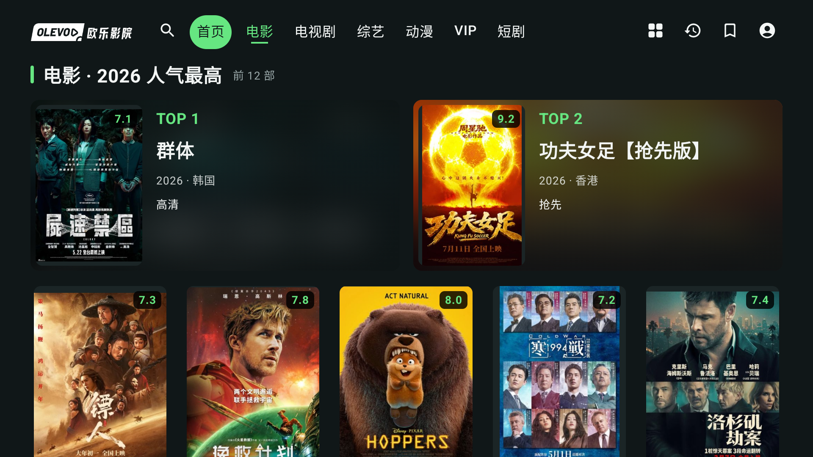
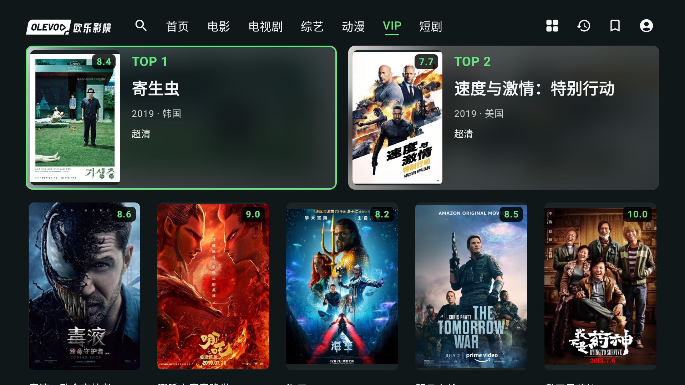

# 分类榜单 Top 2 模糊海报背景：独立验证

## 结论

指定模拟器 `emulator-5554` 上 **6 项全部通过**，24.26 秒，无失败或跳过：V2MiniHomeUiTest 3 项、V2RootJourneyUiTest 3 项。仅安装冻结 APK，不构建或修改生产代码，不操作 Chromecast。

- 应用 SHA-256：`4dfa722ab77682a8a7c5b5224b29c6c8ef18df219154ff090368e612f62a7fde`
- 测试 APK SHA-256：`66a0024d8c236b5729a1ec1a14568f6d8c7c8da49fe24843761e47d87a93ef3b`
- 安装使用 `install -r` 保留数据。原始输出：`.tools/mini-backdrop/test-output.txt`。

覆盖两榜每榜 2 个突出卡片＋10 个独立普通海报、两行五列、VIP 全部年份、短榜/空榜、遥控器路径、浏览全部返回及根路由行为。现有 fixture 回归证明交互未退化；不把这些测试当作真实网络海报的模糊像素验收。

## 图片处理与兼容性审查

- 背景请求记忆以 context/movie.image 为键，解码目标160×160且禁用硬件位图；变换输出160×80，使用两轮半径8的横纵滑窗软件模糊。
- 变换只读取输入位图，不修改或 recycle Coil 所拥有的输入。即使 createScaledBitmap 返回输入本身也保持只读；返回新建ARGB_8888结果。
- cacheKey包含输出宽高、半径、轮数和版本。普通焦点变化不重新创建ImageRequest，前景海报保持Fit并使用独立图片请求。
- 未使用API31 RenderEffect或平台新模糊API；使用的Bitmap及整数运算兼容最低API26。此项是源码兼容性审查，本轮未启动API26设备。
- 背景和遮罩不增加点击/焦点目标，背景contentDescription为null。卡片唯一焦点、202dp基准高度、前景126dp海报及内边距保持；外部border绘制覆盖内容，背景不遮住绿色焦点框。

## 浅色背景文字：计算验证，非实拍

经主代理确认，本轮不扩展fixture接口或注入缓存。以规范960dp宽的16:9画布、每张突出卡约436dp为基准，文字起点约148dp，位于卡片30%之后，横向Bg遮罩至少72%。额外纵向暗化忽略，以最亮全白背景作保守计算；假设常规sRGB混合，使用sRGB相对亮度计算对比。

| 内容 | 最坏背景计算对比 |
| --- | ---: |
| 标题/更新文字，不透明White | 6.65:1 |
| 年份/地区，80% White | 4.96:1 |
| TOP排名，Green | 4.54:1 |

白底经72% `#101718`覆盖后约RGB(83,88,89)。正文小字达到常用4.5:1阈值。实际浅色海报未经注入或截图验证；计算不能替代设备显示、抗锯齿、观看距离和视觉审阅。原始计算记录 `.tools/mini-backdrop/contrast-calculation.txt`。

初始实现文字起点暗化较弱的风险已于代码审查时报告；主代理在最终冻结前将30%位置提升为72%、右沿82%，本报告针对修正后的SHA，不覆盖先前风险记录。

## 主代理补充：Chromecast实际效果

同一App以install-r安装到Google Chromecast with Google TV（sabrina／Android14），保留原应用数据；从设备拉回APK后核对SHA与上述冻结包一致。主代理逐张查看电影、电视剧和VIP三张真实网络海报截图：背景跟随各片色彩、模糊铺满圆角卡片，前景完整Fit、评分角标和文字清楚，聚焦卡绿色边框完整。浅色VIP海报亦已实际查看；上文全白样本的对比数值仍属于计算结果。

本轮构建和47项JVM测试通过，lint为0错误／21个原有警告。6项自动化是独立模拟器结果；真机部分是实际安装、图片视觉和已观察焦点的人工检查，不扩大为6项真机自动化。VIP首张抓图仍在加载，后续按键批次因旧焦点假设进入影片页，已Back返回原VIP首卡；这些中间图片不作为交付效果或播放验收，不宣称本轮没有发生观看记录更新。未清数据、卸载或改动账号／收藏。

三张公开截图保留原始1920×1080PNG字节；来源、大小和哈希见[清单](mini-backdrop-screenshots/manifest.json)。拍摄内容为站点公开目录，不包含账号或个人历史页面。

## 发布交接

此修订已装入电视开发包。此前冻结的v0.2签名候选包001c33cf不含本修订，保留原文件和升级验证作为历史证据；正式发布前须另行准备含本修订的新候选包，不能上传旧候选包冒充最新版本。当前没有推送或发布。
