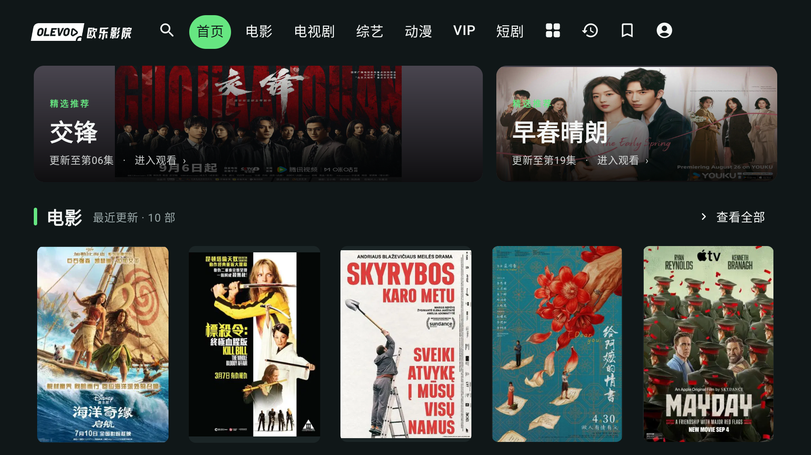

# V2-01 独立验证记录

2026-09-08 · 最新为第三轮：**3 个组件测试执行，3 通过、0 失败、0 跳过**。焦点初始化、底部留白与图片就绪等待问题已修复并实际重跑通过。另已捕获真实 MainActivity 的 fixture 预览 Header；整页来源焦点和后续首页布局仍不在本轮通过范围。

下面保留前两次失败及第三次修复后的结果；不同冻结产物的结果不能混为一次全通过。

## 被测版本与环境

- 基线 Git HEAD：`141878d22acf3563e24eb27627bf0cd79aa6c495`，加主执行 agent 尚未提交的 `TvDesign.kt`、`OlevodApp.kt` 和 `V2FoundationUiTest.kt` 改动。
- 独立构建只执行 `:app:assembleDebugAndroidTest`，成功，48 项中 4 项执行、44 项 up-to-date。主执行 agent 提供的其他 build/unit/lint 通过结果，本轮没有重复执行。
- 构建完成后将 App 与测试 APK 复制到 `.tools/v2-01-verification/` 并计算 SHA-256，再通知主执行 agent 可继续修改源码。本次测试只使用冻结 APK。
- 设备：`emulator-5554`，Android 14 / API 34，1920×1080，density 320（2 px/dp）。`settings get system font_scale` 返回 `null`，本轮没有设置字体比例或进行 1.3 字号验证。
- 仅操作该模拟器；未操作实际 Chromecast、登录账号或清除 App 数据。

| 产物 | SHA-256 |
| --- | --- |
| `app-debug.apk` | `d1d937f9aef28ba0a6267efd98cbd479ab1a84d61277675410b3098367e4a74f` |
| `app-debug-androidTest.apk` | `af4a5391ef86c271fa138738ddb582da66214d552a485f4bf5e764226dcb5f40` |
| 被测测试源码 `V2FoundationUiTest.kt` | `d348a991731e222eb2156b8524df2e42825155ed62ba83b29cf2fea63a63989e` |

源码及产物完整散列保存在本机 `.tools/v2-01-verification/SHA256SUMS.txt`。后续源码变更不改变本次已冻结结果。

## 执行与结果

从仓库根目录使用 `scripts/android-env.sh` 配置环境，在允许本机 Gradle/ADB 端口的沙箱提升环境执行：

```bash
./gradlew --offline :app:assembleDebugAndroidTest
adb -s emulator-5554 install -r .tools/v2-01-verification/app-debug.apk
adb -s emulator-5554 install -r .tools/v2-01-verification/app-debug-androidTest.apk
adb -s emulator-5554 shell am instrument -w -r \
  -e class com.olevod.tv.V2FoundationUiTest \
  com.olevod.tv.test/androidx.test.runner.AndroidJUnitRunner
```

两次安装均返回 `Success`。Instrumentation 执行时间 3.403 秒，报告 `Tests run: 2, Failures: 1`；没有跳过项。ADB shell 命令退出码为 0 不代表测试成功，本记录依据 runner 的逐用例状态及失败汇总。

| 用例 | 结果 | 实际证明范围 |
| --- | --- | --- |
| `singleHeaderKeepsEveryItemVisibleAndOnlyConfirmNavigates` | 通过 | 初始首页、左到搜索、逐项向右焦点移动、短剧仍 displayed；方向操作未触发选择回调；确定账号只触发目标回调；仅一个 Header。属于组件验证，未验证 App 路由和正文回程。 |
| `wholePosterAndMetadataScrollInsideViewportWithoutFocusScale` | 失败 | 在初次设置焦点时抛异常，图片比例、移动后尺寸、末行完整可见和底部留白断言均未执行。 |

失败证据：

```text
java.lang.IllegalStateException: FocusRequester is not initialized.
at androidx.compose.ui.focus.FocusRequester.findFocusTargetNode$ui_release(FocusRequester.kt:275)
at com.olevod.tv.V2FoundationUiTest$wholePosterAndMetadataScrollInsideViewportWithoutFocusScale$1$2$1.invokeSuspend(V2FoundationUiTest.kt:63)
```

初步定位：测试在父组合 `LaunchedEffect(Unit)` 中立即调用 `entry.requestFocus()`，其目标处于 LazyColumn 首项中，此时未挂载。失败来自测试初始化路线，不能据此断言正常 App 打开必然崩溃；也不能跳过失败后记海报验收通过。修复测试需先等待首项布局完成再设置测试初始焦点，之后的遥控导航仍须按键执行。

本机日志：`.tools/v2-01-independent-build.log`、`.tools/v2-01-independent-install.log`、`.tools/v2-01-independent-tests.log`、`.tools/v2-01-device-metadata.log`。

## 只读代码审查

已确认的改动方向：

- `TvDesign.kt` 的 `navigationItems` 为搜索、首页、分类、工具单行顺序，短剧是最后分类，未放直播入口；工具聚焦时才展开标签。
- `OlevodApp.kt` 已移除旧第二行 Navigation 的渲染，改为 UnifiedHeader；保留官网 Logo 原始资源。
- `PosterTile` 使用完整 2:3 容器、`PosterArtwork` 使用 `ContentScale.Fit`；没有焦点缩放。片名、评分、年份/地区/更新文字位于图外，整卡只有一个 clickable，海报为装饰语义。
- 旧 `PosterCard` 转接到 `PosterTile`，不再接受调用方旧比例裁图；这也是首页普通影片行变高的原因。

仍需处理或补证：

1. **测试边界度量**：当前用例以 `fetchSemanticsNode().boundsInRoot` 判断 top/bottom，该值可能已被祖先裁剪，不能证明整卡原始边界完整可见。应使用未裁剪整卡边界与实际结果视口比较。
2. **图片完整性证据**：本次测试所有 `Movie.image` 为空；即使该用例通过，也只能证明占位布局。需用带可识别四角的本地不同比例图片验证 Fit 及不拉伸，不需要真实网站账号。
3. **首页整节滚动竞争**：`HomeMovieGroup` 仍保留整节 `bringIntoView` 及约 200ms 延迟回调；新卡片本身也请求整卡滚入。竖图使一节高于视口，需在 App 首页末行实际验证不会被整节请求拉回顶部。本轮组件测试未覆盖，属于待验证风险而非已复现运行故障。
4. **集成范围未覆盖**：Header 下进入正文、正文上回 Header、从播放器返回来源、空/加载分类、大字体和完整真实图片截图尚未由本轮测试证明。按 [验证计划](VALIDATION_PLAN.md) 继续，不将两个组件测试代替全部 NAV/IMG 验收。

## 下一次回归入口

等待主执行 agent 修复测试初始化及边界断言后，重新冻结新版 APK/测试 APK，重跑同一限定测试类。保留本次失败记录并追加第二次结果；只在相应断言实际执行且通过后更新海报验证结论。

## 第二轮：修复初始化与增加真实比例样本

主执行 agent 已构建新版 App 和测试 APK，构建记录为 `.tools/v2-01-fixture-build.log`。独立验证没有重复 Gradle，直接冻结产物到 `.tools/v2-01-verification/rerun-2/`，在同一模拟器安装两 APK，均返回 `Success`，执行相同限定类。

| 产物 | SHA-256 |
| --- | --- |
| 第二轮 `app-debug.apk` | `a5afb7a33006344922bc762e81d6c23adbff257574cefa7afcc7cc9a1aca0d4d` |
| 第二轮 `app-debug-androidTest.apk` | `d56b1cd544653fc4c42bafffad4e73830b1bd008a7760a25baef3754bf138394` |
| 第二轮测试源码 | `723de714dd18828abeb5ad90bf96f6678c6e2b5256fe301716a2b612669dd5d1` |

本轮 APK 另包含进行中的 V2-02 feed 改动；本测试类仅验证基础 UI 组件，结果不用于证明 V2-02 正确。

已确认修正：初始焦点 Effect 移入 LazyColumn 实际挂载项，海报边界使用 `getUnclippedBoundsInRoot()`；`HomeMovieGroup` 已移除整节和延迟 `bringIntoView`，保留卡级滚动。图片用例在测试缓存创建 100×150、120×160、30×300 的四色位图，不涉及网站图片或账号。

| 用例 | 第二轮结果 | 证据 / 已执行范围 |
| --- | --- | --- |
| `singleHeaderKeepsEveryItemVisibleAndOnlyConfirmNavigates` | 通过 | 初始焦点、顺序遍历、仅确认选择和单一 Header 断言再次通过。 |
| `wholePosterAndMetadataScrollInsideViewportWithoutFocusScale` | 失败 | 初始化、左右不缩放、下到第 11 项焦点、未裁剪上下边界均已通过；最后 `Minimum bottom room` 失败，测试源码第 86 行。 |
| `fitPreservesAllFourCornersForPortraitSquareAndVeryTallImages` | 失败 | 第 106 行 `waitUntil` 等待图片就绪 10 秒后超时；本轮未证明三个样本的四角断言全部执行。 |

Runner 报告 `Tests run: 3, Failures: 2`，耗时 14.897 秒，0 跳过。

```text
java.lang.AssertionError: Minimum bottom room
at com.olevod.tv.V2FoundationUiTest.wholePosterAndMetadataScrollInsideViewportWithoutFocusScale(V2FoundationUiTest.kt:86)

androidx.compose.ui.test.ComposeTimeoutException: Condition still not satisfied after 10000 ms
at com.olevod.tv.V2FoundationUiTest.fitPreservesAllFourCornersForPortraitSquareAndVeryTallImages(V2FoundationUiTest.kt:106)
```

第二轮判定与下一步：

- 底部测试已经证明整张卡的原始上下边界在视口内，不能把本次失败描述成海报/标题被裁掉。未满足的是至少 2 dp 的底部余量；仅设置 LazyColumn 的 64 dp contentPadding，不能保证当前 bringIntoView 会主动留下余量。应修正滚动目标或边界策略后重跑。
- 图片等待条件采样在图像水平中线、并要求容器四分之一宽处非透明；前者可能受分界插值影响，后者可能落在极长图片合法的 Fit 留边内。应等待明确加载完成，或使用落在实际拟合图片内部且远离四色分界的稳定采样点。日志未记录具体失败样本与像素值，当前只可判为等待条件超时，不能断言 ContentScale.Fit 错误。
- 保留图片实值断言；不能仅扩大超时或跳过用例后宣称完成。建议超时时输出样本索引、拟合区域和少量期望/实际像素，便于区分加载失败与采样条件错误。

第二轮日志：`.tools/v2-01-independent-install-2.log`、`.tools/v2-01-independent-tests-2.log`；散列 `.tools/v2-01-verification/rerun-2/SHA256SUMS.txt`。独立验证未编辑源码；模拟器测试已经结束，可交回主执行 agent。

## 第三轮：基础组件回归通过

使用主执行 agent 已完成的 `.tools/v2-01-third-build.log` 对应产物，未重复 Gradle。独立冻结到 `.tools/v2-01-verification/rerun-3/`，安装均 `Success`，在同一 `emulator-5554` 执行限定类，耗时 4.758 秒：`OK (3 tests)`，0 失败、0 跳过。

| 产物 | SHA-256 |
| --- | --- |
| 第三轮 `app-debug.apk` | `669375808f5eaa04fa1643052397db100007463a2ae5e0f99d66301adf3bea8e` |
| 第三轮 `app-debug-androidTest.apk` | `c572db0c18225b0417ce50d463a46c9bc85631368895753a43a6f40602e43fd1` |
| 第三轮测试源码 | `3b3f9b5eb04886a94cd9b99b255a5b1d5aafd18b7cb38f4e63cacffbe6dc8e85` |

| 用例 | 第三轮结果 | 修复后证据 |
| --- | --- | --- |
| `singleHeaderKeepsEveryItemVisibleAndOnlyConfirmNavigates` | 通过 | 单行 Header、默认首页、搜索在左、方向遍历和确认回调通过。 |
| `wholePosterAndMetadataScrollInsideViewportWithoutFocusScale` | 通过 | 实际焦点按键、无缩放、末行整卡未裁剪边界、至少 2 dp 底部余量全部通过；产品滚入目标现包含整卡外扩 4 dp 区域。 |
| `fitPreservesAllFourCornersForPortraitAndVeryTallImages` | 通过 | 100×150、120×160、30×300 样本实际加载；在每张图片拟合区域内逐一检查四个象限 RGB，证明该测试样本的内容保持完整。等待点移到右上象限内部，避开留边和分界。 |

本轮日志：`.tools/v2-01-independent-install-3.log`、`.tools/v2-01-independent-tests-3.log`；散列 `.tools/v2-01-verification/rerun-3/SHA256SUMS.txt`。此前两轮失败已修复，保留历史不再计为当前失败。

### 真实 Activity 的 Header 预览截图

测试通过后运行：

```bash
adb -s emulator-5554 shell am start -S -W -n com.olevod.tv/.MainActivity --ez preview true --es screen home
adb -s emulator-5554 exec-out screencap -p > docs/verification/v2/v2-01-header-preview.png
```

冷启动返回 `Status: ok`，MainActivity 启动耗时 815ms。等待系统启动过渡画面结束后重新捕获最终帧并人工检查，截图为 1920×1080。



图中可见官网 Logo、搜索位于首页左侧、首页绿色焦点、各分类与四个右侧工具同一行，短剧为最后分类。截图使用 debug fixture 页面，没有账号名、密码、验证码或观看记录。

**截图仅用于 Header 集成外观。** 下方是旧 preview 首页内容，不是 V2-03 的“最近五部＋历史”新版首页，也不证明未聚焦列表当前所有标题都在首屏内。不能将此图作为完整 v2 首页设计实现完成的证据。

独立验证与截图完成，设备交回主执行 agent；继续按 `VALIDATION_PLAN.md` 验证 App 跨区焦点、来源恢复及后续页面。基础组件通过不替代 Chromecast 实机集成、1.3 字号、账号或播放验收。
