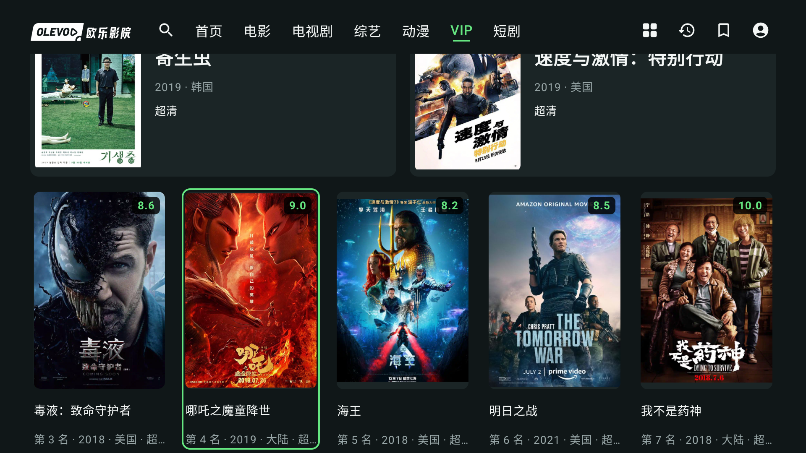
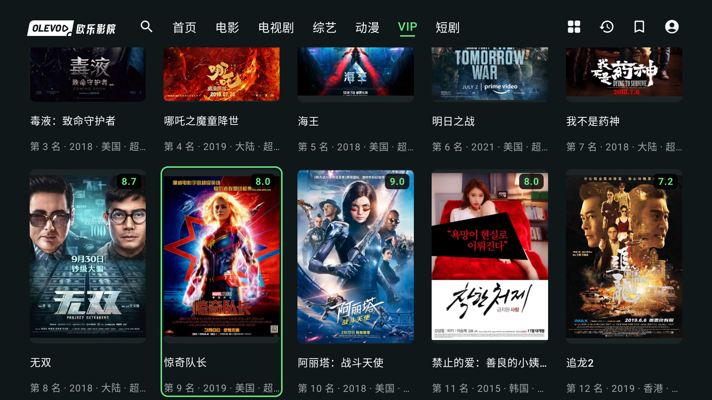

# 发布前界面修订 · Chromecast 实际截图

2026-09-08。真实VIP公开片库，未编辑截图。APK身份见 [manifest.json](manifest.json)；照片来自界面修改完成、versionCode递增前的开发包，不冒充正式签名发布包。

VIP使用全部年份，人气榜与评分榜各最多12部。每榜前两部突出，第三至十二部按五列两行排列，评分叠在完整海报的右上角。未聚焦的下一排允许部分进入视口；方向键进入该排后，整个焦点卡及标题／元信息滚入屏幕。

主执行agent从真实Header进入VIP后取得上述三张图。数据、遥控遍历与评分布局由 [独立复测](../V02_UI_FOLLOWUP.md) 另行验证；原始按键与失败采样记录留在本机。
